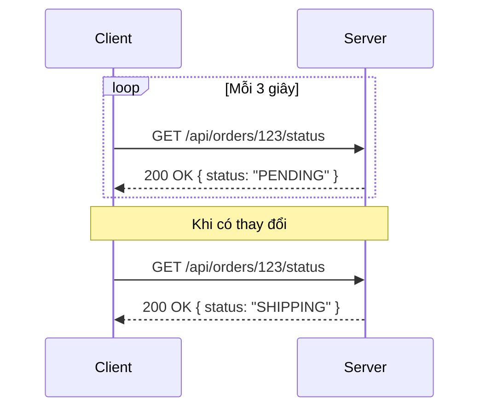
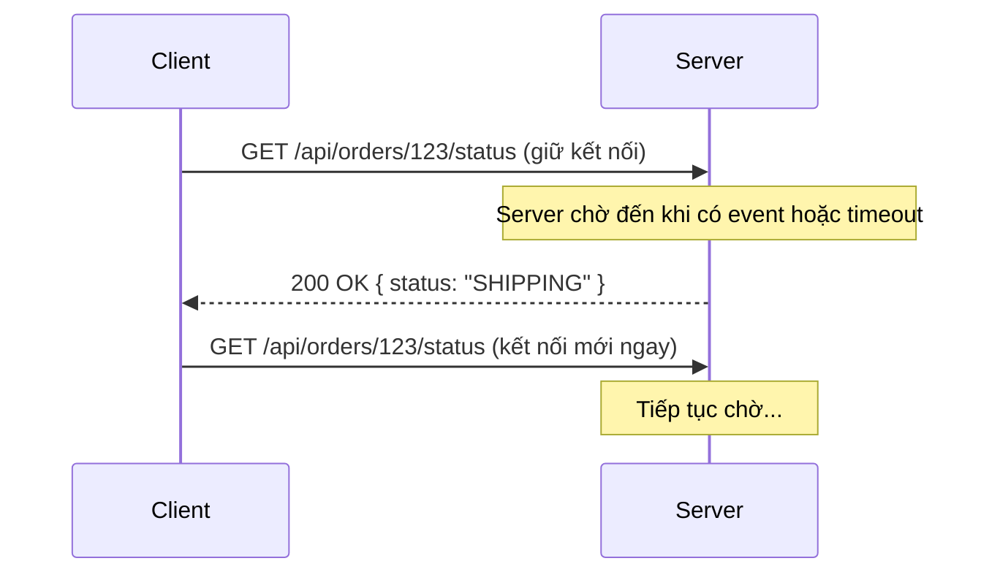
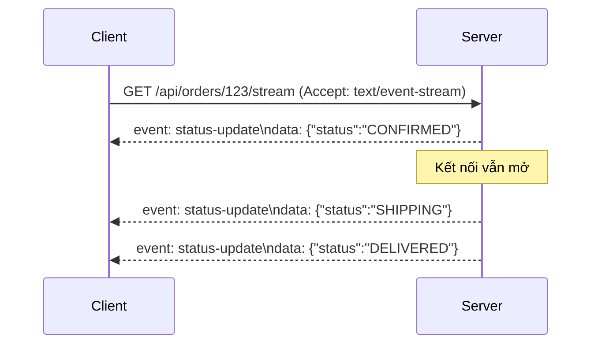
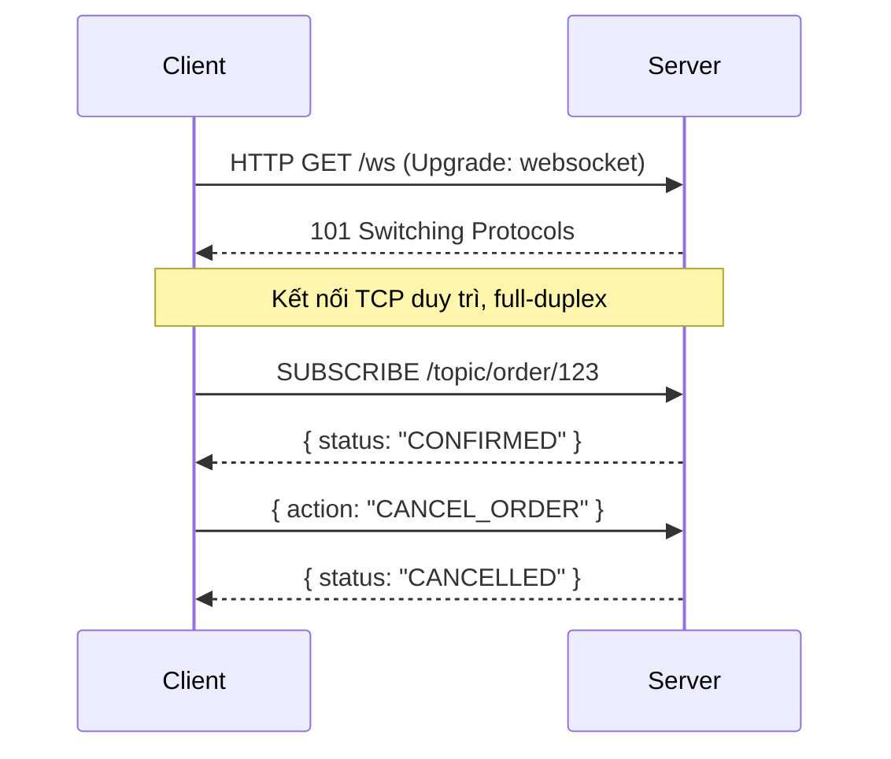
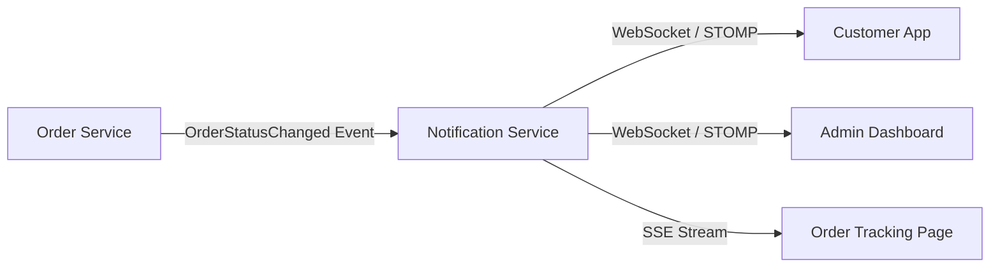
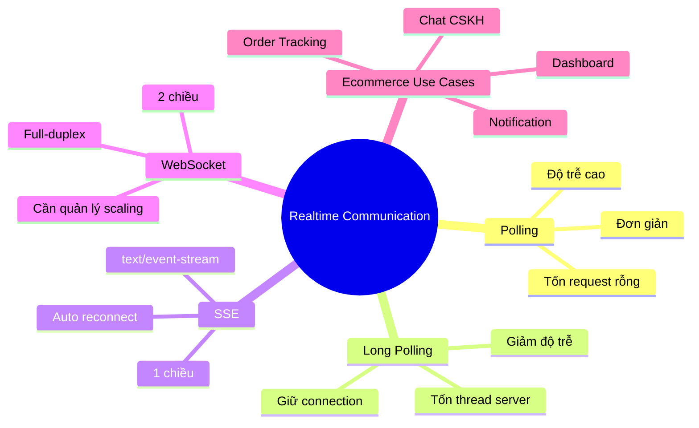
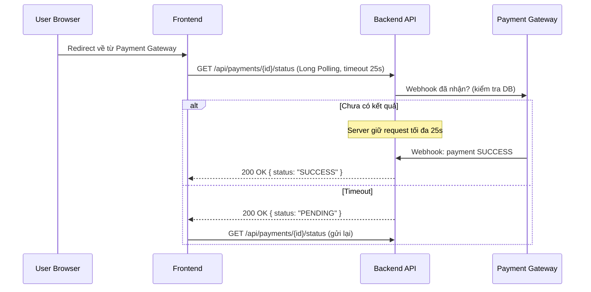

# CHƯƠNG 1 — TỔNG QUAN VỀ REALTIME COMMUNICATION

## 🎯 1. Learning Objectives (Mục tiêu chương)

Sau khi hoàn thành chương này, bạn có thể:

- Giải thích được khái niệm **Realtime Communication** và vì sao nó quan trọng trong Ecommerce.
- Phân biệt rõ **Polling**, **Long Polling**, **Server-Sent Events (SSE)** và **WebSocket**.
- Đánh giá ưu/nhược điểm của từng giải pháp dựa trên: độ trễ, chi phí tài nguyên, độ phức tạp triển khai.
- Xác định **use case thực tế trong Ecommerce** phù hợp với từng công nghệ.
- Đưa ra quyết định kiến trúc: *"Khi nào dùng WebSocket, khi nào dùng SSE, khi nào Polling là đủ?"*

---

## 📖 2. Lý thuyết

### 2.1. Realtime Communication là gì?

**Realtime Communication** là khả năng hệ thống đẩy (push) dữ liệu mới đến client **ngay khi
có sự kiện xảy ra ở server**, mà không cần client phải chủ động yêu cầu lại nhiều lần.

Trong mô hình HTTP truyền thống, giao tiếp là **request-response**: client gửi request, server
trả response, kết nối đóng lại. Server **không thể** tự ý gửi dữ liệu cho client khi chưa có request.

Realtime Communication giải quyết bài toán: *"Server cần chủ động thông báo cho client khi có
sự kiện mới"* — ví dụ: đơn hàng vừa được xác nhận, shipper vừa cập nhật vị trí, giá sản phẩm vừa thay đổi.

### 2.2. Polling (Short Polling)

Client gửi request lặp lại theo chu kỳ cố định (ví dụ mỗi 3 giây) để hỏi server: *"Có gì mới không?"*



**Ưu điểm:**
- Đơn giản, dùng HTTP thuần, không cần hạ tầng đặc biệt.
- Dễ debug, dễ cache.

**Nhược điểm:**
- Độ trễ cao (trung bình = nửa chu kỳ polling).
- Tốn tài nguyên: hầu hết request trả về "không có gì mới".
- Không scale tốt với số lượng client lớn (mỗi client = N request/phút).

### 2.3. Long Polling

Client gửi request, nhưng **server giữ kết nối mở** cho đến khi có dữ liệu mới hoặc timeout,
sau đó client lập tức gửi lại request mới.



**Ưu điểm:**
- Giảm độ trễ đáng kể so với Short Polling.
- Vẫn dùng HTTP, dễ tích hợp với hạ tầng cũ (proxy, load balancer).

**Nhược điểm:**
- Mỗi connection chiếm 1 thread/worker ở server trong thời gian chờ → tốn tài nguyên server.
- Vẫn có overhead của việc thiết lập lại HTTP connection liên tục.
- Không phù hợp giao tiếp **hai chiều** (client → server realtime).

### 2.4. Server-Sent Events (SSE)

SSE cho phép server **giữ một kết nối HTTP mở** và liên tục gửi (stream) dữ liệu dạng text
xuống client theo định dạng `text/event-stream`. Đây là giao tiếp **một chiều: Server → Client**.



**Ưu điểm:**
- Đơn giản hơn WebSocket: chạy trên HTTP/1.1 thuần, tự động reconnect (built-in trong browser API `EventSource`).
- Phù hợp với các luồng dữ liệu **một chiều** (server → client) như feed thông báo, log stream.
- Dễ đi qua proxy/firewall vì vẫn là HTTP.

**Nhược điểm:**
- Chỉ một chiều — client không thể gửi dữ liệu qua cùng kết nối.
- Giới hạn số kết nối đồng thời trên HTTP/1.1 (6 connection/domain ở một số browser).
- Không hỗ trợ dữ liệu nhị phân (binary).

### 2.5. WebSocket

WebSocket là một **protocol độc lập**, hoạt động trên một **TCP connection duy nhất**, cho phép
giao tiếp **hai chiều (full-duplex)**, **liên tục**, độ trễ rất thấp.



**Ưu điểm:**
- Giao tiếp hai chiều thực sự, độ trễ thấp nhất.
- Hỗ trợ cả text và binary frame.
- Phù hợp cho các ứng dụng có tương tác liên tục: tracking, chat, trading, gaming.

**Nhược điểm:**
- Phức tạp hơn khi triển khai: cần quản lý connection state, scaling, load balancing (sticky session hoặc pub/sub).
- Một số hạ tầng cũ (proxy, firewall doanh nghiệp) có thể chặn WebSocket.
- Cần cơ chế heartbeat, reconnect riêng (không tự động như SSE).

### 2.6. Bảng so sánh tổng quan

| Tiêu chí | Polling | Long Polling | SSE | WebSocket |
|---|---|---|---|---|
| Hướng giao tiếp | 1 chiều (client hỏi) | 1 chiều | 1 chiều (server→client) | 2 chiều |
| Độ trễ | Cao | Trung bình | Thấp | Rất thấp |
| Tốn tài nguyên server | Cao (nhiều request rỗng) | Trung bình (giữ connection) | Thấp-Trung bình | Thấp (1 connection lâu dài) |
| Hỗ trợ binary | Có (qua body) | Có | Không | Có |
| Độ phức tạp triển khai | Thấp | Trung bình | Trung bình | Cao |
| Tự reconnect | Có (đơn giản) | Có | Có (built-in) | Phải tự cài đặt |
| Đi qua proxy/firewall | Dễ | Dễ | Dễ | Có thể bị chặn |

---

## 🛒 3. Ví dụ thực tế trong Ecommerce: Realtime Order Status Tracking

**Bài toán:** Khi khách hàng đặt hàng trên sàn Ecommerce, họ muốn theo dõi trạng thái đơn hàng
theo thời gian thực: `PENDING → CONFIRMED → PACKED → SHIPPING → DELIVERED`.

**Phân tích lựa chọn công nghệ:**

| Use case | Công nghệ phù hợp | Lý do |
|---|---|---|
| Trang "Theo dõi đơn hàng" (1 chiều, ít tương tác) | **SSE** hoặc **WebSocket** | Server cần push update, client chỉ xem |
| Chat hỗ trợ khách hàng & shipper | **WebSocket** | Cần giao tiếp 2 chiều liên tục |
| Hiển thị số lượng tồn kho cập nhật trên trang sản phẩm | **WebSocket** (qua STOMP topic) hoặc Polling nhẹ | Tùy mức độ chính xác cần thiết |
| Dashboard admin (doanh thu, số đơn hàng theo thời gian thực) | **WebSocket** | Nhiều luồng dữ liệu, cần 2 chiều để filter |
| Kiểm tra trạng thái thanh toán sau khi redirect từ cổng thanh toán | **Short Polling** (vài lần) hoặc Long Polling | Tần suất thấp, không cần kết nối lâu dài |



> Trong khóa học này, chúng ta sẽ chọn **WebSocket + STOMP** làm giải pháp chính vì hệ thống
> Ecommerce Realtime của chúng ta cần **đa kênh, đa chiều**: thông báo cá nhân hóa, dashboard, tracking, chat hỗ trợ...

---

## 💻 4. Ví dụ minh họa (Conceptual code)

### 4.1. Short Polling (phía Client - Javascript đơn giản)

```javascript
// Polling mỗi 3 giây để lấy trạng thái đơn hàng
function pollOrderStatus(orderId) {
  setInterval(async () => {
    const res = await fetch(`/api/orders/${orderId}/status`);
    const data = await res.json();
    console.log("Order status:", data.status);
  }, 3000);
}
```

### 4.2. SSE (phía Server - Spring Boot)

```java
@RestController
@RequestMapping("/api/orders")
public class OrderStreamController {

    @GetMapping(value = "/{orderId}/stream", produces = MediaType.TEXT_EVENT_STREAM_VALUE)
    public Flux<ServerSentEvent<OrderStatusResponse>> streamOrderStatus(@PathVariable String orderId) {
        return orderStatusFlux
                .filter(event -> event.orderId().equals(orderId))
                .map(event -> ServerSentEvent.<OrderStatusResponse>builder()
                        .event("status-update")
                        .data(new OrderStatusResponse(event.orderId(), event.status()))
                        .build());
    }
}
```

### 4.3. WebSocket (phía Server - khái niệm)

```java
@Controller
public class OrderTrackingController {

    @MessageMapping("/order/{orderId}/subscribe")
    @SendTo("/topic/order/{orderId}")
    public OrderStatusResponse subscribe(@DestinationVariable String orderId) {
        return orderQueryService.getCurrentStatus(orderId);
    }
}
```

> Chương 2-5 sẽ đi sâu vào cách triển khai WebSocket thực tế với Spring Boot và STOMP.

---

## 📝 5. Hands-on Exercises (Bài tập thực hành)

**Bài 1:** Cho 4 tình huống dưới đây trong hệ thống Ecommerce, hãy chọn công nghệ phù hợp nhất
(Polling / Long Polling / SSE / WebSocket) và giải thích lý do:

1. Trang checkout cần kiểm tra xem mã giảm giá còn hiệu lực không sau mỗi 30 giây.
2. Trang quản trị hiển thị "Số đơn hàng mới trong 1 giờ qua" cập nhật liên tục.
3. Tính năng chat giữa khách hàng và nhân viên CSKH.
4. Trang "Flash Sale" hiển thị số lượng sản phẩm còn lại realtime cho hàng nghìn người xem.

**Bài 2:** Vẽ sơ đồ sequence diagram (dùng Mermaid) mô tả luồng Long Polling cho việc kiểm tra
trạng thái thanh toán sau khi người dùng quay lại từ cổng thanh toán VNPay/Momo.

---

## 🚀 6. Advanced Exercises (Bài tập nâng cao)

**Bài 3:** Thiết kế kiến trúc kết hợp cả **SSE và WebSocket** trong cùng hệ thống Ecommerce.
Hãy chỉ ra:
- Service nào sẽ expose SSE endpoint, service nào expose WebSocket endpoint.
- Cách tránh trùng lặp logic publish event giữa 2 kênh.

**Bài 4:** Giả sử hệ thống có 100,000 người dùng đang mở trang "Theo dõi đơn hàng" cùng lúc.
Hãy ước lượng và so sánh tải tài nguyên server (số connection, số thread, băng thông) giữa:
- Short Polling (chu kỳ 5s)
- SSE
- WebSocket

---

## ❓ 7. Interview Questions

1. Sự khác biệt cốt lõi giữa Long Polling và WebSocket là gì?
2. Vì sao SSE không phù hợp để xây dựng tính năng chat hai chiều?
3. Trình bày một tình huống mà Polling vẫn là lựa chọn tốt hơn WebSocket, dù WebSocket có độ trễ thấp hơn.
4. WebSocket có đi qua được HTTP proxy/load balancer không? Cần lưu ý gì?
5. Nếu một hệ thống cần hỗ trợ 1 triệu kết nối WebSocket đồng thời, vấn đề lớn nhất bạn phải giải quyết là gì? (Gợi mở cho Chương 11, 12)

---

## 📋 8. Chapter Summary

- Realtime Communication giải quyết bài toán server cần **chủ động push dữ liệu** cho client.
- 4 giải pháp chính: **Polling**, **Long Polling**, **SSE**, **WebSocket** — mỗi giải pháp có
  trade-off riêng về độ trễ, tài nguyên và độ phức tạp.
- **SSE** phù hợp cho luồng dữ liệu một chiều đơn giản (server → client).
- **WebSocket** là lựa chọn mạnh nhất cho hệ thống cần giao tiếp hai chiều, độ trễ thấp, nhiều kênh.
- Hệ thống Ecommerce Realtime của khóa học sẽ dùng **WebSocket + STOMP** làm nền tảng chính,
  có thể kết hợp SSE cho các luồng đơn giản.

---

## 🧠 9. Mindmap



---

## ✅ 10. Completion Checklist

- [ ] Giải thích được khái niệm Realtime Communication bằng lời của mình.
- [ ] Vẽ được sơ đồ sequence cho cả 4 giải pháp.
- [ ] Hoàn thành Bài 1 và Bài 2.
- [ ] Trả lời được 5 câu hỏi phỏng vấn ở mục 7 mà không cần xem lại lý thuyết.
- [ ] Xác định được công nghệ phù hợp cho ít nhất 3 use case Ecommerce khác (tự nghĩ thêm).

---

## 📌 11. Reference Answers

**Bài 1:**
1. **Short Polling** (chu kỳ 30s là đủ, không cần realtime tức thì, đơn giản và an toàn).
2. **WebSocket** — số liệu thay đổi liên tục, cần đẩy ngay khi có đơn hàng mới, dashboard cần độ trễ thấp.
3. **WebSocket** — chat cần 2 chiều, độ trễ thấp, có typing indicator, trạng thái online/offline.
4. **WebSocket** — số lượng thay đổi rất nhanh, cần broadcast đến hàng nghìn client với độ trễ tối thiểu;
   SSE cũng có thể dùng nhưng WebSocket linh hoạt hơn nếu sau này cần thêm tương tác 2 chiều (đặt mua nhanh).

**Bài 2:** (Sơ đồ tham khảo)



**Bài 3 (gợi ý):**
- **SSE endpoint**: dùng cho trang "Order Tracking" công khai (không cần phản hồi từ client).
- **WebSocket endpoint**: dùng cho Notification Center, Chat, Admin Dashboard (cần 2 chiều).
- Tránh trùng lặp logic: cả 2 kênh đều lấy dữ liệu từ **cùng một Domain Event**
  (`OrderStatusChangedEvent`) được publish qua một `EventBus` nội bộ (Spring `ApplicationEventPublisher`
  hoặc Redis Pub/Sub ở quy mô lớn). Hai adapter (SSE Adapter, WebSocket Adapter) cùng lắng nghe
  event này và chuyển đổi sang định dạng tương ứng — đây chính là ý tưởng **Hexagonal Architecture**
  sẽ học ở Chương 6.

**Bài 4 (gợi ý ước lượng):**
- **Short Polling (5s)**: 100,000 user × (1 request / 5s) = 20,000 request/giây liên tục →
  cần hạ tầng rất lớn để xử lý phần lớn request "không có gì mới".
- **SSE**: 100,000 kết nối HTTP mở đồng thời, mỗi connection tốn 1 socket + buffer nhỏ;
  không tốn CPU khi không có sự kiện.
- **WebSocket**: tương tự SSE về số connection, nhưng tốn thêm chi phí cho heartbeat 2 chiều;
  tuy nhiên linh hoạt hơn để mở rộng tính năng.
- **Kết luận**: SSE/WebSocket vượt trội về tải hệ thống so với Polling ở quy mô lớn, nhưng đòi hỏi
  hạ tầng hỗ trợ giữ connection lâu dài (connection pool, load balancer hỗ trợ WebSocket/HTTP2).
- [Chương 2 - WebSocket Fundamentals](./chap02.md)
