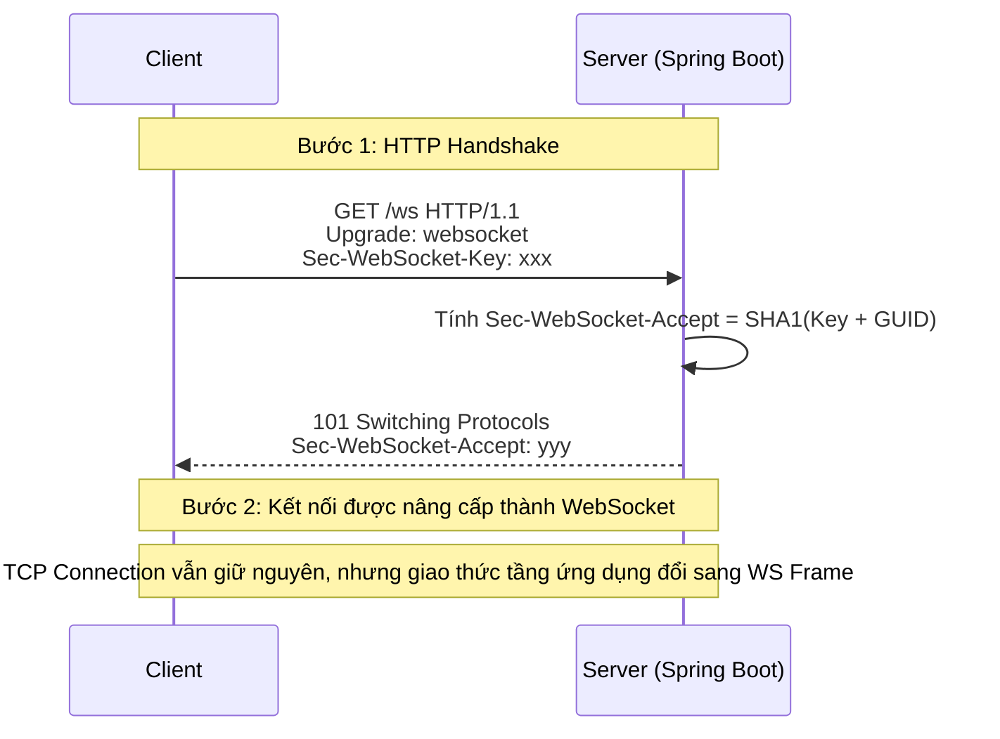
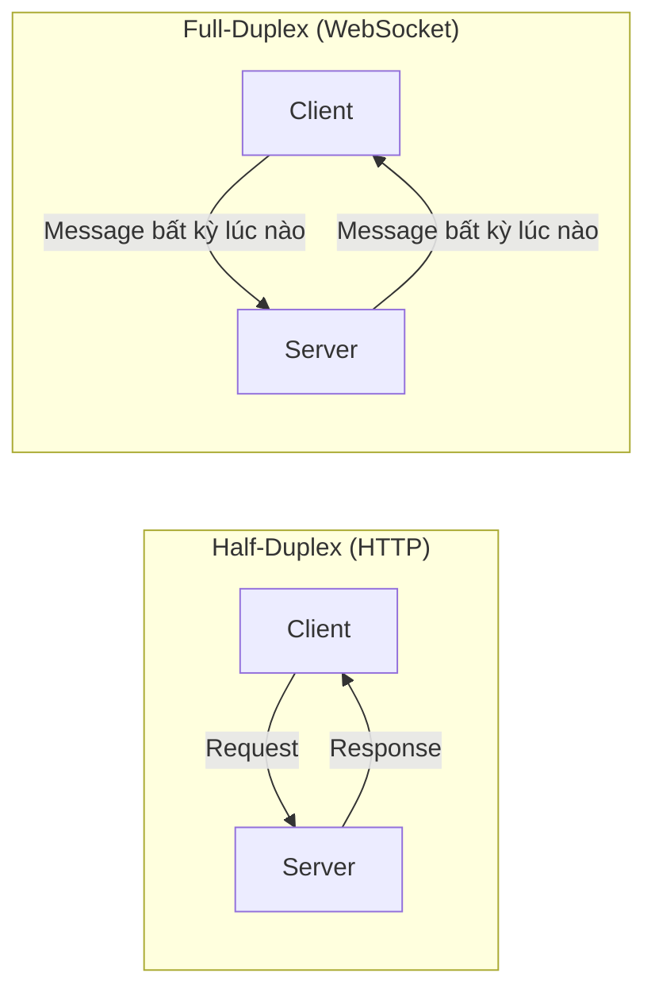
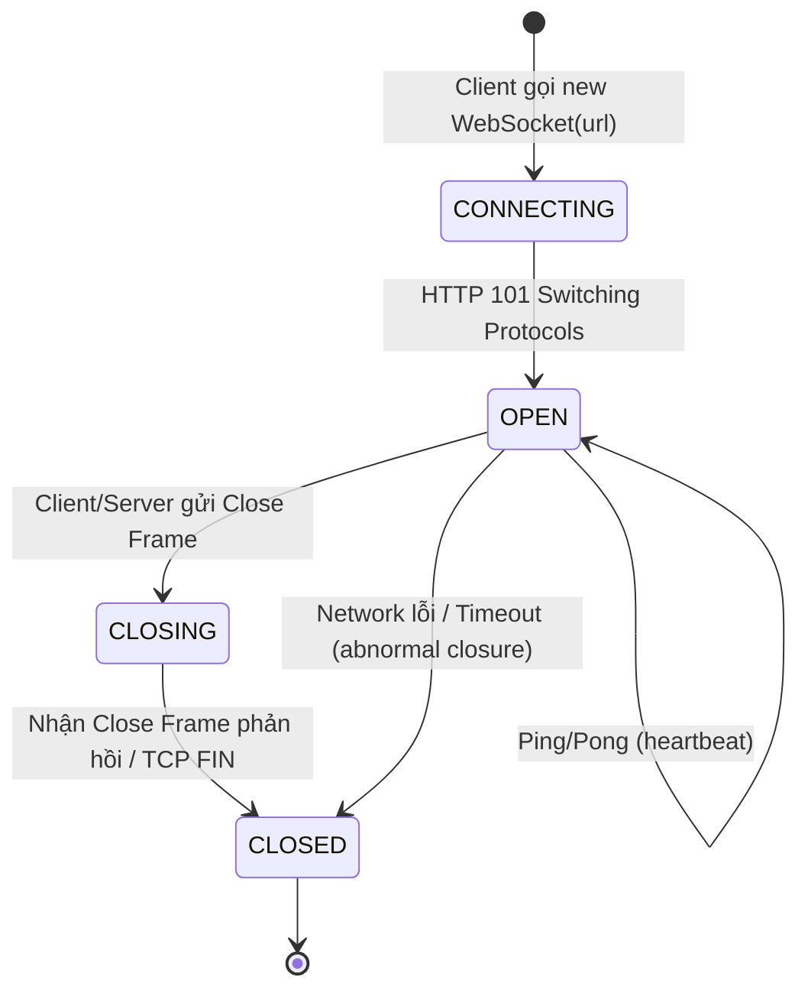
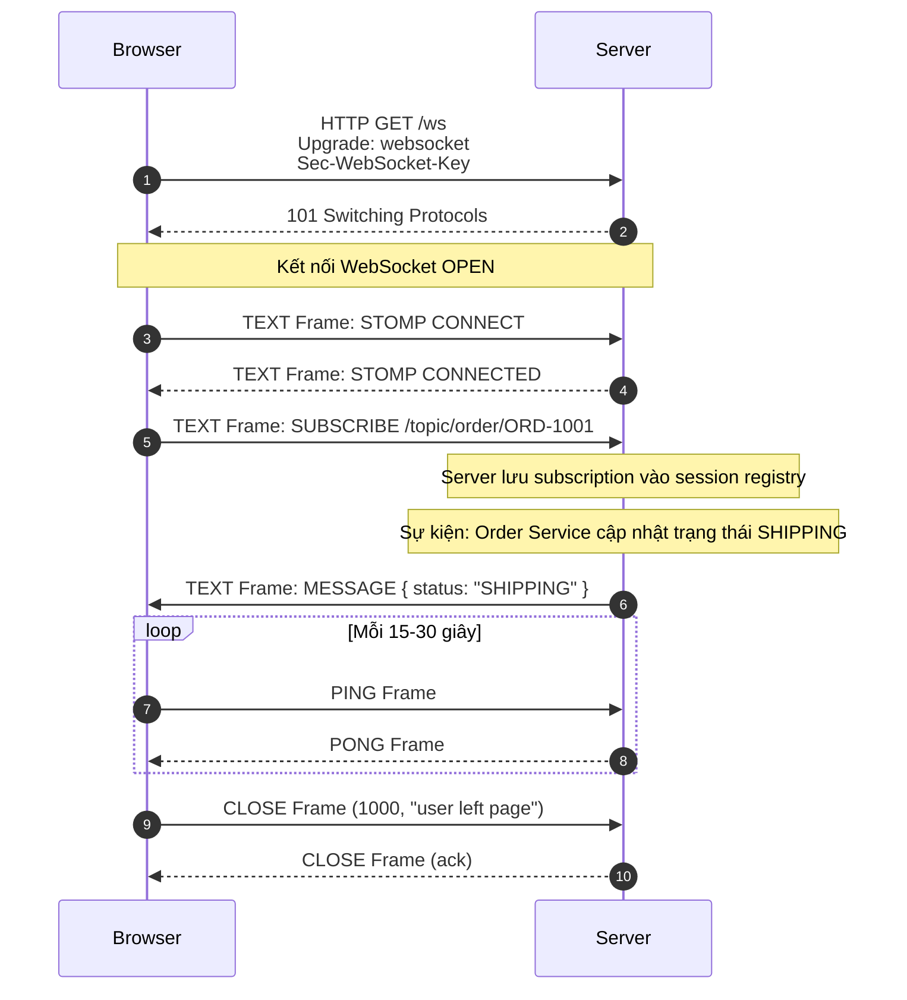
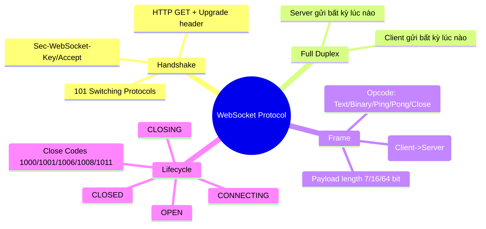
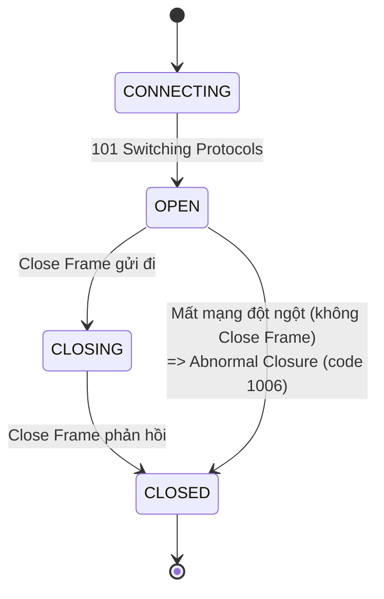

# CHƯƠNG 2 — WEBSOCKET FUNDAMENTALS (NỀN TẢNG GIAO THỨC WEBSOCKET)

## 🎯 1. Learning Objectives

- Hiểu **WebSocket Protocol** (RFC 6455) hoạt động như thế nào ở tầng TCP/HTTP.
- Giải thích chi tiết **HTTP Handshake** và **Upgrade Mechanism**.
- Hiểu khái niệm **Full Duplex Communication**.
- Phân tích cấu trúc của **WebSocket Frame**.
- Mô tả đầy đủ **Connection Lifecycle**: Connect → Open → Message → Close.
- Vẽ được sơ đồ luồng đóng gói/giải mã packet ở tầng thấp.

---

## 📖 2. Lý thuyết

### 2.1. WebSocket Protocol là gì?

WebSocket (RFC 6455) là một **giao thức truyền thông độc lập**, chạy trên **một kết nối TCP duy
nhất**, được "khởi động" thông qua một HTTP request đặc biệt gọi là **Handshake**. Sau khi
handshake thành công, kết nối **không còn là HTTP nữa** — nó trở thành kết nối WebSocket thuần,
cho phép cả client và server gửi dữ liệu cho nhau **bất kỳ lúc nào**, không cần request-response.

### 2.2. HTTP Handshake & Upgrade Mechanism

Client bắt đầu bằng một HTTP GET request đặc biệt, có các header:

```http
GET /ws HTTP/1.1
Host: ecommerce.example.com
Upgrade: websocket
Connection: Upgrade
Sec-WebSocket-Key: dGhlIHNhbXBsZSBub25jZQ==
Sec-WebSocket-Version: 13
Origin: https://ecommerce.example.com
```

Server phản hồi bằng status code **101 Switching Protocols**:

```http
HTTP/1.1 101 Switching Protocols
Upgrade: websocket
Connection: Upgrade
Sec-WebSocket-Accept: s3pPLMBiTxaQ9kYGzzhZRbK+xOo=
```

**Giải thích các header quan trọng:**

| Header | Vai trò |
|---|---|
| `Upgrade: websocket` | Yêu cầu chuyển đổi protocol từ HTTP sang WebSocket |
| `Connection: Upgrade` | Báo hiệu rằng kết nối hiện tại sẽ được nâng cấp |
| `Sec-WebSocket-Key` | Một giá trị random (base64), dùng để server tạo `Sec-WebSocket-Accept` |
| `Sec-WebSocket-Accept` | = base64(SHA1(Sec-WebSocket-Key + "258EAFA5-E914-47DA-95CA-C5AB0DC85B11")) — chứng minh server hiểu giao thức WebSocket |
| `Sec-WebSocket-Version` | Phiên bản giao thức (thường là 13) |



> **Lưu ý quan trọng:** Quá trình Upgrade **không tạo connection TCP mới**. TCP connection ban đầu
> (dùng cho HTTP request) được **tái sử dụng** cho toàn bộ phiên WebSocket. Đây là lý do WebSocket
> tiết kiệm chi phí thiết lập kết nối so với việc mở connection mới liên tục.

### 2.3. Full Duplex Communication

**Full Duplex** nghĩa là cả client và server có thể **gửi dữ liệu đồng thời, độc lập với nhau**,
trên cùng một kết nối — khác với HTTP request-response (Half Duplex: phải hỏi rồi mới được trả lời).



Ví dụ Ecommerce: Trong khi server đang **đẩy thông báo "Đơn hàng đã giao"** cho client, client
có thể **đồng thời gửi yêu cầu "Đánh giá đơn hàng"** lên server — cả hai luồng dữ liệu không
chặn lẫn nhau.

### 2.4. WebSocket Frame — Cấu trúc dữ liệu tầng thấp

Sau handshake, mọi dữ liệu trao đổi được đóng gói thành các **Frame** theo cấu trúc binary:

```
 0                   1                   2                   3
 0 1 2 3 4 5 6 7 8 9 0 1 2 3 4 5 6 7 8 9 0 1 2 3 4 5 6 7 8 9 0 1
+-+-+-+-+-------+-+-------------+-------------------------------+
|F|R|R|R| opcode|M| Payload len |    Extended payload length    |
|I|S|S|S|  (4)  |A|     (7)     |             (16/64)            |
|N|V|V|V|       |S|             |   (if payload len==126/127)    |
| |1|2|3|       |K|             |                                 |
+-+-+-+-+-------+-+-------------+ - - - - - - - - - - - - - - - -+
|     Extended payload length continued, if payload len == 127  |
+ - - - - - - - - - - - - - - - +-------------------------------+
|                     Masking-key (nếu MASK=1)                   |
+---------------------------------------------------------------+
|                          Payload Data                          |
+---------------------------------------------------------------+
```

**Các thành phần quan trọng:**

| Thành phần | Ý nghĩa |
|---|---|
| `FIN` | Bit báo đây có phải frame cuối của message hay không (hỗ trợ message chia nhiều frame) |
| `opcode` | Loại frame: `0x1` = Text, `0x2` = Binary, `0x8` = Close, `0x9` = Ping, `0xA` = Pong |
| `MASK` | Frame từ Client → Server **luôn phải mask** dữ liệu (bảo mật, chống cache poisoning) |
| `Payload length` | Độ dài dữ liệu (7 bit, hoặc mở rộng 16/64 bit cho dữ liệu lớn) |
| `Payload Data` | Dữ liệu thực tế (JSON, text, binary...) |

**Các loại Opcode quan trọng cho việc xây dựng hệ thống Ecommerce Realtime:**

- `Text Frame (0x1)`: dùng để gửi JSON message (ví dụ: `{"type":"ORDER_STATUS","status":"SHIPPING"}`)
- `Ping/Pong (0x9/0xA)`: dùng cho **heartbeat** — kiểm tra connection còn sống (Chương 18)
- `Close (0x8)`: đóng kết nối một cách "graceful" (có status code, ví dụ 1000 = Normal Closure)

### 2.5. Connection Lifecycle (Chu trình sống của một kết nối WebSocket)



**Các trạng thái (theo Web API `WebSocket.readyState`):**

| Trạng thái | Giá trị | Ý nghĩa |
|---|---|---|
| `CONNECTING` | 0 | Đang thực hiện handshake |
| `OPEN` | 1 | Kết nối thành công, có thể gửi/nhận dữ liệu |
| `CLOSING` | 2 | Đang trong quá trình đóng kết nối |
| `CLOSED` | 3 | Kết nối đã đóng hoàn toàn |

**Close Codes thường gặp:**

| Code | Ý nghĩa |
|---|---|
| 1000 | Normal Closure — đóng bình thường |
| 1001 | Going Away — server shutdown, browser tab đóng |
| 1006 | Abnormal Closure — mất kết nối đột ngột (không có Close Frame) |
| 1008 | Policy Violation — ví dụ: token hết hạn, vi phạm xác thực |
| 1011 | Server Error — lỗi nội bộ server |

---

## 🛒 3. Ví dụ thực tế Ecommerce: Phân tích Packet Flow cho Order Tracking

Khi người dùng mở trang "Theo dõi đơn hàng #ORD-1001":



> Lưu ý: STOMP là một **protocol con** chạy "bên trong" các Text Frame của WebSocket — chúng ta
> sẽ học chi tiết ở Chương 4. Chương này tập trung vào tầng WebSocket thuần (transport layer).

---

## 💻 4. Source code minh họa: Raw WebSocket Handler (chưa dùng STOMP)

Trước khi đến với STOMP (Chương 4), hãy xem một ví dụ **WebSocket thuần** trong Spring Boot để
hiểu rõ lifecycle ở tầng code:

```java
package com.ecommerce.realtime.infrastructure.messaging.websocket;

import lombok.extern.slf4j.Slf4j;
import org.springframework.web.socket.CloseStatus;
import org.springframework.web.socket.TextMessage;
import org.springframework.web.socket.WebSocketSession;
import org.springframework.web.socket.handler.TextWebSocketHandler;

/**
 * Raw WebSocket Handler - minh họa connection lifecycle ở mức thấp.
 * Trong dự án thực tế, chúng ta sẽ dùng STOMP (Chương 3-4) thay vì handler raw này,
 * nhưng việc hiểu handler raw giúp nắm rõ bản chất của WebSocket.
 */
@Slf4j
public class RawOrderTrackingHandler extends TextWebSocketHandler {

    @Override
    public void afterConnectionEstablished(WebSocketSession session) {
        // Được gọi ngay sau khi handshake thành công -> trạng thái OPEN
        log.info("Connection OPEN: sessionId={}", session.getId());
    }

    @Override
    protected void handleTextMessage(WebSocketSession session, TextMessage message) {
        // Được gọi mỗi khi nhận một Text Frame từ client
        String payload = message.getPayload();
        log.info("Received TEXT frame: sessionId={}, payload={}", session.getId(), payload);
    }

    @Override
    public void afterConnectionClosed(WebSocketSession session, CloseStatus status) {
        // Được gọi khi nhận Close Frame hoặc connection bị ngắt
        log.info("Connection CLOSED: sessionId={}, code={}, reason={}",
                session.getId(), status.getCode(), status.getReason());
    }

    @Override
    public void handleTransportError(WebSocketSession session, Throwable exception) {
        // Lỗi tầng transport (network lỗi, timeout...)
        log.error("Transport error: sessionId={}", session.getId(), exception);
    }
}
```

---

## 📝 5. Hands-on Exercises

**Bài 1:** Dùng trình duyệt (DevTools → Network → WS), kết nối đến một WebSocket endpoint demo
(ví dụ `wss://echo.websocket.org`) và quan sát:
- Header của HTTP Handshake request/response.
- Giá trị `Sec-WebSocket-Key` và `Sec-WebSocket-Accept`.

**Bài 2:** Vẽ lại sơ đồ **Connection Lifecycle** (state diagram) bằng Mermaid, bổ sung thêm
trường hợp: client mất mạng đột ngột (không gửi Close Frame) — trạng thái cuối là gì?

---

## 🚀 6. Advanced Exercises

**Bài 3:** Tính toán: nếu một frame Text có `Payload Data` dài 70,000 byte, trường
`Payload length` sẽ được biểu diễn như thế nào trong frame header? (Gợi ý: 7-bit, 16-bit, 64-bit)

**Bài 4:** Giải thích tại sao **Client → Server frame luôn phải mask payload**, nhưng
**Server → Client thì không cần**. Điều này có ý nghĩa gì về bảo mật (liên hệ đến cache poisoning
ở các proxy trung gian)?

---

## ❓ 7. Interview Questions

1. WebSocket Upgrade có tạo ra kết nối TCP mới không? Giải thích.
2. `Sec-WebSocket-Accept` được tính như thế nào và mục đích của nó là gì?
3. Phân biệt Ping/Pong frame và STOMP heartbeat (gợi mở Chương 18).
4. Close code 1006 khác gì so với 1000? Trong production, khi nào bạn sẽ thấy code 1006 xuất hiện nhiều?
5. Một WebSocket message lớn (ví dụ 1MB JSON) có được gửi trong 1 frame duy nhất không? Nếu không, điều gì xảy ra?

---

## 📋 8. Chapter Summary

- WebSocket bắt đầu bằng một **HTTP Handshake** với header `Upgrade: websocket`, server trả về
  **101 Switching Protocols**.
- Sau handshake, TCP connection ban đầu được **tái sử dụng** cho giao tiếp **Full Duplex**.
- Dữ liệu được truyền dưới dạng **Frame** (Text/Binary/Ping/Pong/Close), có cấu trúc binary chuẩn theo RFC 6455.
- **Connection Lifecycle** gồm 4 trạng thái: `CONNECTING → OPEN → CLOSING → CLOSED`.
- Hiểu rõ tầng giao thức này là nền tảng để debug các vấn đề production: mất kết nối (1006),
  reconnect, heartbeat...

---

## 🧠 9. Mindmap



---

## ✅ 10. Completion Checklist

- [ ] Vẽ được sơ đồ Handshake request/response với đầy đủ header.
- [ ] Giải thích được Full Duplex khác Half Duplex như thế nào.
- [ ] Mô tả được cấu trúc cơ bản của WebSocket Frame (opcode, mask, payload length).
- [ ] Vẽ được state diagram cho Connection Lifecycle, bao gồm cả abnormal closure.
- [ ] Đọc và hiểu code `RawOrderTrackingHandler` ở mục 4.

---

## 📌 11. Reference Answers

**Bài 1:** Trong DevTools, request handshake sẽ có status `101 Switching Protocols`, với header
`Sec-WebSocket-Key` (client gửi) và `Sec-WebSocket-Accept` (server trả về) — bạn có thể verify
công thức: `Accept = base64(SHA1(Key + "258EAFA5-E914-47DA-95CA-C5AB0DC85B11"))`.

**Bài 2 (gợi ý sơ đồ):**


Khi mất mạng đột ngột, trạng thái cuối vẫn là `CLOSED`, nhưng `CloseEvent.code = 1006` và
`wasClean = false` — không trải qua trạng thái `CLOSING`.

**Bài 3:** Vì 70,000 > 65,535 (giới hạn của 16-bit = 2^16 - 1), payload length 7-bit sẽ là `127`,
báo hiệu rằng 8 byte tiếp theo (64-bit) chứa độ dài thực tế = 70,000.
Nếu payload ≤ 125: dùng trực tiếp 7-bit. Nếu 126 ≤ payload ≤ 65535: 7-bit = `126`, kèm 16-bit tiếp theo.
Nếu payload > 65535: 7-bit = `127`, kèm 64-bit tiếp theo.

**Bài 4:** Masking từ Client → Server được yêu cầu để **ngăn chặn các cuộc tấn công cache poisoning
qua proxy trung gian** — nếu dữ liệu từ client không được mask, một kẻ tấn công có thể tạo ra payload
trông giống một HTTP request hợp lệ, "đánh lừa" proxy cache lưu trữ response sai. Server → Client
không cần mask vì server được tin tưởng hơn và không đi qua các proxy theo cách tương tự (theo thiết kế RFC 6455).
- [Chương 1 - Realtime Communication](./chap01.md)

- [Chương 3 - Spring Boot WebSocket Setup](./chap03.md)
