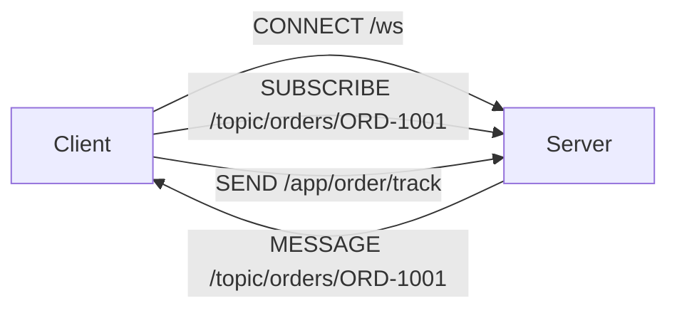
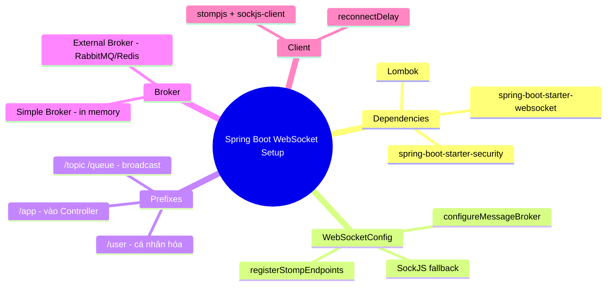

# CHƯƠNG 3 — SPRING BOOT WEBSOCKET SETUP

## 🎯 1. Learning Objectives

- Cài đặt dependencies cần thiết cho Spring Boot WebSocket + STOMP.
- Viết `WebSocketConfig` hoàn chỉnh: đăng ký endpoint, cấu hình Message Broker.
- Hiểu sự khác nhau giữa **Simple Broker** (in-memory) và **External Broker** (RabbitMQ/ActiveMQ — sẽ mở rộng ở Chương 11-12 với Redis).
- Tạo endpoint WebSocket đầu tiên cho hệ thống Ecommerce Realtime.
- Viết một React client đơn giản để kết nối và test endpoint.

---

## 📖 2. Lý thuyết

### 2.1. Dependencies cần thiết (Maven)

```xml
<dependencies>
    <!-- Spring Boot WebSocket (bao gồm hỗ trợ STOMP) -->
    <dependency>
        <groupId>org.springframework.boot</groupId>
        <artifactId>spring-boot-starter-websocket</artifactId>
    </dependency>

    <!-- Spring Boot Web (REST API) -->
    <dependency>
        <groupId>org.springframework.boot</groupId>
        <artifactId>spring-boot-starter-web</artifactId>
    </dependency>

    <!-- Spring Security (dùng từ Chương 8) -->
    <dependency>
        <groupId>org.springframework.boot</groupId>
        <artifactId>spring-boot-starter-security</artifactId>
    </dependency>

    <!-- Lombok -->
    <dependency>
        <groupId>org.projectlombok</groupId>
        <artifactId>lombok</artifactId>
        <optional>true</optional>
    </dependency>

    <!-- Validation -->
    <dependency>
        <groupId>org.springframework.boot</groupId>
        <artifactId>spring-boot-starter-validation</artifactId>
    </dependency>

    <!-- JPA + PostgreSQL (dùng từ Chương 6) -->
    <dependency>
        <groupId>org.springframework.boot</groupId>
        <artifactId>spring-boot-starter-data-jpa</artifactId>
    </dependency>
    <dependency>
        <groupId>org.postgresql</groupId>
        <artifactId>postgresql</artifactId>
        <scope>runtime</scope>
    </dependency>

    <!-- Redis (dùng từ Chương 12) -->
    <dependency>
        <groupId>org.springframework.boot</groupId>
        <artifactId>spring-boot-starter-data-redis</artifactId>
    </dependency>
</dependencies>
```

### 2.2. Kiến trúc WebSocket trong Spring: STOMP over WebSocket

Spring Boot không bắt buộc dùng WebSocket "thuần" (raw `TextWebSocketHandler` như Chương 2).
Trong thực tế, Spring tích hợp sẵn **STOMP** (Simple Text Oriented Messaging Protocol) — một
protocol tầng ứng dụng chạy "bên trong" WebSocket, cung cấp khái niệm **Destination** (topic/queue),
**Subscription**, **Message Broker** giống các hệ thống Message Queue.

```mermaid
flowchart TB
    subgraph "Spring WebSocket Stack"
    A[Client - SockJS/STOMP.js] -->|WebSocket Frame chứa STOMP Frame| B[WebSocket Endpoint /ws]
    B --> C[STOMP Sub-protocol Handler]
    C --> D{Message Broker}
    D -->|/app/** prefix| E[@MessageMapping Controller]
    D -->|/topic/**, /queue/** prefix| F[Simple Broker hoặc External Broker]
    F --> A
    end
```

**Hai loại prefix quan trọng:**

| Prefix | Vai trò |
|---|---|
| `/app` (application destination prefix) | Message từ client gửi đến **server logic** (đi vào `@MessageMapping`) |
| `/topic`, `/queue` (broker destination prefix) | Message được **broadcast/route** qua Message Broker đến các client đã subscribe |
| `/user` (user destination prefix) | Message gửi đến **một user cụ thể** (Chương 7) |

### 2.3. Simple Broker vs External Broker

| | **Simple Broker** (mặc định) | **External Broker** (RabbitMQ/ActiveMQ) |
|---|---|---|
| Triển khai | In-memory, built-in trong Spring | Cần cài đặt broker riêng |
| Scale nhiều instance | ❌ Không hỗ trợ trực tiếp | ✅ Có (qua broker) |
| Độ phức tạp | Thấp — phù hợp học tập, demo, app nhỏ | Cao hơn, nhưng production-ready |
| Persistent message | ❌ | ✅ |

> Trong khóa học, chúng ta bắt đầu với **Simple Broker** (Chương 3-10), sau đó chuyển sang
> **Redis Pub/Sub** (Chương 12) để giải quyết bài toán **scale nhiều instance** mà không cần
> phụ thuộc vào RabbitMQ/ActiveMQ — đây là pattern phổ biến trong các hệ thống production
> dùng Spring WebSocket.

---

## 🛒 3. Ví dụ thực tế: Endpoint đầu tiên cho Ecommerce Realtime

Chúng ta sẽ tạo endpoint `/ws` cho toàn hệ thống Ecommerce Realtime, với các destination:

- `/app/order/track` — client gửi yêu cầu theo dõi đơn hàng
- `/topic/orders/{orderId}` — server broadcast trạng thái đơn hàng
- `/topic/system/announcement` — thông báo hệ thống chung (ví dụ: bảo trì)



---

## 💻 4. Complete Source Code

### 4.1. `WebSocketConfig` — Cấu hình hoàn chỉnh

```java
package com.ecommerce.realtime.infrastructure.config;

import org.springframework.context.annotation.Configuration;
import org.springframework.messaging.simp.config.MessageBrokerRegistry;
import org.springframework.web.socket.config.annotation.*;

@Configuration
@EnableWebSocketMessageBroker
public class WebSocketConfig implements WebSocketMessageBrokerConfigurer {

    /**
     * Đăng ký endpoint mà client sẽ kết nối đến để bắt đầu handshake WebSocket.
     * SockJS được bật để hỗ trợ fallback cho các browser/môi trường không hỗ trợ WebSocket trực tiếp.
     */
    @Override
    public void registerStompEndpoints(StompEndpointRegistry registry) {
        registry.addEndpoint("/ws")
                .setAllowedOriginPatterns("*") // Production: chỉ định domain cụ thể (Chương 17)
                .withSockJS();                 // Fallback HTTP streaming/polling nếu WebSocket bị chặn
    }

    /**
     * Cấu hình Message Broker:
     * - enableSimpleBroker: dùng broker in-memory cho các destination /topic, /queue
     * - setApplicationDestinationPrefixes: message client gửi lên có prefix /app
     *   sẽ được route đến các @MessageMapping
     * - setUserDestinationPrefix: dùng cho gửi message đến user cụ thể (Chương 7)
     */
    @Override
    public void configureMessageBroker(MessageBrokerRegistry registry) {
        registry.enableSimpleBroker("/topic", "/queue")
                .setHeartbeatValue(new long[]{10000, 10000}) // heartbeat 10s (Chương 18)
                .setTaskScheduler(heartBeatScheduler());

        registry.setApplicationDestinationPrefixes("/app");
        registry.setUserDestinationPrefix("/user");
    }

    @org.springframework.context.annotation.Bean
    public org.springframework.scheduling.concurrent.ThreadPoolTaskScheduler heartBeatScheduler() {
        org.springframework.scheduling.concurrent.ThreadPoolTaskScheduler scheduler =
                new org.springframework.scheduling.concurrent.ThreadPoolTaskScheduler();
        scheduler.setPoolSize(1);
        scheduler.setThreadNamePrefix("ws-heartbeat-");
        scheduler.initialize();
        return scheduler;
    }
}
```

### 4.2. Endpoint đầu tiên — `OrderTrackingController`

```java
package com.ecommerce.realtime.presentation.websocket;

import lombok.RequiredArgsConstructor;
import org.springframework.messaging.handler.annotation.DestinationVariable;
import org.springframework.messaging.handler.annotation.MessageMapping;
import org.springframework.messaging.handler.annotation.SendTo;
import org.springframework.stereotype.Controller;

@Controller
@RequiredArgsConstructor
public class OrderTrackingController {

    /**
     * Client gửi message đến: /app/order/track
     * Server xử lý và broadcast kết quả đến: /topic/orders/{orderId}
     *
     * Đây CHƯA phải kiến trúc Clean Architecture hoàn chỉnh (sẽ refactor ở Chương 6),
     * mục tiêu của chương này là làm quen với luồng @MessageMapping -> @SendTo.
     */
    @MessageMapping("/order/track")
    @SendTo("/topic/orders/{orderId}")
    public OrderStatusMessage track(TrackOrderRequest request) {
        // Demo: trả về trạng thái giả định
        return new OrderStatusMessage(request.orderId(), "CONFIRMED", "Đơn hàng đã được xác nhận");
    }

    public record TrackOrderRequest(String orderId) {}

    public record OrderStatusMessage(String orderId, String status, String message) {}
}
```

> **Lưu ý:** `@SendTo("/topic/orders/{orderId}")` với placeholder `{orderId}` **không tự động hoạt
> động** như `@DestinationVariable` trong path của `@MessageMapping`. Trong thực tế, để gửi đến
> một topic động theo `orderId`, chúng ta cần dùng `SimpMessagingTemplate` (sẽ học ở Chương 5)
> thay vì `@SendTo` tĩnh. Phiên bản trên chỉ mang tính minh họa cấu trúc — Chương 5 sẽ sửa đúng cách.

### 4.3. React Client Example

```jsx
import { useEffect, useState } from "react";
import { Client } from "@stomp/stompjs";
import SockJS from "sockjs-client";

export default function OrderTrackingDemo({ orderId }) {
  const [status, setStatus] = useState("Đang kết nối...");

  useEffect(() => {
    const client = new Client({
      webSocketFactory: () => new SockJS("http://localhost:8080/ws"),
      reconnectDelay: 5000, // tự động reconnect sau 5s nếu mất kết nối
      onConnect: () => {
        // Subscribe để nhận cập nhật trạng thái đơn hàng
        client.subscribe(`/topic/orders/${orderId}`, (message) => {
          const body = JSON.parse(message.body);
          setStatus(body.status);
        });

        // Gửi yêu cầu theo dõi đơn hàng
        client.publish({
          destination: "/app/order/track",
          body: JSON.stringify({ orderId }),
        });
      },
    });

    client.activate();
    return () => client.deactivate();
  }, [orderId]);

  return (
    <div>
      <h3>Đơn hàng #{orderId}</h3>
      <p>Trạng thái: {status}</p>
    </div>
  );
}
```

### 4.4. `application.yml` cơ bản

```yaml
server:
  port: 8080

spring:
  application:
    name: ecommerce-realtime-service

logging:
  level:
    org.springframework.web.socket: DEBUG
    org.springframework.messaging: DEBUG
```

---

## 📝 5. Hands-on Exercises

**Bài 1:** Tạo project Spring Boot mới với các dependencies ở mục 2.1. Chạy `WebSocketConfig`
và `OrderTrackingController`, sau đó dùng một WebSocket client (Postman, hoặc trang test STOMP
online) để:
- Connect đến `/ws`
- Subscribe `/topic/orders/ORD-1001`
- Publish message đến `/app/order/track` với body `{"orderId": "ORD-1001"}`
- Quan sát message nhận được trên topic.

**Bài 2:** Tạo một endpoint mới `/app/product/{productId}/view` — khi client gửi message này,
server broadcast đến `/topic/products/{productId}/views` một thông báo dạng
`{"productId": "...", "viewerCount": N}` (giá trị N có thể là số ngẫu nhiên cho demo).

---

## 🚀 6. Advanced Exercises

**Bài 3:** Cấu hình `WebSocketConfig` để:
- Giới hạn `setAllowedOriginPatterns` chỉ cho phép `https://shop.example.com` và `http://localhost:3000`.
- Thêm một `TaskExecutor` riêng cho việc xử lý inbound message (`configureClientInboundChannel`)
  với `corePoolSize=4, maxPoolSize=8` — giải thích vì sao việc này quan trọng cho production (gợi mở Chương 16).

**Bài 4:** Nghiên cứu và giải thích: nếu không bật `.withSockJS()`, điều gì xảy ra khi client
chạy trên môi trường mạng doanh nghiệp chặn WebSocket (proxy chỉ cho phép HTTP)? SockJS xử lý
tình huống này bằng cách nào (gợi ý: fallback transport: xhr-streaming, xhr-polling)?

---

## ❓ 7. Interview Questions

1. Sự khác biệt giữa `/app`, `/topic`, `/queue`, `/user` prefix trong Spring STOMP là gì?
2. Khi nào nên dùng Simple Broker, khi nào cần External Broker (RabbitMQ)?
3. `@SendTo` hoạt động như thế nào, và hạn chế của nó khi cần gửi đến destination động?
4. SockJS là gì? Nó có phải một phần của giao thức WebSocket chuẩn không?
5. Tại sao nên cấu hình `TaskExecutor` riêng cho inbound/outbound channel trong WebSocket?

---

## 📋 8. Chapter Summary

- Spring Boot tích hợp sẵn **STOMP over WebSocket**, cung cấp khái niệm Destination, Broker, Subscription.
- `WebSocketConfig` cần đăng ký **endpoint** (`registerStompEndpoints`) và **message broker**
  (`configureMessageBroker`).
- **Simple Broker** phù hợp cho học tập/app nhỏ; **External Broker hoặc Redis Pub/Sub** cần cho production scale.
- `@MessageMapping` + `@SendTo` là cách cơ bản nhất để xử lý message, nhưng có hạn chế với
  destination động — sẽ được giải quyết bằng `SimpMessagingTemplate` ở Chương 5.
- React client dùng `@stomp/stompjs` + `sockjs-client` để kết nối, subscribe, publish.

---

## 🧠 9. Mindmap



---

## ✅ 10. Completion Checklist

- [ ] Tạo thành công project Spring Boot với đầy đủ dependencies.
- [ ] Viết và hiểu rõ từng phần của `WebSocketConfig`.
- [ ] Test thành công luồng CONNECT → SUBSCRIBE → SEND → MESSAGE bằng client.
- [ ] Hoàn thành Bài 1 và Bài 2.
- [ ] Giải thích được vì sao `@SendTo` tĩnh không phù hợp với destination động.

---

## 📌 11. Reference Answers

**Bài 1:** Sau khi connect `/ws` và subscribe `/topic/orders/ORD-1001`, khi publish
`{"orderId": "ORD-1001"}` đến `/app/order/track`, bạn sẽ nhận được message:
```json
{"orderId": "ORD-1001", "status": "CONFIRMED", "message": "Đơn hàng đã được xác nhận"}
```
trên topic đã subscribe — vì `@SendTo("/topic/orders/{orderId}")` trong ví dụ này **thực chất
không thay thế placeholder**; Spring sẽ gửi đến đúng literal string nếu không xử lý đúng. Đây
chính là lý do bài tập này giúp bạn nhận ra hạn chế và chuẩn bị cho Chương 5.

**Bài 2 (gợi ý code):**
```java
@MessageMapping("/product/{productId}/view")
public void viewProduct(@DestinationVariable String productId,
                         SimpMessagingTemplate messagingTemplate) {
    int viewerCount = ThreadLocalRandom.current().nextInt(1, 100);
    messagingTemplate.convertAndSend(
            "/topic/products/" + productId + "/views",
            new ProductViewMessage(productId, viewerCount));
}

public record ProductViewMessage(String productId, int viewerCount) {}
```

**Bài 3 (gợi ý code):**
```java
@Override
public void registerStompEndpoints(StompEndpointRegistry registry) {
    registry.addEndpoint("/ws")
            .setAllowedOriginPatterns("https://shop.example.com", "http://localhost:3000")
            .withSockJS();
}

@Override
public void configureClientInboundChannel(ChannelRegistration registration) {
    registration.taskExecutor()
            .corePoolSize(4)
            .maxPoolSize(8)
            .queueCapacity(100);
}
```
Việc này quan trọng vì mặc định, Spring dùng một thread pool chung cho việc xử lý message —
nếu một `@MessageMapping` xử lý chậm (gọi DB, gọi service ngoài), nó có thể **block toàn bộ**
việc xử lý message khác. Cấu hình `TaskExecutor` riêng giúp **cô lập tải** và kiểm soát concurrency.

**Bài 4:** Nếu không bật SockJS, client browser sẽ gọi trực tiếp `new WebSocket(...)`. Nếu mạng
chặn giao thức WebSocket (chặn `Upgrade: websocket` header hoặc port), handshake sẽ thất bại
hoàn toàn và không có cách nào kết nối. SockJS giải quyết bằng cách **thử nhiều transport theo
thứ tự ưu tiên**: WebSocket → xhr-streaming → xhr-polling — nếu WebSocket thất bại, SockJS tự
động fallback sang giao tiếp dựa trên HTTP request thông thường (long-polling), đảm bảo ứng
dụng vẫn hoạt động được (với độ trễ cao hơn).
- [Chương 2 - WebSocket Fundamentals](./chap02.md)
- [Chương 4 - STOMP Protocol](./chap04.md)
