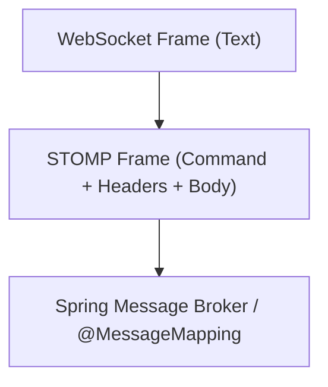
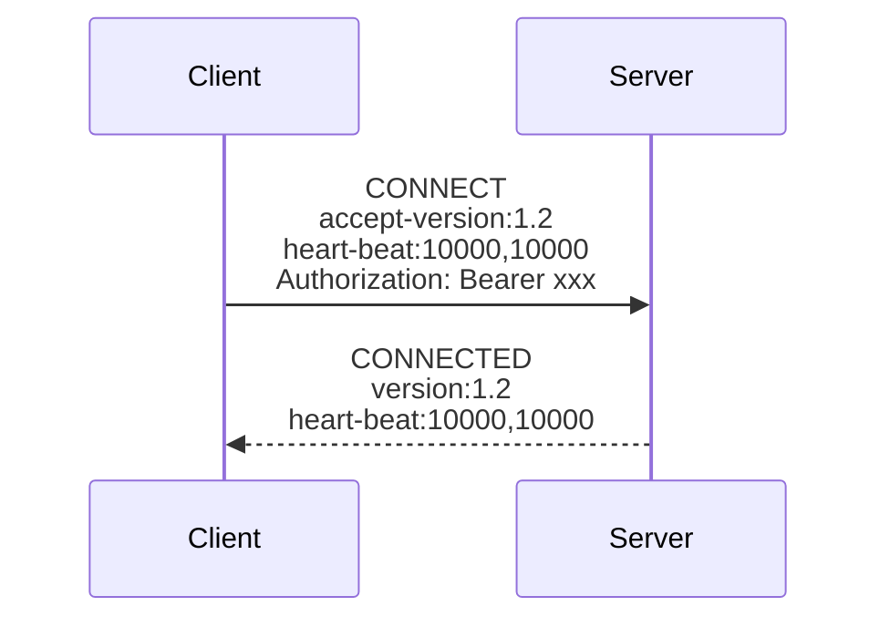
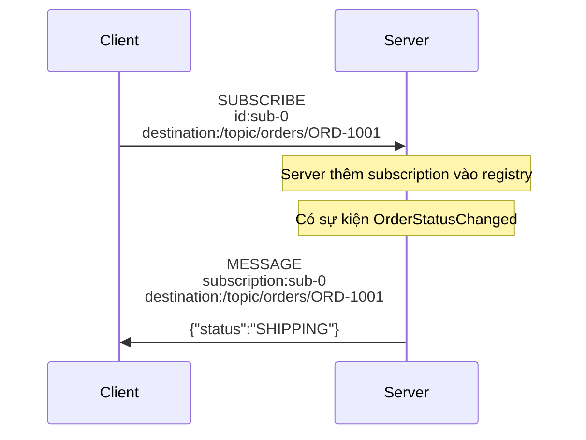
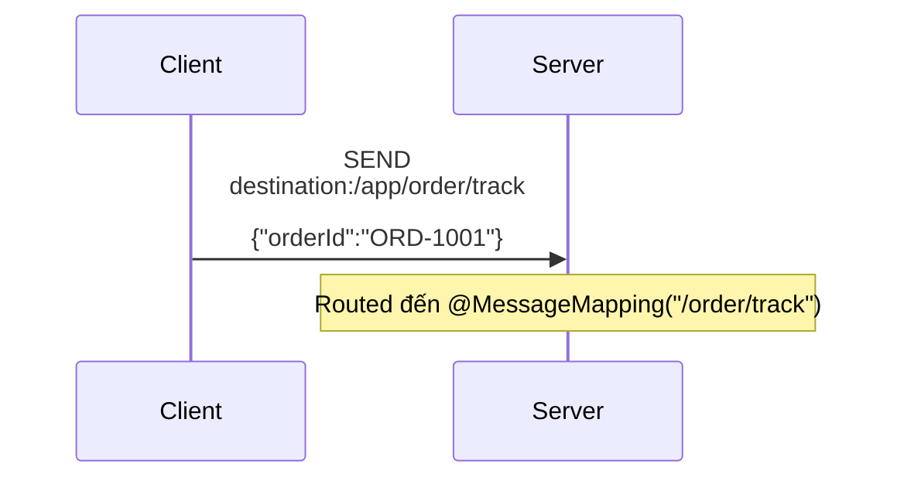
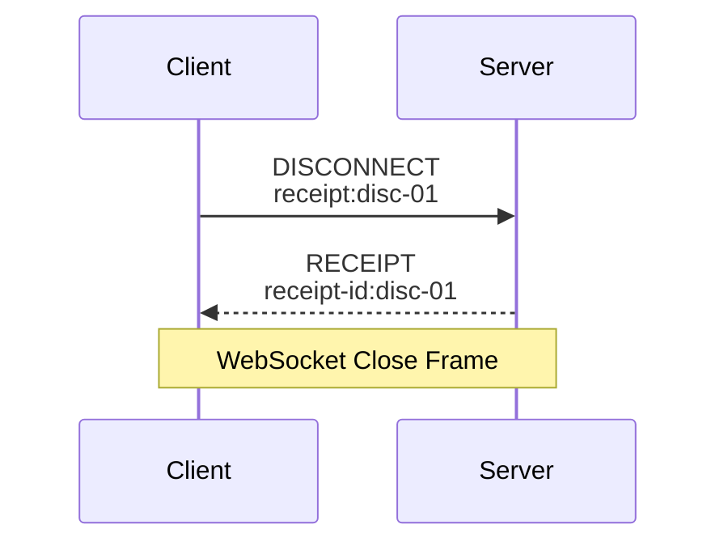
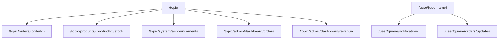
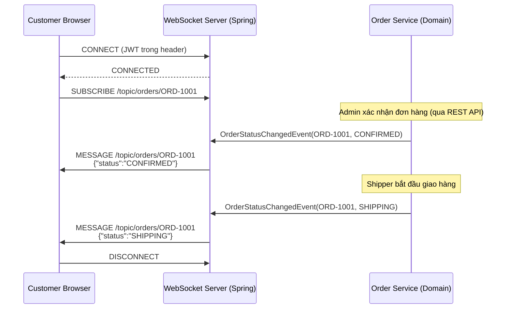
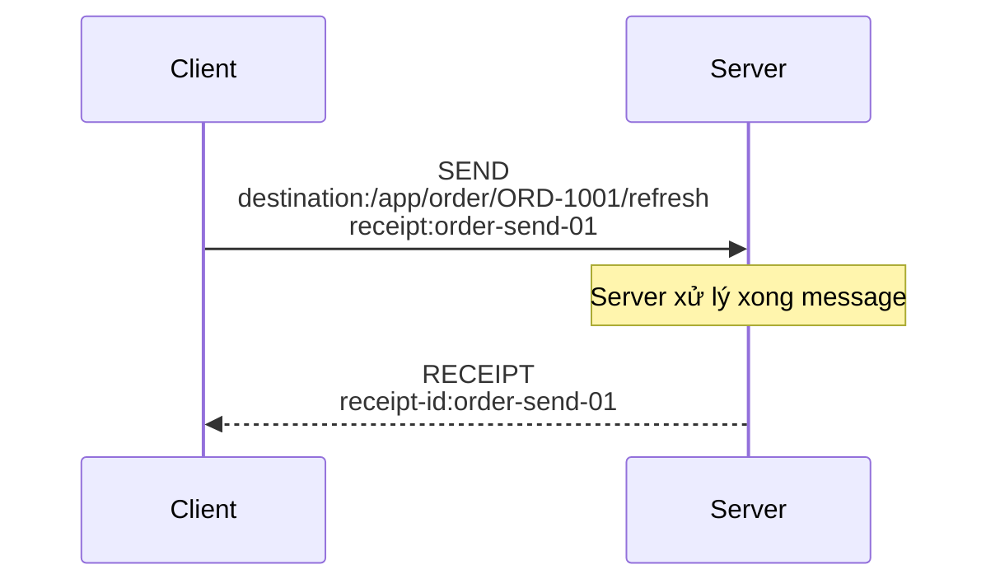

# CHƯƠNG 4 — STOMP PROTOCOL

## 🎯 1. Learning Objectives

- Hiểu **STOMP** (Simple/Streaming Text Oriented Messaging Protocol) là gì và vì sao Spring chọn nó.
- Nắm rõ các frame chính: `CONNECT`, `CONNECTED`, `SUBSCRIBE`, `SEND`, `MESSAGE`, `DISCONNECT`, `RECEIPT`, `ERROR`.
- Thiết kế **chiến lược đặt tên topic (Topic Design Strategy)** cho hệ thống Ecommerce Realtime.
- Áp dụng STOMP cho ví dụ **Order Status Tracking**.

---

## 📖 2. Lý thuyết

### 2.1. STOMP là gì?

STOMP là một **protocol tầng ứng dụng** (application-level protocol), đơn giản, dạng text
(tương tự HTTP), được thiết kế để giao tiếp với **Message Broker** (RabbitMQ, ActiveMQ...).
Khi chạy "bên trong" WebSocket, STOMP cung cấp một **lớp ngữ nghĩa** (semantics) rõ ràng:
*Destination, Subscription, Message, Acknowledgment* — thay vì làm việc với các byte/frame
WebSocket thô.



### 2.2. Cấu trúc một STOMP Frame

```
COMMAND
header1:value1
header2:value2

Body^@
```

Ví dụ một frame `SEND`:

```
SEND
destination:/app/order/track
content-type:application/json
content-length:25

{"orderId":"ORD-1001"}^@
```

(`^@` là ký tự NULL — đánh dấu kết thúc frame)

### 2.3. Các STOMP Command quan trọng

#### a) `CONNECT` / `CONNECTED`



- `CONNECT`: client khởi tạo session STOMP (sau khi WebSocket đã OPEN).
- `CONNECTED`: server xác nhận, thỏa thuận `heart-beat` (Chương 18) và `version`.
- Đây là nơi **JWT token** thường được gửi qua header (Chương 8).

#### b) `SUBSCRIBE` / `MESSAGE`



- `SUBSCRIBE`: client đăng ký nhận message từ một `destination` (topic/queue).
- `MESSAGE`: server gửi dữ liệu đến client đã subscribe, kèm `subscription` id để client biết
  message thuộc subscription nào.

#### c) `SEND`



- `SEND`: client gửi dữ liệu lên `destination` — thường có prefix `/app` để vào `@MessageMapping`.

#### d) `DISCONNECT`



- `DISCONNECT`: client chủ động kết thúc session STOMP (có thể kèm `receipt` để xác nhận).
- `ERROR`: server gửi khi có lỗi (ví dụ: subscribe vào destination không hợp lệ, lỗi xác thực).

### 2.4. Bảng tổng hợp STOMP Frames

| Frame | Hướng | Mục đích |
|---|---|---|
| `CONNECT` | Client → Server | Khởi tạo session, gửi credentials |
| `CONNECTED` | Server → Client | Xác nhận kết nối |
| `SUBSCRIBE` | Client → Server | Đăng ký nhận message từ destination |
| `UNSUBSCRIBE` | Client → Server | Hủy đăng ký |
| `SEND` | Client → Server | Gửi message đến destination |
| `MESSAGE` | Server → Client | Gửi dữ liệu đến subscriber |
| `RECEIPT` | Server → Client | Xác nhận đã xử lý frame có header `receipt` |
| `ERROR` | Server → Client | Báo lỗi |
| `DISCONNECT` | Client → Server | Đóng session |
| `ACK` / `NACK` | Client → Server | Xác nhận xử lý message (dùng với External Broker) |

---

## 🛒 3. Topic Design Strategy cho Ecommerce

Một trong những quyết định kiến trúc quan trọng nhất là **đặt tên destination (topic) một cách
nhất quán, dễ mở rộng, và bảo mật**.

### 3.1. Nguyên tắc thiết kế

1. **Phân cấp theo domain**: `/topic/{domain}/{resourceId}/{event-type}`
2. **Phân biệt rõ topic công khai vs cá nhân**: dùng `/user/queue/...` cho cá nhân (Chương 7).
3. **Tránh lộ thông tin nhạy cảm trong tên topic** (ví dụ: không nhúng email, số thẻ).
4. **Versioning**: có thể thêm prefix `/v1/topic/...` để dễ migrate sau này.

### 3.2. Đề xuất Topic Map cho Ecommerce Realtime Platform



| Topic / Destination | Mục đích | Ai subscribe |
|---|---|---|
| `/topic/orders/{orderId}` | Trạng thái đơn hàng cụ thể | Khách hàng đang xem trang tracking đơn đó |
| `/topic/products/{productId}/stock` | Cập nhật tồn kho realtime | Khách hàng đang xem trang sản phẩm |
| `/topic/system/announcements` | Thông báo hệ thống (bảo trì, khuyến mãi toàn site) | Tất cả client |
| `/topic/admin/dashboard/orders` | Số đơn hàng mới realtime | Admin Dashboard |
| `/topic/admin/dashboard/revenue` | Doanh thu realtime | Admin Dashboard |
| `/user/queue/notifications` | Thông báo cá nhân (đơn hàng của riêng tôi) | Một user cụ thể |
| `/app/order/track` | Client yêu cầu theo dõi đơn hàng | (Application destination) |
| `/app/chat/{conversationId}/send` | Gửi tin nhắn chat CSKH | (Application destination) |

### 3.3. Ví dụ thực tế: Order Status Tracking với STOMP



---

## 💻 4. Source Code minh họa

### 4.1. Controller xử lý SUBSCRIBE/SEND cho Order Tracking

```java
package com.ecommerce.realtime.presentation.websocket;

import lombok.RequiredArgsConstructor;
import org.springframework.messaging.handler.annotation.DestinationVariable;
import org.springframework.messaging.handler.annotation.MessageMapping;
import org.springframework.messaging.simp.SimpMessagingTemplate;
import org.springframework.stereotype.Controller;

@Controller
@RequiredArgsConstructor
public class OrderStompController {

    private final SimpMessagingTemplate messagingTemplate;

    /**
     * STOMP SEND đến /app/order/{orderId}/refresh
     * -> Server chủ động "đẩy lại" trạng thái hiện tại đến đúng topic /topic/orders/{orderId}
     * Dùng khi client mới subscribe và muốn nhận snapshot ngay lập tức.
     */
    @MessageMapping("/order/{orderId}/refresh")
    public void refreshOrderStatus(@DestinationVariable String orderId) {
        OrderStatusPayload payload = new OrderStatusPayload(orderId, "CONFIRMED", "Đơn hàng đã xác nhận");
        messagingTemplate.convertAndSend("/topic/orders/" + orderId, payload);
    }

    public record OrderStatusPayload(String orderId, String status, String description) {}
}
```

### 4.2. Cấu hình ghi log STOMP Frame (debug)

```java
package com.ecommerce.realtime.infrastructure.config;

import lombok.extern.slf4j.Slf4j;
import org.springframework.context.annotation.Configuration;
import org.springframework.messaging.Message;
import org.springframework.messaging.MessageChannel;
import org.springframework.messaging.simp.stomp.StompHeaderAccessor;
import org.springframework.messaging.support.ChannelInterceptor;
import org.springframework.web.socket.config.annotation.WebSocketMessageBrokerConfigurer;
import org.springframework.messaging.simp.config.ChannelRegistration;

@Slf4j
@Configuration
public class StompLoggingConfig implements WebSocketMessageBrokerConfigurer {

    @Override
    public void configureClientInboundChannel(ChannelRegistration registration) {
        registration.interceptors(new ChannelInterceptor() {
            @Override
            public Message<?> preSend(Message<?> message, MessageChannel channel) {
                StompHeaderAccessor accessor = StompHeaderAccessor.wrap(message);
                log.debug("STOMP IN: command={}, destination={}, sessionId={}",
                        accessor.getCommand(), accessor.getDestination(), accessor.getSessionId());
                return message;
            }
        });
    }
}
```

---

## 📝 5. Hands-on Exercises

**Bài 1:** Dùng STOMP client (ví dụ extension trên Chrome hoặc thư viện `@stomp/stompjs`),
thực hiện thủ công các bước:
1. `CONNECT`
2. `SUBSCRIBE /topic/orders/ORD-2002`
3. `SEND /app/order/ORD-2002/refresh`
4. Quan sát `MESSAGE` nhận được, ghi lại toàn bộ header.

**Bài 2:** Thiết kế **Topic Design Strategy** cho 2 tính năng mới:
- Thông báo khi sản phẩm trong wishlist của user giảm giá.
- Theo dõi vị trí shipper trên bản đồ trong thời gian thực.

Viết ra destination name đề xuất và lý do.

---

## 🚀 6. Advanced Exercises

**Bài 3:** STOMP hỗ trợ header `receipt`. Hãy viết kịch bản (sequence diagram) cho việc client
gửi `SEND` kèm `receipt:order-send-01` và server phản hồi `RECEIPT`. Giải thích ứng dụng thực
tế của cơ chế này (ví dụ: đảm bảo message "đã được broker nhận" trước khi client cập nhật UI).

**Bài 4:** Phân tích: nếu hai client cùng subscribe `/topic/orders/ORD-1001` nhưng một client
là **chủ đơn hàng**, một client là **admin đang hỗ trợ**, có vấn đề bảo mật gì nếu topic này
**không có kiểm soát quyền subscribe**? Đề xuất giải pháp (gợi mở Chương 7, 8).

---

## ❓ 7. Interview Questions

1. STOMP khác gì so với raw WebSocket message? Vì sao Spring chọn STOMP làm sub-protocol mặc định?
2. Giải thích sự khác nhau giữa `SEND` và `MESSAGE` trong STOMP.
3. `destination` trong STOMP có phải là một khái niệm bắt buộc của WebSocket không?
4. Làm sao để client biết một `MESSAGE` thuộc về `SUBSCRIBE` nào nếu client có nhiều subscription đến cùng prefix?
5. Tại sao việc thiết kế Topic Naming Convention quan trọng đối với bảo mật và khả năng mở rộng?

---

## 📋 8. Chapter Summary

- STOMP là một protocol đơn giản, dạng text, cung cấp các khái niệm `CONNECT`, `SUBSCRIBE`, `SEND`,
  `MESSAGE`, `DISCONNECT`, `RECEIPT`, `ERROR`.
- STOMP chạy "bên trong" WebSocket Text Frame, giúp Spring xây dựng mô hình
  Destination/Broker/Subscription giống Message Queue.
- Thiết kế Topic Naming Convention (`/topic/{domain}/{id}/{event}`) là nền tảng cho một hệ thống
  Ecommerce Realtime dễ bảo trì và bảo mật.
- `SimpMessagingTemplate` là công cụ chính để gửi message đến destination động — sẽ học sâu ở Chương 5.

---

## 🧠 9. Mindmap

```mermaid
mindmap
  root((STOMP Protocol))
    Frames
      CONNECT/CONNECTED
      SUBSCRIBE/UNSUBSCRIBE
      SEND/MESSAGE
      RECEIPT/ERROR
      DISCONNECT
    Topic Design
      /topic/orders/{id}
      /topic/products/{id}/stock
      /topic/admin/dashboard
      /user/queue/notifications
    Security Concerns
      Subscription Authorization
      Topic Naming convention
```

---

## ✅ 10. Completion Checklist

- [ ] Phân biệt được rõ chức năng của từng STOMP Frame.
- [ ] Thực hiện thành công Bài 1 và quan sát được toàn bộ frame.
- [ ] Thiết kế được Topic Map hoàn chỉnh cho Bài 2.
- [ ] Hiểu được rủi ro bảo mật khi topic không kiểm soát quyền subscribe (Bài 4).

---

## 📌 11. Reference Answers

**Bài 2 (gợi ý):**
- Wishlist giảm giá: `/user/queue/wishlist/price-drop` — vì đây là thông báo **cá nhân**, mỗi
  user chỉ nên nhận thông báo về wishlist của chính họ.
- Theo dõi vị trí shipper: `/topic/orders/{orderId}/shipper-location` — vì có thể nhiều bên
  (khách hàng, admin hỗ trợ) cùng theo dõi 1 đơn hàng cụ thể, dùng topic theo `orderId` là hợp lý.

**Bài 3 (gợi ý sequence diagram):**

Ứng dụng thực tế: client có thể hiển thị "loading spinner" cho đến khi nhận `RECEIPT`, đảm bảo
broker/server đã xử lý frame trước khi coi hành động là hoàn tất — hữu ích cho các action quan
trọng như "Hủy đơn hàng" gửi qua WebSocket.

**Bài 4:** Nếu topic `/topic/orders/{orderId}` không kiểm soát quyền, **bất kỳ user đã đăng nhập
nào cũng có thể subscribe và xem trạng thái đơn hàng của người khác** chỉ bằng cách biết `orderId`
(thường là số tự tăng, dễ đoán). Giải pháp: chuyển sang **per-user destination**
(`/user/queue/orders/{orderId}/updates`, Chương 7) kết hợp **xác thực tại thời điểm SUBSCRIBE**
qua `ChannelInterceptor` (Chương 8) để kiểm tra user hiện tại có quyền xem đơn hàng đó hay không.
- [Chương 3 - Spring Boot WebSocket Setup](./chap03.md)

- [Chương 5 - Producer Consumer Pattern](./chap05.md)

