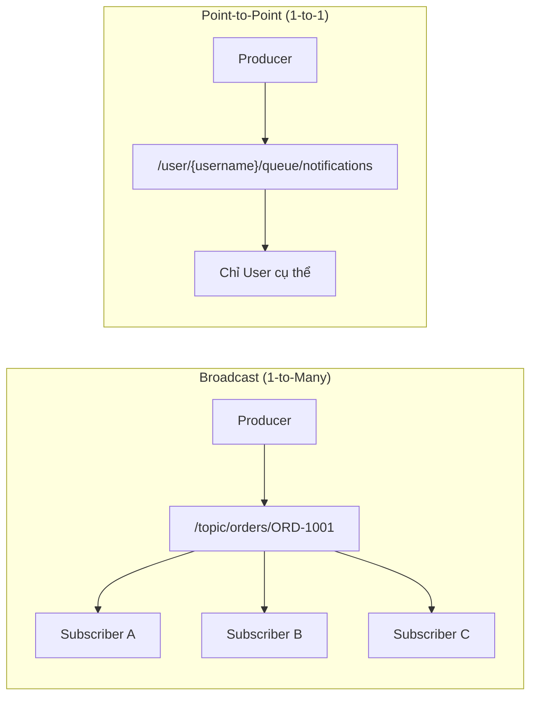
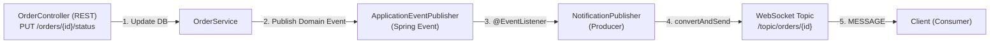
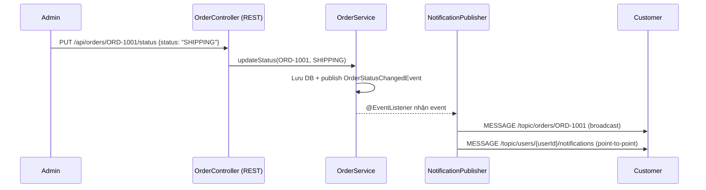
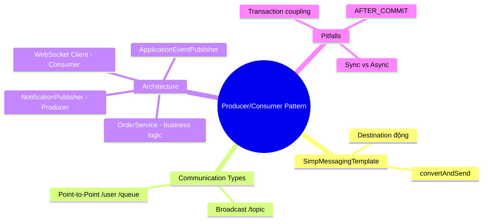

# CHƯƠNG 5 — PRODUCER VÀ CONSUMER PATTERNS

## 🎯 1. Learning Objectives

- Sử dụng thành thạo `SimpMessagingTemplate` để publish message đến destination động.
- Phân biệt **Broadcast Communication** (1-to-many) và **Point-to-Point Communication** (1-to-1).
- Xây dựng **Order Notification System**: `NotificationController` (Consumer/Entry point) và
  `NotificationPublisher` (Producer).
- Hiểu rõ vai trò của **Producer/Consumer pattern** trong kiến trúc event-driven cho Ecommerce.

---

## 📖 2. Lý thuyết

### 2.1. `SimpMessagingTemplate`

`SimpMessagingTemplate` là công cụ chính để **gửi (publish) message từ phía server** đến một
destination cụ thể — khác với `@SendTo` (tĩnh), `SimpMessagingTemplate` cho phép:

- Gửi đến destination **động** (runtime), ví dụ `/topic/orders/" + orderId`.
- Gửi từ **bất kỳ đâu trong code** (Service, Event Listener), không chỉ trong `@MessageMapping`.
- Gửi đến **user cụ thể** qua `convertAndSendToUser` (Chương 7).

```java
@Service
@RequiredArgsConstructor
public class OrderEventPublisher {
    private final SimpMessagingTemplate messagingTemplate;

    public void publishOrderStatus(String orderId, String status) {
        messagingTemplate.convertAndSend("/topic/orders/" + orderId, new OrderStatusPayload(orderId, status));
    }
}
```

### 2.2. Broadcast vs Point-to-Point



| | Broadcast | Point-to-Point |
|---|---|---|
| Destination | `/topic/**` | `/user/**` hoặc `/queue/**` với 1 consumer |
| Use case Ecommerce | Trạng thái đơn hàng cho tất cả người theo dõi (admin + customer) | Thông báo "Đơn hàng của bạn đã giao" — chỉ chủ đơn |
| Số lượng người nhận | Nhiều (N) | Một (1) |

### 2.3. Producer/Consumer trong kiến trúc Event-Driven

Trong hệ thống Ecommerce thực tế, luồng xử lý không nên gọi trực tiếp `SimpMessagingTemplate`
từ Controller REST (sẽ vi phạm Single Responsibility). Thay vào đó:



- **Producer** = thành phần publish message vào WebSocket topic (`NotificationPublisher`).
- **Consumer** ở đây có 2 nghĩa:
  - **Consumer phía Client**: subscriber nhận message qua STOMP.
  - **Consumer phía Server**: `@EventListener` hoặc `@MessageMapping` "tiêu thụ" sự kiện/nội bộ
    để xử lý logic, gọi Producer.

---

## 🛒 3. Ví dụ thực tế: Order Notification System

**Bài toán:** Khi admin cập nhật trạng thái đơn hàng qua REST API, hệ thống cần:
1. Lưu trạng thái mới vào DB.
2. **Broadcast** trạng thái mới đến `/topic/orders/{orderId}` (cho trang tracking công khai).
3. **Gửi point-to-point** thông báo cá nhân đến chủ đơn hàng qua `/user/queue/notifications`
   (chi tiết về `convertAndSendToUser` sẽ học ở Chương 7 — chương này dùng giả lập đơn giản
   qua `/topic/users/{userId}/notifications`).



---

## 💻 4. Complete Source Code

### 4.1. Domain Event (đơn giản hóa — Clean Architecture đầy đủ ở Chương 6)

```java
package com.ecommerce.realtime.domain.order.event;

import java.time.Instant;

public record OrderStatusChangedEvent(
        String orderId,
        String userId,
        String previousStatus,
        String newStatus,
        Instant occurredAt
) {
    public static OrderStatusChangedEvent of(String orderId, String userId, String prev, String next) {
        return new OrderStatusChangedEvent(orderId, userId, prev, next, Instant.now());
    }
}
```

### 4.2. `OrderService` — publish Domain Event sau khi update

```java
package com.ecommerce.realtime.application.order;

import com.ecommerce.realtime.domain.order.event.OrderStatusChangedEvent;
import lombok.RequiredArgsConstructor;
import org.springframework.context.ApplicationEventPublisher;
import org.springframework.stereotype.Service;
import org.springframework.transaction.annotation.Transactional;

@Service
@RequiredArgsConstructor
public class OrderService {

    private final OrderRepository orderRepository; // Spring Data JPA repository
    private final ApplicationEventPublisher eventPublisher;

    @Transactional
    public void updateOrderStatus(String orderId, String newStatus) {
        OrderEntity order = orderRepository.findById(orderId)
                .orElseThrow(() -> new IllegalArgumentException("Order not found: " + orderId));

        String previousStatus = order.getStatus();
        order.setStatus(newStatus);
        orderRepository.save(order);

        // Publish domain event - decoupled khỏi WebSocket layer (Producer)
        eventPublisher.publishEvent(
                OrderStatusChangedEvent.of(orderId, order.getUserId(), previousStatus, newStatus)
        );
    }
}
```

### 4.3. `NotificationPublisher` — Producer

```java
package com.ecommerce.realtime.infrastructure.messaging.websocket;

import com.ecommerce.realtime.domain.order.event.OrderStatusChangedEvent;
import lombok.RequiredArgsConstructor;
import lombok.extern.slf4j.Slf4j;
import org.springframework.context.event.EventListener;
import org.springframework.messaging.simp.SimpMessagingTemplate;
import org.springframework.stereotype.Component;

@Slf4j
@Component
@RequiredArgsConstructor
public class NotificationPublisher {

    private final SimpMessagingTemplate messagingTemplate;

    /**
     * Lắng nghe OrderStatusChangedEvent (publish bởi OrderService)
     * và broadcast đến các kênh WebSocket tương ứng.
     *
     * Đây là Producer trong mô hình Producer/Consumer:
     * - Consumer (nội bộ): @EventListener nhận domain event
     * - Producer (ra ngoài): convertAndSend để đẩy message tới WebSocket client
     */
    @EventListener
    public void onOrderStatusChanged(OrderStatusChangedEvent event) {
        log.info("Publishing order status update: orderId={}, status={}",
                event.orderId(), event.newStatus());

        // 1. Broadcast cho trang tracking công khai (nhiều client có thể xem)
        OrderStatusPayload broadcastPayload = OrderStatusPayload.from(event);
        messagingTemplate.convertAndSend("/topic/orders/" + event.orderId(), broadcastPayload);

        // 2. Point-to-point: gửi riêng cho chủ đơn hàng (đơn giản hóa - hoàn thiện ở Chương 7)
        messagingTemplate.convertAndSend(
                "/topic/users/" + event.userId() + "/notifications",
                NotificationPayload.fromOrderEvent(event)
        );
    }

    public record OrderStatusPayload(String orderId, String status, String occurredAt) {
        public static OrderStatusPayload from(OrderStatusChangedEvent e) {
            return new OrderStatusPayload(e.orderId(), e.newStatus(), e.occurredAt().toString());
        }
    }

    public record NotificationPayload(String title, String message, String orderId) {
        public static NotificationPayload fromOrderEvent(OrderStatusChangedEvent e) {
            String title = switch (e.newStatus()) {
                case "CONFIRMED" -> "Đơn hàng đã được xác nhận";
                case "SHIPPING" -> "Đơn hàng đang được giao";
                case "DELIVERED" -> "Đơn hàng đã được giao thành công";
                case "CANCELLED" -> "Đơn hàng đã bị hủy";
                default -> "Cập nhật đơn hàng";
            };
            return new NotificationPayload(title, "Đơn hàng #" + e.orderId() + " - " + e.newStatus(), e.orderId());
        }
    }
}
```

### 4.4. `NotificationController` — REST entry point (giả lập admin update)

```java
package com.ecommerce.realtime.presentation.rest;

import com.ecommerce.realtime.application.order.OrderService;
import lombok.RequiredArgsConstructor;
import org.springframework.web.bind.annotation.*;

@RestController
@RequestMapping("/api/orders")
@RequiredArgsConstructor
public class OrderAdminController {

    private final OrderService orderService;

    @PutMapping("/{orderId}/status")
    public void updateStatus(@PathVariable String orderId, @RequestBody UpdateStatusRequest request) {
        orderService.updateOrderStatus(orderId, request.status());
    }

    public record UpdateStatusRequest(String status) {}
}
```

---

## 📝 5. Hands-on Exercises

**Bài 1:** Triển khai đầy đủ luồng ở mục 3 trong project của bạn. Test bằng cách:
1. Subscribe `/topic/orders/ORD-1001` và `/topic/users/USER-99/notifications` từ 2 client khác nhau.
2. Gọi `PUT /api/orders/ORD-1001/status` với body `{"status": "SHIPPING"}`.
3. Xác nhận cả 2 client đều nhận được message tương ứng.

**Bài 2:** Viết thêm một Producer khác: `ProductStockPublisher`, lắng nghe
`ProductStockChangedEvent` (tạo tương tự `OrderStatusChangedEvent`) và broadcast đến
`/topic/products/{productId}/stock`.

---

## 🚀 6. Advanced Exercises

**Bài 3:** Phân tích vấn đề: nếu `NotificationPublisher.onOrderStatusChanged` ném exception
(ví dụ lỗi serialize), điều gì xảy ra với transaction của `OrderService.updateOrderStatus`
(vì `@EventListener` mặc định chạy **đồng bộ trong cùng transaction**)? Đề xuất giải pháp dùng
`@TransactionalEventListener(phase = AFTER_COMMIT)` và `@Async`.

**Bài 4:** Thiết kế một `NotificationPublisher` tổng quát hơn, áp dụng **Strategy Pattern**:
mỗi loại event (`OrderStatusChangedEvent`, `ProductStockChangedEvent`, `PromotionAppliedEvent`)
có một `NotificationStrategy` riêng để build payload, nhưng dùng chung logic publish. Viết
interface và 1-2 implementation minh họa.

---

## ❓ 7. Interview Questions

1. `SimpMessagingTemplate.convertAndSend()` khác gì so với `@SendTo`?
2. Vì sao nên tách `NotificationPublisher` ra khỏi `OrderService` thay vì gọi trực tiếp `SimpMessagingTemplate` trong service?
3. Phân tích rủi ro khi dùng `@EventListener` đồng bộ trong một method `@Transactional`.
4. Trong mô hình Producer/Consumer, ai là "Producer" và ai là "Consumer" trong ví dụ Order Notification System?
5. Làm sao đảm bảo việc publish message tới WebSocket không làm chậm response time của REST API cập nhật trạng thái đơn hàng?

---

## 📋 8. Chapter Summary

- `SimpMessagingTemplate` cho phép publish message đến destination động từ bất kỳ tầng nào trong code.
- **Broadcast** (`/topic/**`) dùng cho thông tin nhiều người cùng quan tâm; **Point-to-Point**
  (`/user/**`, `/queue/**`) dùng cho thông tin cá nhân.
- Kiến trúc Producer/Consumer dựa trên **Domain Event** (`ApplicationEventPublisher` +
  `@EventListener`) giúp tách biệt logic nghiệp vụ (OrderService) khỏi logic giao tiếp realtime
  (NotificationPublisher) — nền tảng cho Clean Architecture (Chương 6).
- Cần lưu ý vấn đề transaction và performance khi publish event đồng bộ.

---

## 🧠 9. Mindmap



---

## ✅ 10. Completion Checklist

- [ ] Hiểu rõ và sử dụng được `SimpMessagingTemplate.convertAndSend`.
- [ ] Phân biệt rõ Broadcast và Point-to-Point qua ví dụ thực tế.
- [ ] Triển khai thành công Order Notification System (Bài 1).
- [ ] Hoàn thành `ProductStockPublisher` (Bài 2).
- [ ] Hiểu vấn đề transaction với `@EventListener` (Bài 3).

---

## 📌 11. Reference Answers

**Bài 2 (gợi ý code):**
```java
public record ProductStockChangedEvent(String productId, int newStock, Instant occurredAt) {
    public static ProductStockChangedEvent of(String productId, int newStock) {
        return new ProductStockChangedEvent(productId, newStock, Instant.now());
    }
}

@Component
@RequiredArgsConstructor
public class ProductStockPublisher {
    private final SimpMessagingTemplate messagingTemplate;

    @EventListener
    public void onStockChanged(ProductStockChangedEvent event) {
        messagingTemplate.convertAndSend(
                "/topic/products/" + event.productId() + "/stock",
                new StockPayload(event.productId(), event.newStock()));
    }

    public record StockPayload(String productId, int stock) {}
}
```

**Bài 3 (gợi ý):**
Mặc định, `@EventListener` chạy **đồng bộ và trong cùng transaction** với method publish event.
Nếu listener ném exception, transaction của `OrderService.updateOrderStatus` có thể bị
**rollback** — dẫn đến tình huống: cập nhật DB thất bại chỉ vì lỗi gửi WebSocket message (không
liên quan đến nghiệp vụ chính!).

Giải pháp:
```java
@Async
@TransactionalEventListener(phase = TransactionPhase.AFTER_COMMIT)
public void onOrderStatusChanged(OrderStatusChangedEvent event) {
    // Chỉ chạy SAU KHI transaction đã commit thành công
    // Chạy bất đồng bộ -> không block response REST API
    ...
}
```
Cần thêm `@EnableAsync` trong configuration.

**Bài 4 (gợi ý):**
```java
public interface NotificationStrategy<T> {
    boolean supports(Object event);
    String destination(T event);
    Object buildPayload(T event);
}

@Component
public class OrderStatusNotificationStrategy implements NotificationStrategy<OrderStatusChangedEvent> {
    @Override
    public boolean supports(Object event) { return event instanceof OrderStatusChangedEvent; }

    @Override
    public String destination(OrderStatusChangedEvent event) {
        return "/topic/orders/" + event.orderId();
    }

    @Override
    public Object buildPayload(OrderStatusChangedEvent event) {
        return new OrderStatusPayload(event.orderId(), event.newStatus());
    }
}

// NotificationPublisher tổng quát sẽ tiêm List<NotificationStrategy<?>>,
// tìm strategy phù hợp với event, rồi gọi convertAndSend(destination, payload).
```
Cách này tuân theo **Open/Closed Principle**: thêm loại event mới chỉ cần thêm 1 Strategy mới,
không sửa `NotificationPublisher`.
- [Chương 4 - STOMP Protocol](./chap04.md)

- [Chương 6 - Clean Architecture](./chap06.md)
