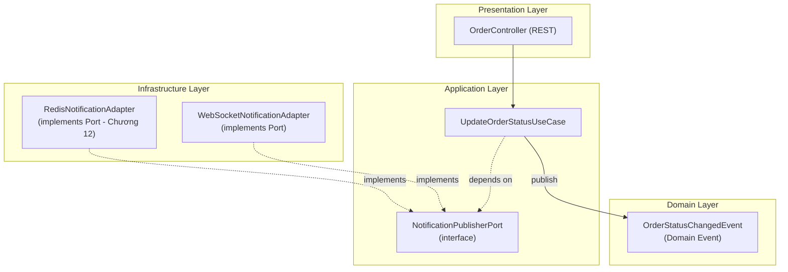
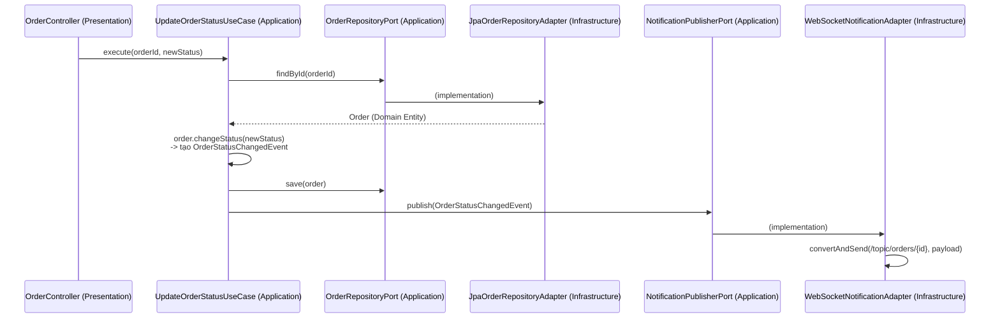

# CHƯƠNG 6 — WEBSOCKET VỚI CLEAN ARCHITECTURE

## 🎯 1. Learning Objectives

- Áp dụng **Clean Architecture** (Domain → Application → Infrastructure → Presentation) cho
  hệ thống WebSocket.
- Thiết kế **Port & Adapter** (Hexagonal Architecture) cho việc gửi notification.
- Refactor `NotificationPublisher` (Chương 5) thành `NotificationPublisherPort` (interface) +
  `WebSocketNotificationAdapter` (implementation).
- Hiểu cách Domain Layer **hoàn toàn không biết** đến sự tồn tại của WebSocket/STOMP.

---

## 📖 2. Lý thuyết

### 2.1. Vấn đề với code ở Chương 5

Ở Chương 5, `NotificationPublisher` **trực tiếp phụ thuộc vào `SimpMessagingTemplate`** —
một class thuộc Spring WebSocket (`infrastructure`). Điều này:

- Vi phạm **Dependency Inversion Principle**: logic nghiệp vụ "khi nào cần gửi thông báo gì"
  bị trộn lẫn với "làm thế nào để gửi qua WebSocket".
- Khó test: muốn test logic build payload, phải mock `SimpMessagingTemplate`.
- Khó thay đổi: nếu sau này muốn gửi qua **Redis Pub/Sub** (Chương 12) hoặc **SSE** song song
  với WebSocket, phải sửa trực tiếp `NotificationPublisher`.

### 2.2. Giải pháp: Hexagonal Architecture (Ports & Adapters)



**Nguyên tắc:**
- **Domain Layer**: chứa `OrderStatusChangedEvent`, các Entity/Value Object — KHÔNG import bất
  kỳ class nào từ Spring WebSocket.
- **Application Layer**: định nghĩa **Port** (`interface NotificationPublisherPort`) — đây là
  "hợp đồng" mà tầng trên (Use Case) sử dụng, nhưng không quan tâm ai implement.
- **Infrastructure Layer**: chứa **Adapter** (`WebSocketNotificationAdapter`) — implement Port,
  chứa toàn bộ chi tiết kỹ thuật về `SimpMessagingTemplate`.
- **Presentation Layer**: REST Controller hoặc WebSocket Controller — chỉ gọi Use Case.

### 2.3. Sơ đồ luồng đầy đủ (Order Status Update)



---

## 🛒 3. Ví dụ thực tế: Refactor Order Notification System

Chúng ta sẽ refactor toàn bộ ví dụ Chương 5 theo cấu trúc package chuẩn đã định nghĩa ở README.

---

## 💻 4. Complete Source Code

### 4.1. Domain Layer — `Order` (Aggregate Root) + `OrderStatusChangedEvent`

```java
package com.ecommerce.realtime.domain.order.model;

import com.ecommerce.realtime.domain.order.event.OrderStatusChangedEvent;
import lombok.Getter;

import java.util.ArrayList;
import java.util.List;

/**
 * Aggregate Root - chứa business logic thuần, không phụ thuộc Spring/JPA/WebSocket.
 */
@Getter
public class Order {

    private final String id;
    private final String userId;
    private OrderStatus status;

    // Domain Events được tích lũy, sẽ được "drain" bởi Application Layer sau khi save
    private final List<Object> domainEvents = new ArrayList<>();

    public Order(String id, String userId, OrderStatus status) {
        this.id = id;
        this.userId = userId;
        this.status = status;
    }

    /**
     * Business rule: chỉ cho phép chuyển trạng thái theo đúng quy trình.
     */
    public void changeStatus(OrderStatus newStatus) {
        if (!status.canTransitionTo(newStatus)) {
            throw new IllegalStateException(
                    "Không thể chuyển trạng thái từ " + status + " sang " + newStatus);
        }
        OrderStatus previous = this.status;
        this.status = newStatus;
        this.domainEvents.add(OrderStatusChangedEvent.of(id, userId, previous.name(), newStatus.name()));
    }

    public List<Object> pullDomainEvents() {
        List<Object> events = new ArrayList<>(domainEvents);
        domainEvents.clear();
        return events;
    }
}
```

### 4.2. Domain Layer — `OrderStatus` (Value Object / Enum)

```java
package com.ecommerce.realtime.domain.order.model;

import java.util.Set;

public enum OrderStatus {
    PENDING, CONFIRMED, PACKED, SHIPPING, DELIVERED, CANCELLED;

    private static final java.util.Map<OrderStatus, Set<OrderStatus>> TRANSITIONS = java.util.Map.of(
            PENDING,   Set.of(CONFIRMED, CANCELLED),
            CONFIRMED, Set.of(PACKED, CANCELLED),
            PACKED,    Set.of(SHIPPING, CANCELLED),
            SHIPPING,  Set.of(DELIVERED),
            DELIVERED, Set.of(),
            CANCELLED, Set.of()
    );

    public boolean canTransitionTo(OrderStatus target) {
        return TRANSITIONS.get(this).contains(target);
    }
}
```

### 4.3. Domain Layer — `OrderStatusChangedEvent` (đã có ở Chương 5, giữ nguyên)

```java
package com.ecommerce.realtime.domain.order.event;

import java.time.Instant;

public record OrderStatusChangedEvent(
        String orderId,
        String userId,
        String previousStatus,
        String newStatus,
        Instant occurredAt
) {
    public static OrderStatusChangedEvent of(String orderId, String userId, String prev, String next) {
        return new OrderStatusChangedEvent(orderId, userId, prev, next, Instant.now());
    }
}
```

### 4.4. Application Layer — Ports

```java
package com.ecommerce.realtime.application.order.port;

import com.ecommerce.realtime.domain.order.model.Order;
import java.util.Optional;

/**
 * Outbound Port - Application Layer định nghĩa "cần gì",
 * Infrastructure Layer sẽ implement "làm như thế nào" (JPA, in-memory, v.v.)
 */
public interface OrderRepositoryPort {
    Optional<Order> findById(String orderId);
    void save(Order order);
}
```

```java
package com.ecommerce.realtime.application.notification.port;

/**
 * Outbound Port cho việc publish notification.
 * KHÔNG có bất kỳ tham chiếu nào đến SimpMessagingTemplate / STOMP / Redis.
 */
public interface NotificationPublisherPort {
    void publish(Object domainEvent);
}
```

### 4.5. Application Layer — Use Case

```java
package com.ecommerce.realtime.application.order.usecase;

import com.ecommerce.realtime.application.notification.port.NotificationPublisherPort;
import com.ecommerce.realtime.application.order.port.OrderRepositoryPort;
import com.ecommerce.realtime.domain.order.model.Order;
import com.ecommerce.realtime.domain.order.model.OrderStatus;
import lombok.RequiredArgsConstructor;
import org.springframework.stereotype.Service;
import org.springframework.transaction.annotation.Transactional;

@Service
@RequiredArgsConstructor
public class UpdateOrderStatusUseCase {

    private final OrderRepositoryPort orderRepository;
    private final NotificationPublisherPort notificationPublisher;

    @Transactional
    public void execute(String orderId, OrderStatus newStatus) {
        Order order = orderRepository.findById(orderId)
                .orElseThrow(() -> new IllegalArgumentException("Order not found: " + orderId));

        order.changeStatus(newStatus); // Business rule trong Domain
        orderRepository.save(order);

        // Drain & publish domain events - Application Layer điều phối,
        // nhưng không biết chi tiết "publish" nghĩa là gì (WebSocket? Redis? Cả hai?)
        order.pullDomainEvents().forEach(notificationPublisher::publish);
    }
}
```

### 4.6. Infrastructure Layer — `WebSocketNotificationAdapter`

```java
package com.ecommerce.realtime.infrastructure.messaging.websocket;

import com.ecommerce.realtime.application.notification.port.NotificationPublisherPort;
import com.ecommerce.realtime.domain.order.event.OrderStatusChangedEvent;
import lombok.RequiredArgsConstructor;
import lombok.extern.slf4j.Slf4j;
import org.springframework.messaging.simp.SimpMessagingTemplate;
import org.springframework.stereotype.Component;

/**
 * Adapter - implement NotificationPublisherPort bằng STOMP/WebSocket.
 * Đây là NƠI DUY NHẤT trong toàn bộ hệ thống "biết" về SimpMessagingTemplate.
 */
@Slf4j
@Component
@RequiredArgsConstructor
public class WebSocketNotificationAdapter implements NotificationPublisherPort {

    private final SimpMessagingTemplate messagingTemplate;

    @Override
    public void publish(Object domainEvent) {
        if (domainEvent instanceof OrderStatusChangedEvent event) {
            publishOrderStatusChanged(event);
        }
        // Khi có thêm domain event khác (ProductStockChangedEvent...),
        // thêm "else if" hoặc refactor sang Strategy Pattern (Chương 5 - Bài 4)
    }

    private void publishOrderStatusChanged(OrderStatusChangedEvent event) {
        log.info("WS publish: orderId={}, status={}", event.orderId(), event.newStatus());

        messagingTemplate.convertAndSend(
                "/topic/orders/" + event.orderId(),
                new OrderStatusMessage(event.orderId(), event.newStatus(), event.occurredAt().toString())
        );
    }

    public record OrderStatusMessage(String orderId, String status, String occurredAt) {}
}
```

### 4.7. Infrastructure Layer — `JpaOrderRepositoryAdapter`

```java
package com.ecommerce.realtime.infrastructure.persistence;

import com.ecommerce.realtime.application.order.port.OrderRepositoryPort;
import com.ecommerce.realtime.domain.order.model.Order;
import com.ecommerce.realtime.domain.order.model.OrderStatus;
import lombok.RequiredArgsConstructor;
import org.springframework.stereotype.Component;

import java.util.Optional;

@Component
@RequiredArgsConstructor
public class JpaOrderRepositoryAdapter implements OrderRepositoryPort {

    private final OrderJpaRepository jpaRepository; // Spring Data JPA interface

    @Override
    public Optional<Order> findById(String orderId) {
        return jpaRepository.findById(orderId)
                .map(entity -> new Order(entity.getId(), entity.getUserId(),
                        OrderStatus.valueOf(entity.getStatus())));
    }

    @Override
    public void save(Order order) {
        OrderJpaEntity entity = jpaRepository.findById(order.getId())
                .orElse(new OrderJpaEntity(order.getId(), order.getUserId(), order.getStatus().name()));
        entity.setStatus(order.getStatus().name());
        jpaRepository.save(entity);
    }
}
```

### 4.8. Presentation Layer — `OrderController`

```java
package com.ecommerce.realtime.presentation.rest;

import com.ecommerce.realtime.application.order.usecase.UpdateOrderStatusUseCase;
import com.ecommerce.realtime.domain.order.model.OrderStatus;
import lombok.RequiredArgsConstructor;
import org.springframework.web.bind.annotation.*;

@RestController
@RequestMapping("/api/orders")
@RequiredArgsConstructor
public class OrderController {

    private final UpdateOrderStatusUseCase updateOrderStatusUseCase;

    @PutMapping("/{orderId}/status")
    public void updateStatus(@PathVariable String orderId, @RequestBody UpdateStatusRequest request) {
        updateOrderStatusUseCase.execute(orderId, OrderStatus.valueOf(request.status()));
    }

    public record UpdateStatusRequest(String status) {}
}
```

---

## 📝 5. Hands-on Exercises

**Bài 1:** Refactor code Chương 5 của bạn theo đúng cấu trúc package ở mục 4. Đảm bảo:
- Package `domain` không có import nào từ `org.springframework.web.socket` hoặc
  `org.springframework.messaging`.
- Package `application` chỉ import từ `domain` và các Port tự định nghĩa.

**Bài 2:** Viết Unit Test cho `Order.changeStatus()` (domain logic thuần, không cần Spring
context) — test các trường hợp chuyển trạng thái hợp lệ và không hợp lệ (ví dụ:
`DELIVERED -> PENDING` phải throw exception).

---

## 🚀 6. Advanced Exercises

**Bài 3:** Thêm một Adapter thứ hai: `LoggingNotificationAdapter implements NotificationPublisherPort`
chỉ ghi log mọi domain event (dùng cho audit). Sử dụng `CompositeNotificationPublisher` để
publish đến **cả hai adapter** (WebSocket + Logging) — đây chính là tiền đề cho Chương 12 khi
thêm Redis Adapter.

**Bài 4:** Domain Layer hiện tại dùng `pullDomainEvents()` (pattern "Aggregate collects events").
Hãy so sánh pattern này với việc dùng `ApplicationEventPublisher` trực tiếp trong Use Case
(Chương 5). Ưu/nhược điểm của mỗi cách trong việc giữ Domain Layer "pure"?

---

## ❓ 7. Interview Questions

1. Trong Clean Architecture, Port và Adapter khác nhau như thế nào? Cho ví dụ với WebSocket.
2. Tại sao Domain Layer không nên import bất kỳ class nào từ Spring Framework?
3. `NotificationPublisherPort` là Inbound Port hay Outbound Port? Giải thích.
4. Nếu sau này thay `SimpMessagingTemplate` bằng việc gửi qua Kafka, có bao nhiêu file cần thay đổi với kiến trúc này?
5. Aggregate Root tích lũy Domain Event rồi "drain" có ưu điểm gì so với publish trực tiếp trong Domain?

---

## 📋 8. Chapter Summary

- Clean Architecture chia hệ thống thành 4 tầng: **Domain, Application, Infrastructure, Presentation**.
- **Port** (interface trong Application) định nghĩa "hợp đồng", **Adapter** (trong Infrastructure)
  implement chi tiết kỹ thuật (WebSocket, JPA, Redis...).
- `WebSocketNotificationAdapter` là **adapter duy nhất** biết về `SimpMessagingTemplate` — toàn
  bộ phần còn lại của hệ thống độc lập với công nghệ realtime cụ thể.
- Domain Layer (`Order`, `OrderStatus`, `OrderStatusChangedEvent`) chứa business rule thuần,
  dễ test, không phụ thuộc framework.
- Kiến trúc này là nền tảng để dễ dàng thêm Redis Pub/Sub (Chương 12), Kafka (Chương 20) mà
  không phải sửa Domain/Application Layer.

---

## 🧠 9. Mindmap

```mermaid
mindmap
  root((Clean Architecture for WebSocket))
    Domain
      Order Aggregate
      OrderStatus
      OrderStatusChangedEvent
      Pure business logic
    Application
      UpdateOrderStatusUseCase
      OrderRepositoryPort
      NotificationPublisherPort
    Infrastructure
      JpaOrderRepositoryAdapter
      WebSocketNotificationAdapter
      (future) RedisNotificationAdapter
    Presentation
      OrderController REST
      WebSocket STOMP Controller
```

---

## ✅ 10. Completion Checklist

- [ ] Refactor thành công theo cấu trúc Clean Architecture (Bài 1).
- [ ] Domain Layer không có dependency vào Spring WebSocket/JPA.
- [ ] Viết và pass Unit Test cho `Order.changeStatus()` (Bài 2).
- [ ] Hiểu rõ vai trò Port vs Adapter, trả lời được các câu hỏi phỏng vấn mục 7.
- [ ] (Advanced) Triển khai `CompositeNotificationPublisher` (Bài 3).

---

## 📌 11. Reference Answers

**Bài 2 (gợi ý test):**
```java
class OrderTest {
    @Test
    void shouldTransitionFromPendingToConfirmed() {
        Order order = new Order("ORD-1", "USER-1", OrderStatus.PENDING);
        order.changeStatus(OrderStatus.CONFIRMED);
        assertEquals(OrderStatus.CONFIRMED, order.getStatus());
        assertEquals(1, order.pullDomainEvents().size());
    }

    @Test
    void shouldThrowWhenInvalidTransition() {
        Order order = new Order("ORD-1", "USER-1", OrderStatus.DELIVERED);
        assertThrows(IllegalStateException.class, () -> order.changeStatus(OrderStatus.PENDING));
    }
}
```

**Bài 3 (gợi ý code):**
```java
@Component
@Primary
@RequiredArgsConstructor
public class CompositeNotificationPublisher implements NotificationPublisherPort {

    private final List<NotificationPublisherPort> delegates; // Spring inject tất cả implementation khác

    @Override
    public void publish(Object domainEvent) {
        delegates.forEach(d -> d.publish(domainEvent));
    }
}
```
*Lưu ý:* cần đảm bảo `CompositeNotificationPublisher` không tự inject chính nó (loại trừ bằng
`@Qualifier` hoặc tách interface riêng nếu dùng `@Primary`).

**Bài 4 (gợi ý):**
- **Pattern "Aggregate collects events"** (đang dùng): Domain Layer hoàn toàn pure — không phụ
  thuộc Spring. Application Layer chủ động "drain" và quyết định publish khi nào (sau khi save
  thành công). Nhược điểm: phải nhớ gọi `pullDomainEvents()`.
- **`ApplicationEventPublisher` trực tiếp** (Chương 5): tiện lợi, tận dụng cơ chế Spring Event
  (transaction-aware via `@TransactionalEventListener`). Nhược điểm: Domain Layer hoặc Application
  Layer phải phụ thuộc vào `ApplicationEventPublisher` (một phần của Spring) — nếu muốn Domain
  Layer 100% pure, nên dùng pattern "collect events" rồi để Application Layer publish qua Spring Event.
  - [Chương 5 - Producer Consumer Pattern](./chap05.md)

- [Chương 7 - User Specific Messaging](./chap07.md)
