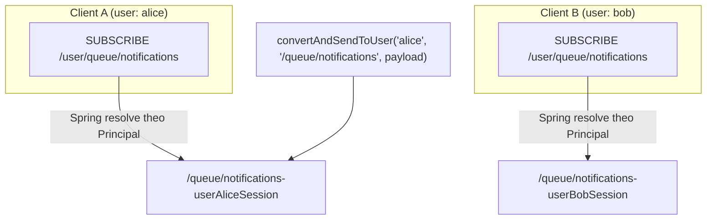
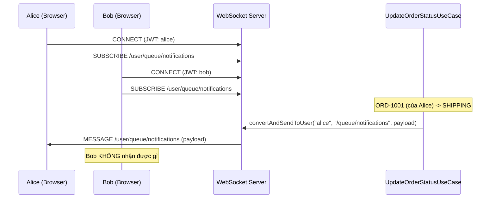
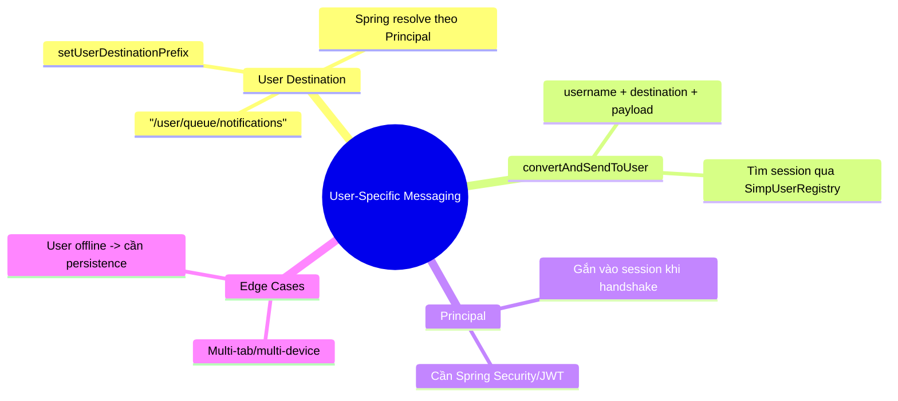

# CHƯƠNG 7 — USER-SPECIFIC MESSAGING (THÔNG BÁO CÁ NHÂN HÓA)

## 🎯 1. Learning Objectives

- Hiểu cơ chế **User Destination** trong Spring WebSocket (`/user/**`).
- Sử dụng `convertAndSendToUser()` để gửi message đến một user cụ thể.
- Hiểu vai trò của `Principal` trong việc xác định "user hiện tại" của một WebSocket session.
- Xây dựng tính năng: **chỉ chủ đơn hàng mới nhận được thông báo về đơn hàng của họ**.

---

## 📖 2. Lý thuyết

### 2.1. Vấn đề với `/topic/users/{userId}/notifications` (Chương 5-6)

Ở các chương trước, chúng ta dùng `/topic/users/{userId}/notifications` để giả lập gửi
point-to-point. Cách này có **2 vấn đề lớn**:

1. **Không an toàn**: bất kỳ client nào cũng có thể subscribe `/topic/users/{userId}/notifications`
   với `userId` của người khác (nếu biết hoặc đoán được ID).
2. **Không tận dụng session hiện tại**: server phải biết trước `userId` để build destination,
   nhưng thực tế server nên dựa vào **session đang kết nối** để xác định "gửi cho ai".

### 2.2. User Destination trong Spring

Spring cung cấp cơ chế đặc biệt: khi client subscribe đến một destination có prefix
`/user/**` (ví dụ `/user/queue/notifications`), Spring sẽ:

1. Lấy `Principal` (thông tin user đã xác thực) gắn với session đó.
2. **Chuyển đổi nội bộ** destination thành dạng duy nhất cho session, ví dụ:
   `/queue/notifications-user{sessionId}`.
3. Khi server gọi `convertAndSendToUser(username, "/queue/notifications", payload)`, Spring
   tự động tìm **đúng session** của `username` đó và gửi message đến destination thực tế.



**Điểm quan trọng:** Cả `alice` và `bob` subscribe đến **cùng một destination string**
(`/user/queue/notifications`), nhưng Spring đảm bảo mỗi người chỉ nhận message của riêng họ.

### 2.3. `Principal` — Ai là "user hiện tại"?

`Principal` là một interface Java (`java.security.Principal`) đại diện cho danh tính người dùng
đã xác thực. Trong WebSocket session, `Principal` được gắn vào session **tại thời điểm handshake**
(thường thông qua `HandshakeInterceptor` hoặc Spring Security — chi tiết ở Chương 8).

```java
public interface Principal {
    String getName(); // username, dùng làm "destination key" cho convertAndSendToUser
}
```

> **Lưu ý:** Nếu WebSocket session **không có `Principal`** (user chưa đăng nhập / chưa xác
> thực), `convertAndSendToUser` và `/user/**` subscription sẽ **không hoạt động**. Đây là lý
> do Chương 8 (JWT Authentication) là **bắt buộc** để Chương 7 hoạt động đúng trong production.

---

## 🛒 3. Ví dụ thực tế: Chỉ thông báo cho chủ đơn hàng

**Bài toán:** Khi đơn hàng `ORD-1001` (thuộc về user `alice`) chuyển sang `SHIPPING`, **chỉ
`alice`** nhận được thông báo cá nhân trên `/user/queue/notifications`. Các user khác (kể cả
đang online) **không** nhận được.



---

## 💻 4. Complete Source Code

### 4.1. Cập nhật `WebSocketNotificationAdapter` (kế thừa từ Chương 6)

```java
package com.ecommerce.realtime.infrastructure.messaging.websocket;

import com.ecommerce.realtime.application.notification.port.NotificationPublisherPort;
import com.ecommerce.realtime.domain.order.event.OrderStatusChangedEvent;
import lombok.RequiredArgsConstructor;
import lombok.extern.slf4j.Slf4j;
import org.springframework.messaging.simp.SimpMessagingTemplate;
import org.springframework.stereotype.Component;

@Slf4j
@Component
@RequiredArgsConstructor
public class WebSocketNotificationAdapter implements NotificationPublisherPort {

    private final SimpMessagingTemplate messagingTemplate;

    @Override
    public void publish(Object domainEvent) {
        if (domainEvent instanceof OrderStatusChangedEvent event) {
            // 1. Broadcast cho trang tracking công khai
            messagingTemplate.convertAndSend(
                    "/topic/orders/" + event.orderId(),
                    new OrderStatusMessage(event.orderId(), event.newStatus(), event.occurredAt().toString())
            );

            // 2. Gửi point-to-point cho ĐÚNG user là chủ đơn hàng
            // event.userId() chính là "username" mà Principal.getName() trả về
            messagingTemplate.convertAndSendToUser(
                    event.userId(),                 // username đích
                    "/queue/notifications",         // destination KHÔNG có prefix /user (Spring tự thêm)
                    NotificationPayload.fromOrderEvent(event)
            );

            log.info("Sent personalized notification to user={} for order={}",
                    event.userId(), event.orderId());
        }
    }

    public record OrderStatusMessage(String orderId, String status, String occurredAt) {}

    public record NotificationPayload(String title, String message, String orderId) {
        public static NotificationPayload fromOrderEvent(OrderStatusChangedEvent e) {
            String title = switch (e.newStatus()) {
                case "CONFIRMED" -> "Đơn hàng đã được xác nhận";
                case "SHIPPING" -> "Đơn hàng đang được giao";
                case "DELIVERED" -> "Đơn hàng đã được giao thành công";
                case "CANCELLED" -> "Đơn hàng đã bị hủy";
                default -> "Cập nhật đơn hàng";
            };
            return new NotificationPayload(title, "Đơn hàng #" + e.orderId() + " - " + e.newStatus(), e.orderId());
        }
    }
}
```

### 4.2. Client subscribe `/user/queue/notifications` (React)

```jsx
import { useEffect, useState } from "react";
import { Client } from "@stomp/stompjs";
import SockJS from "sockjs-client";

export default function NotificationBell({ jwtToken }) {
  const [notifications, setNotifications] = useState([]);

  useEffect(() => {
    const client = new Client({
      webSocketFactory: () => new SockJS("http://localhost:8080/ws"),
      connectHeaders: {
        Authorization: `Bearer ${jwtToken}`, // Chương 8: dùng để xác định Principal
      },
      onConnect: () => {
        // Mỗi user subscribe CÙNG MỘT destination string,
        // nhưng Spring đảm bảo chỉ user tương ứng nhận được message
        client.subscribe("/user/queue/notifications", (message) => {
          const payload = JSON.parse(message.body);
          setNotifications((prev) => [payload, ...prev]);
        });
      },
    });

    client.activate();
    return () => client.deactivate();
  }, [jwtToken]);

  return (
    <div>
      <h4>🔔 Thông báo của bạn ({notifications.length})</h4>
      <ul>
        {notifications.map((n, i) => (
          <li key={i}>
            <strong>{n.title}</strong>: {n.message}
          </li>
        ))}
      </ul>
    </div>
  );
}
```

### 4.3. Lưu ý cấu hình `WebSocketConfig` cho User Destination

```java
@Override
public void configureMessageBroker(MessageBrokerRegistry registry) {
    registry.enableSimpleBroker("/topic", "/queue");
    registry.setApplicationDestinationPrefixes("/app");
    registry.setUserDestinationPrefix("/user"); // Bắt buộc để convertAndSendToUser hoạt động
}
```

---

## 📝 5. Hands-on Exercises

**Bài 1:** Tạo 2 user giả lập (`alice`, `bob`) bằng cách tạm thời gắn `Principal` cứng (hard-code)
qua một `HandshakeInterceptor` đơn giản (Chương 8 sẽ làm đúng với JWT). Xác minh:
- Cả 2 cùng subscribe `/user/queue/notifications`.
- Khi đơn hàng của `alice` đổi trạng thái, chỉ `alice` nhận message.

**Bài 2:** Viết thêm tính năng: khi sản phẩm trong **wishlist** của một user giảm giá, gửi
thông báo cá nhân đến đúng user đó qua `/user/queue/wishlist-alerts`.

---

## 🚀 6. Advanced Exercises

**Bài 3:** Một user có thể mở **nhiều tab/nhiều device** cùng lúc (nhiều WebSocket session
nhưng cùng `username`). `convertAndSendToUser` có gửi đến **tất cả session** của user đó không?
Hãy kiểm tra bằng thực nghiệm (mở 2 tab cùng đăng nhập `alice`) và giải thích kết quả dựa trên
cơ chế `SimpUserRegistry`.

**Bài 4:** Thiết kế giải pháp cho tình huống: user `alice` **không online** tại thời điểm
`convertAndSendToUser` được gọi (không có session nào). Thông báo "biến mất" — làm sao để
user vẫn thấy thông báo này khi đăng nhập lại? (Gợi mở: kết hợp lưu Notification vào PostgreSQL —
Chương 10).

---

## ❓ 7. Interview Questions

1. Cơ chế nội bộ của `/user/**` destination hoạt động như thế nào? Vai trò của `SimpUserRegistry`?
2. Điều gì xảy ra nếu một WebSocket session **không có `Principal`** nhưng subscribe `/user/queue/notifications`?
3. `convertAndSendToUser("alice", "/queue/notifications", payload)` — tham số thứ 2 có cần
   prefix `/user` không? Vì sao?
4. Nếu `alice` mở 3 tab browser cùng lúc, có 3 WebSocket session với cùng `Principal`.
   `convertAndSendToUser` sẽ gửi đến bao nhiêu session?
5. So sánh ưu/nhược điểm giữa User Destination (`/user/**`) và việc tự thiết kế topic theo
   `userId` (`/topic/users/{userId}/...`) như Chương 5.

---

## 📋 8. Chapter Summary

- `/user/**` là cơ chế đặc biệt của Spring để gửi message **cá nhân hóa, an toàn**, dựa trên
  `Principal` của session.
- `convertAndSendToUser(username, destination, payload)` tự động tìm đúng session(s) của user
  và gửi đến destination nội bộ tương ứng — client luôn subscribe cùng một destination string
  (`/user/queue/...`).
- Cơ chế này **yêu cầu Authentication** (Chương 8) để mỗi WebSocket session có `Principal` hợp lệ.
- Một user có thể có nhiều session (nhiều tab/device) — `SimpUserRegistry` quản lý mapping
  này, và `convertAndSendToUser` gửi đến **tất cả** session của user đó.
- Nếu user offline, message bị "mất" — cần kết hợp lưu trữ Notification (Chương 10) để đảm bảo
  không mất thông tin.

---

## 🧠 9. Mindmap



---

## ✅ 10. Completion Checklist

- [ ] Hiểu cơ chế resolve destination của `/user/**`.
- [ ] Triển khai thành công `convertAndSendToUser` cho Order Notification (Bài 1).
- [ ] Hoàn thành tính năng Wishlist Alert (Bài 2).
- [ ] Thực nghiệm và giải thích hành vi multi-tab (Bài 3).
- [ ] Đề xuất giải pháp cho user offline (Bài 4) — chuẩn bị cho Chương 10.

---

## 📌 11. Reference Answers

**Bài 3:** `convertAndSendToUser` sẽ gửi đến **tất cả session** đang active của user đó (cả 3 tab),
vì `SimpUserRegistry` lưu mapping `username -> Set<sessionId>`. Mỗi session có một
"destination nội bộ" riêng (`/queue/notifications-user<sessionId>`), và Spring lặp qua tất cả
session của user để gửi message đến từng destination nội bộ tương ứng. Kết quả: cả 3 tab đều
nhận được thông báo.

**Bài 4 (gợi ý):**
- Lưu mọi `Notification` vào bảng `notifications` trong PostgreSQL **trước hoặc đồng thời** với
  việc gọi `convertAndSendToUser` (xem Chương 10 — Notification Domain Design).
- Khi `convertAndSendToUser` được gọi nhưng user offline, message **không đến được qua WebSocket**
  nhưng **đã được lưu vào DB** với trạng thái `UNREAD`.
- Khi user đăng nhập lại, frontend gọi REST API `GET /api/notifications?unread=true` để lấy
  danh sách thông báo chưa đọc — đảm bảo "không mất thông tin" dù WebSocket có hoạt động hay không.
- Đây là pattern **"WebSocket for realtime delivery, Database for durability"** — rất phổ biến
  trong các hệ thống notification production.
  - [Chương 6 - Clean Architecture](./chap06.md)

- [Chương 8 - Authentication & Authorization](./chap08.md)
