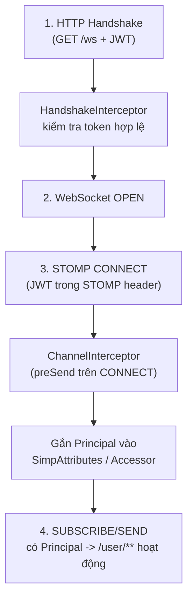
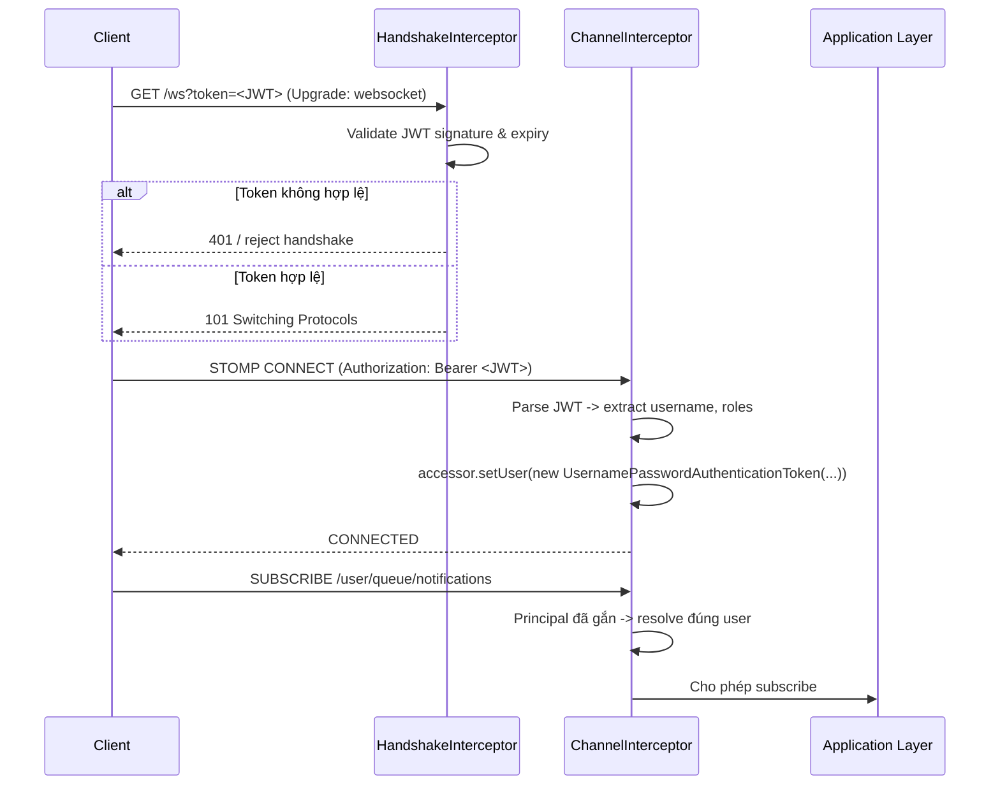
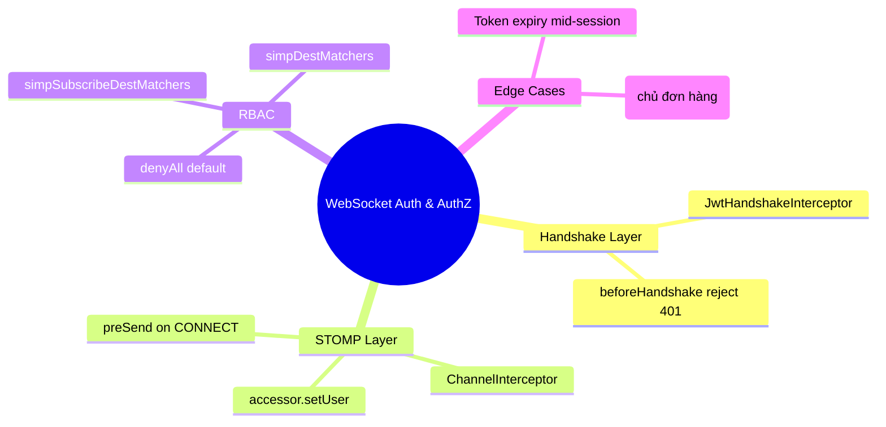

# CHƯƠNG 8 — AUTHENTICATION VÀ AUTHORIZATION CHO WEBSOCKET

## 🎯 1. Learning Objectives

- Hiểu các điểm "chèn" (interception points) để xác thực một WebSocket connection.
- Triển khai **JWT Authentication** cho WebSocket handshake và STOMP CONNECT.
- Viết **HandshakeInterceptor** và **ChannelInterceptor** để gắn `Principal` vào session.
- Cấu hình **Spring Security** cho WebSocket endpoint.
- Áp dụng **Role-Based Access Control (RBAC)** để kiểm soát quyền subscribe/send theo destination.

---

## 📖 2. Lý thuyết

### 2.1. Tại sao xác thực WebSocket khác với REST API?

Với REST API, mỗi request HTTP đều mang theo header `Authorization: Bearer <token>`, và Spring
Security xử lý xác thực **cho từng request**. Với WebSocket:

- **Handshake** (HTTP GET ban đầu) có thể mang JWT (qua header hoặc query param).
- Sau khi kết nối **OPEN**, không còn HTTP request/response riêng lẻ — toàn bộ giao tiếp diễn
  ra qua **STOMP frame** trong **một connection duy nhất**.
- Cần xác thực **2 lớp**:
  1. **Tại Handshake**: xác thực ban đầu (ai đang kết nối?).
  2. **Tại STOMP CONNECT**: gắn `Principal` vào session STOMP (quan trọng cho `/user/**`, Chương 7).



### 2.2. Hai vị trí can thiệp chính

| Vị trí | Class | Khi nào chạy | Dùng để |
|---|---|---|---|
| `HandshakeInterceptor` | `beforeHandshake()` | Trước khi WebSocket connection được thiết lập (vẫn còn là HTTP request) | Validate token sớm, từ chối kết nối nếu không hợp lệ, lưu thông tin vào `attributes` |
| `ChannelInterceptor` | `preSend()` trên `inboundChannel` | Mỗi khi có STOMP frame gửi từ client (đặc biệt là `CONNECT`) | Gắn `Principal` vào `Message` (qua `StompHeaderAccessor.setUser()`), kiểm tra quyền SUBSCRIBE/SEND |

### 2.3. Luồng JWT Authentication đầy đủ



### 2.4. Role-Based Access Control (RBAC) cho Destination

Ngoài xác thực "là ai", cần kiểm soát "được làm gì":

| Destination | Role yêu cầu | Lý do |
|---|---|---|
| `/topic/orders/{orderId}` | `USER` (và phải là chủ đơn hoặc admin) | Tránh xem đơn hàng người khác |
| `/topic/admin/dashboard/**` | `ADMIN` | Dữ liệu kinh doanh nhạy cảm |
| `/app/order/{orderId}/cancel` | `USER` (chủ đơn) hoặc `ADMIN` | Hành động nghiệp vụ quan trọng |
| `/user/queue/notifications` | `USER` (bất kỳ user đã xác thực) | Thông báo cá nhân |

---

## 🛒 3. Ví dụ thực tế: Secure WebSocket Connections cho Ecommerce

**Bài toán:** Đảm bảo:
1. Chỉ user đã đăng nhập (JWT hợp lệ) mới được kết nối WebSocket.
2. `/topic/admin/**` chỉ admin mới subscribe được.
3. `Principal` được gắn đúng để `/user/queue/notifications` hoạt động (Chương 7).

---

## 💻 4. Complete Source Code

### 4.1. `JwtHandshakeInterceptor`

```java
package com.ecommerce.realtime.infrastructure.security;

import io.jsonwebtoken.Jws;
import io.jsonwebtoken.Jwts;
import lombok.RequiredArgsConstructor;
import lombok.extern.slf4j.Slf4j;
import org.springframework.http.server.ServerHttpRequest;
import org.springframework.http.server.ServerHttpResponse;
import org.springframework.http.server.ServletServerHttpRequest;
import org.springframework.web.socket.WebSocketHandler;
import org.springframework.web.socket.server.HandshakeInterceptor;

import java.util.Map;

/**
 * Chạy TRƯỚC khi handshake hoàn tất (vẫn là HTTP request).
 * Trích xuất JWT từ query param hoặc header, validate, và lưu username vào "attributes"
 * để dùng lại ở ChannelInterceptor (vì handshake và CONNECT là 2 bước khác nhau).
 */
@Slf4j
@RequiredArgsConstructor
public class JwtHandshakeInterceptor implements HandshakeInterceptor {

    private final JwtTokenProvider jwtTokenProvider;

    @Override
    public boolean beforeHandshake(ServerHttpRequest request, ServerHttpResponse response,
                                    WebSocketHandler wsHandler, Map<String, Object> attributes) {

        String token = extractToken(request);

        if (token == null || !jwtTokenProvider.isValid(token)) {
            log.warn("WebSocket handshake rejected: invalid or missing token");
            response.setStatusCode(org.springframework.http.HttpStatus.UNAUTHORIZED);
            return false; // từ chối handshake -> client không kết nối được
        }

        Jws<io.jsonwebtoken.Claims> claims = jwtTokenProvider.parseClaims(token);
        attributes.put("username", claims.getBody().getSubject());
        attributes.put("roles", claims.getBody().get("roles"));
        return true;
    }

    @Override
    public void afterHandshake(ServerHttpRequest request, ServerHttpResponse response,
                                WebSocketHandler wsHandler, Exception exception) {
        // no-op
    }

    private String extractToken(ServerHttpRequest request) {
        if (request instanceof ServletServerHttpRequest servletRequest) {
            String authHeader = servletRequest.getServletRequest().getHeader("Authorization");
            if (authHeader != null && authHeader.startsWith("Bearer ")) {
                return authHeader.substring(7);
            }
            // Fallback: token qua query param (hữu ích vì browser WebSocket API không set header tùy ý)
            return servletRequest.getServletRequest().getParameter("token");
        }
        return null;
    }
}
```

### 4.2. `StompAuthChannelInterceptor` — gắn `Principal`

```java
package com.ecommerce.realtime.infrastructure.security;

import io.jsonwebtoken.Claims;
import lombok.RequiredArgsConstructor;
import org.springframework.messaging.Message;
import org.springframework.messaging.MessageChannel;
import org.springframework.messaging.simp.stomp.StompCommand;
import org.springframework.messaging.simp.stomp.StompHeaderAccessor;
import org.springframework.messaging.support.ChannelInterceptor;
import org.springframework.security.authentication.UsernamePasswordAuthenticationToken;
import org.springframework.security.core.GrantedAuthority;
import org.springframework.security.core.authority.SimpleGrantedAuthority;
import org.springframework.stereotype.Component;

import java.util.List;

/**
 * Chạy mỗi khi có STOMP frame đi vào. Quan trọng nhất là xử lý frame CONNECT:
 * gắn Principal vào Message để các bước sau (SUBSCRIBE, SEND, /user/**) hoạt động đúng.
 */
@Component
@RequiredArgsConstructor
public class StompAuthChannelInterceptor implements ChannelInterceptor {

    private final JwtTokenProvider jwtTokenProvider;

    @Override
    public Message<?> preSend(Message<?> message, MessageChannel channel) {
        StompHeaderAccessor accessor = StompHeaderAccessor.wrap(message);

        if (StompCommand.CONNECT.equals(accessor.getCommand())) {
            String authHeader = accessor.getFirstNativeHeader("Authorization");
            if (authHeader != null && authHeader.startsWith("Bearer ")) {
                String token = authHeader.substring(7);
                Claims claims = jwtTokenProvider.parseClaims(token).getBody();

                List<GrantedAuthority> authorities = parseRoles(claims);
                var authentication = new UsernamePasswordAuthenticationToken(
                        claims.getSubject(), null, authorities);

                // QUAN TRỌNG: setUser() gắn Principal vào session STOMP
                accessor.setUser(authentication);
            }
        }
        return message;
    }

    @SuppressWarnings("unchecked")
    private List<GrantedAuthority> parseRoles(Claims claims) {
        List<String> roles = claims.get("roles", List.class);
        if (roles == null) return List.of();
        return roles.stream().map(SimpleGrantedAuthority::new).map(GrantedAuthority.class::cast).toList();
    }
}
```

### 4.3. `WebSocketConfig` — đăng ký interceptors

```java
package com.ecommerce.realtime.infrastructure.config;

import com.ecommerce.realtime.infrastructure.security.JwtHandshakeInterceptor;
import com.ecommerce.realtime.infrastructure.security.JwtTokenProvider;
import com.ecommerce.realtime.infrastructure.security.StompAuthChannelInterceptor;
import lombok.RequiredArgsConstructor;
import org.springframework.context.annotation.Configuration;
import org.springframework.messaging.simp.config.ChannelRegistration;
import org.springframework.messaging.simp.config.MessageBrokerRegistry;
import org.springframework.web.socket.config.annotation.*;

@Configuration
@EnableWebSocketMessageBroker
@RequiredArgsConstructor
public class WebSocketConfig implements WebSocketMessageBrokerConfigurer {

    private final JwtTokenProvider jwtTokenProvider;
    private final StompAuthChannelInterceptor stompAuthChannelInterceptor;

    @Override
    public void registerStompEndpoints(StompEndpointRegistry registry) {
        registry.addEndpoint("/ws")
                .addInterceptors(new JwtHandshakeInterceptor(jwtTokenProvider))
                .setAllowedOriginPatterns("https://shop.example.com")
                .withSockJS();
    }

    @Override
    public void configureMessageBroker(MessageBrokerRegistry registry) {
        registry.enableSimpleBroker("/topic", "/queue");
        registry.setApplicationDestinationPrefixes("/app");
        registry.setUserDestinationPrefix("/user");
    }

    @Override
    public void configureClientInboundChannel(ChannelRegistration registration) {
        registration.interceptors(stompAuthChannelInterceptor);
    }
}
```

### 4.4. RBAC — `MessageSecurityConfig`

```java
package com.ecommerce.realtime.infrastructure.security;

import org.springframework.context.annotation.Configuration;
import org.springframework.messaging.simp.config.ChannelRegistration;
import org.springframework.security.config.annotation.web.messaging.MessageSecurityMetadataSourceRegistry;
import org.springframework.security.config.annotation.web.socket.AbstractSecurityWebSocketMessageBrokerConfigurer;
import org.springframework.security.messaging.context.AuthenticationPrincipalArgumentResolver;

@Configuration
public class MessageSecurityConfig extends AbstractSecurityWebSocketMessageBrokerConfigurer {

    @Override
    protected void configureInbound(MessageSecurityMetadataSourceRegistry messages) {
        messages
                // CONNECT, DISCONNECT luôn cho phép (đã xác thực ở Handshake/CONNECT interceptor)
                .nullDestMatcher().permitAll()
                // Chỉ ADMIN mới subscribe được dashboard
                .simpSubscribeDestMatchers("/topic/admin/**").hasRole("ADMIN")
                // User cá nhân - chỉ cần đã đăng nhập
                .simpSubscribeDestMatchers("/user/queue/**").authenticated()
                // Order tracking - cần đăng nhập (kiểm tra chủ đơn ở Application Layer)
                .simpSubscribeDestMatchers("/topic/orders/**").authenticated()
                // Gửi lệnh hủy đơn - cần đăng nhập
                .simpDestMatchers("/app/order/*/cancel").authenticated()
                .anyMessage().denyAll(); // Mặc định: deny tất cả - whitelist approach
    }

    @Override
    protected boolean sameOriginDisabled() {
        // Tắt kiểm tra CSRF token cho STOMP (Chương 17 sẽ phân tích kỹ trade-off này)
        return true;
    }
}
```

### 4.5. `JwtTokenProvider` (tóm tắt)

```java
package com.ecommerce.realtime.infrastructure.security;

import io.jsonwebtoken.Claims;
import io.jsonwebtoken.Jws;
import io.jsonwebtoken.Jwts;
import io.jsonwebtoken.security.Keys;
import org.springframework.beans.factory.annotation.Value;
import org.springframework.stereotype.Component;

import javax.crypto.SecretKey;

@Component
public class JwtTokenProvider {

    private final SecretKey secretKey;

    public JwtTokenProvider(@Value("${jwt.secret}") String secret) {
        this.secretKey = Keys.hmacShaKeyFor(secret.getBytes());
    }

    public boolean isValid(String token) {
        try {
            parseClaims(token);
            return true;
        } catch (Exception e) {
            return false;
        }
    }

    public Jws<Claims> parseClaims(String token) {
        return Jwts.parserBuilder().setSigningKey(secretKey).build().parseClaimsJws(token);
    }
}
```

---

## 📝 5. Hands-on Exercises

**Bài 1:** Tích hợp JWT Authentication vào project hiện tại:
- Tạo endpoint REST `/api/auth/login` trả về JWT (có `sub` = username, claim `roles`).
- Cấu hình `JwtHandshakeInterceptor` và `StompAuthChannelInterceptor`.
- Test: kết nối không có token → bị từ chối; kết nối có token hợp lệ → `Principal` được gắn
  đúng (verify qua `/user/queue/notifications` từ Chương 7).

**Bài 2:** Thêm rule RBAC: user với role `USER` không được subscribe `/topic/admin/dashboard/orders`.
Test bằng cách thử subscribe với token role `USER` và xác nhận nhận được `ERROR` frame.

---

## 🚀 6. Advanced Exercises

**Bài 3:** Xử lý tình huống **token hết hạn giữa session** (WebSocket connection vẫn OPEN nhưng
JWT đã expire). Đề xuất 2 giải pháp:
- (a) Đóng connection khi access token hết hạn (kiểm tra định kỳ).
- (b) Cho phép connection tiếp tục nhưng từ chối các hành động yêu cầu quyền cao hơn.

So sánh trade-off của 2 cách.

**Bài 4:** Thiết kế kiểm tra "chủ đơn hàng" cho `/topic/orders/{orderId}`: `MessageSecurityConfig`
chỉ kiểm tra "đã đăng nhập", nhưng không kiểm tra `orderId` có thuộc về user hiện tại hay không.
Viết một `ChannelInterceptor` bổ sung kiểm tra điều này tại `SUBSCRIBE`, trả về `ERROR` nếu
không đúng chủ đơn (trừ khi user có role `ADMIN`).

---

## ❓ 7. Interview Questions

1. Vì sao cần cả `HandshakeInterceptor` và `ChannelInterceptor` để xác thực WebSocket bằng JWT?
2. `accessor.setUser()` trong `ChannelInterceptor` có tác dụng gì đối với `/user/**` destination?
3. RBAC cho WebSocket khác gì so với RBAC cho REST API (`@PreAuthorize`)?
4. Nếu không cấu hình `sameOriginDisabled()`, điều gì xảy ra với STOMP message từ cross-origin client?
5. Một token JWT hết hạn giữa lúc WebSocket session đang mở — hệ thống của bạn xử lý thế nào?

---

## 📋 8. Chapter Summary

- WebSocket cần xác thực ở **2 lớp**: `HandshakeInterceptor` (HTTP handshake) và
  `ChannelInterceptor` (STOMP CONNECT) — lớp sau gắn `Principal` vào session.
- `Principal` là điều kiện **bắt buộc** để `/user/**` (Chương 7) hoạt động.
- `AbstractSecurityWebSocketMessageBrokerConfigurer` cho phép định nghĩa RBAC theo destination
  (`simpSubscribeDestMatchers`, `simpDestMatchers`).
- Theo nguyên tắc **whitelist** (`anyMessage().denyAll()`), chỉ những destination được khai báo
  rõ mới được phép.
- Việc kiểm tra "ownership" (chủ đơn hàng) cần logic bổ sung ngoài RBAC theo role thông thường.

---

## 🧠 9. Mindmap



---

## ✅ 10. Completion Checklist

- [ ] Triển khai thành công `JwtHandshakeInterceptor` + `StompAuthChannelInterceptor`.
- [ ] `/user/queue/notifications` nhận đúng message cho từng user (kết quả từ Chương 7 + Auth).
- [ ] Cấu hình RBAC cho `/topic/admin/**`.
- [ ] Hoàn thành Bài 1, Bài 2.
- [ ] (Advanced) Triển khai kiểm tra ownership cho `/topic/orders/{orderId}` (Bài 4).

---

## 📌 11. Reference Answers

**Bài 3 (gợi ý):**
- **(a) Đóng connection khi token hết hạn**: an toàn hơn (đảm bảo mọi hành động đều với
  identity hợp lệ), nhưng UX kém — user đang xem trang tracking có thể bị "rớt kết nối" đột
  ngột. Cần kết hợp với **refresh token qua REST**, sau đó client reconnect WebSocket với token mới.
- **(b) Cho phép connection tiếp tục, chỉ chặn hành động nhạy cảm**: UX tốt hơn (vẫn nhận
  thông báo realtime), nhưng phức tạp hơn — cần kiểm tra expiry tại **mỗi `SEND`** (không chỉ
  CONNECT), vì `Principal` được gắn 1 lần tại CONNECT và không tự refresh.
- **Khuyến nghị production**: dùng (b) cho các hành động đọc (SUBSCRIBE để nhận update), dùng
  kiểm tra token mới (qua REST/refresh) cho các hành động viết quan trọng (`/app/order/*/cancel`).

**Bài 4 (gợi ý code):**
```java
@Component
@RequiredArgsConstructor
public class OrderSubscriptionAuthorizationInterceptor implements ChannelInterceptor {

    private final OrderRepositoryPort orderRepository;

    @Override
    public Message<?> preSend(Message<?> message, MessageChannel channel) {
        StompHeaderAccessor accessor = StompHeaderAccessor.wrap(message);

        if (StompCommand.SUBSCRIBE.equals(accessor.getCommand())) {
            String destination = accessor.getDestination();
            if (destination != null && destination.startsWith("/topic/orders/")) {
                String orderId = destination.substring("/topic/orders/".length());
                Authentication auth = (Authentication) accessor.getUser();

                boolean isAdmin = auth.getAuthorities().stream()
                        .anyMatch(a -> a.getAuthority().equals("ROLE_ADMIN"));

                if (!isAdmin) {
                    Order order = orderRepository.findById(orderId)
                            .orElseThrow(() -> new IllegalArgumentException("Order not found"));
                    if (!order.getUserId().equals(auth.getName())) {
                        throw new org.springframework.messaging.MessagingException(
                                "Không có quyền theo dõi đơn hàng này");
                    }
                }
            }
        }
        return message;
    }
}
```
Đăng ký interceptor này **sau** `StompAuthChannelInterceptor` trong `configureClientInboundChannel`
để đảm bảo `Principal` đã được gắn trước khi kiểm tra ownership.