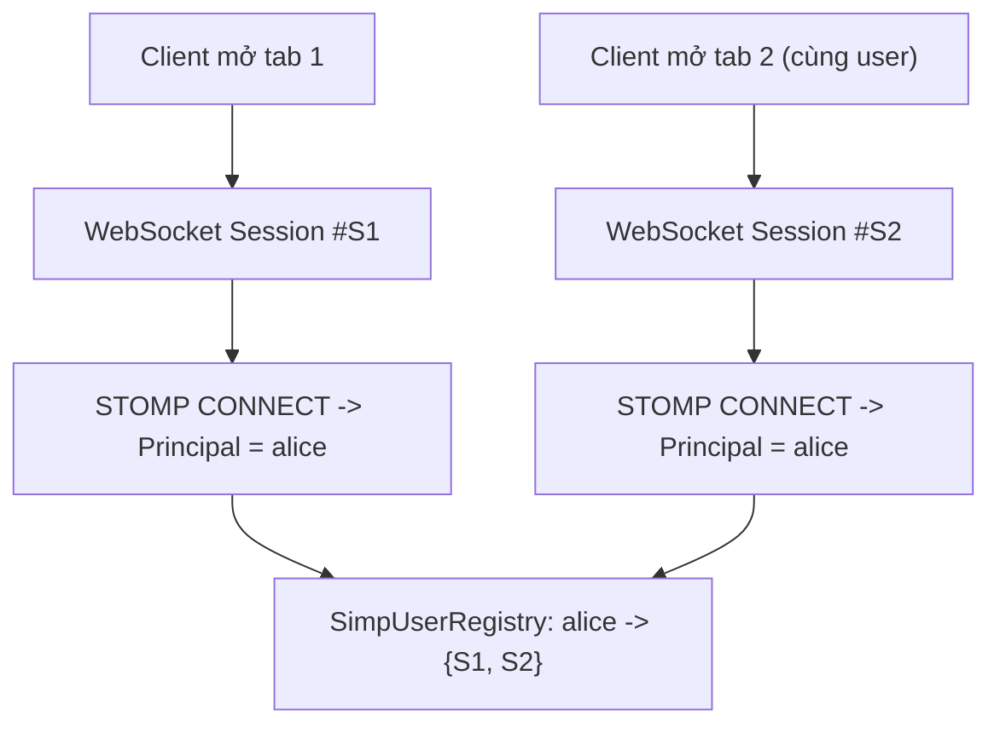
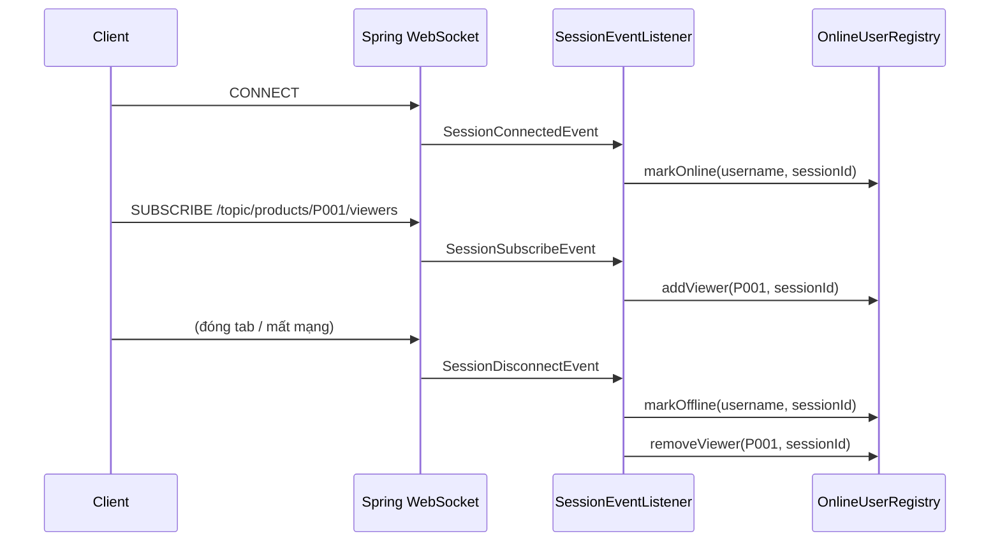
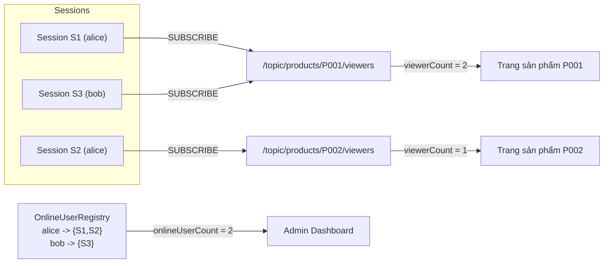
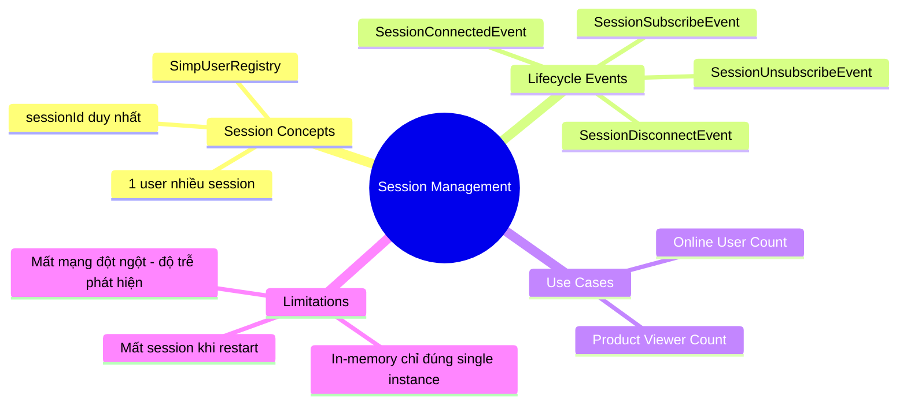

# CHƯƠNG 9 — SESSION MANAGEMENT (QUẢN LÝ SESSION & ONLINE USER)

## 🎯 1. Learning Objectives

- Hiểu cách Spring quản lý **WebSocket Session** ở tầng STOMP (`SimpUserRegistry`, `sessionId`).
- Xây dựng **User Registry** tùy chỉnh để theo dõi user online theo thời gian thực.
- Lắng nghe các sự kiện `SessionConnectEvent`, `SessionDisconnectEvent`, `SessionSubscribeEvent`.
- Xử lý **Concurrent Connections** (1 user, nhiều session/tab/device).
- Xây dựng tính năng **Online User Monitoring** cho Ecommerce (ví dụ: hiển thị "X người đang xem sản phẩm này").

---

## 📖 2. Lý thuyết

### 2.1. Session trong WebSocket/STOMP là gì?

Mỗi khi client thực hiện handshake WebSocket thành công, Spring tạo ra một
**`WebSocketSession`** (tầng transport) và một **STOMP session** tương ứng (tầng ứng dụng),
được định danh bởi một `sessionId` duy nhất.



- **1 user** có thể có **N session** (nhiều tab, nhiều thiết bị).
- **1 session** chỉ thuộc về **1 user** (hoặc anonymous nếu không xác thực).
- `SimpUserRegistry` (Spring cung cấp sẵn) lưu mapping `username -> Set<session>` — đây là
  nền tảng cho `convertAndSendToUser` (Chương 7).

### 2.2. Application Events của Spring WebSocket

Spring publish các **Application Event** tại các thời điểm quan trọng trong lifecycle của
session — chúng ta có thể lắng nghe bằng `@EventListener`:

| Event | Khi nào xảy ra | Dùng để |
|---|---|---|
| `SessionConnectEvent` | Client gửi STOMP `CONNECT` | Ghi log, khởi tạo session metadata |
| `SessionConnectedEvent` | Server gửi `CONNECTED` thành công | Đánh dấu user online |
| `SessionSubscribeEvent` | Client `SUBSCRIBE` đến một destination | Theo dõi "ai đang xem cái gì" |
| `SessionUnsubscribeEvent` | Client `UNSUBSCRIBE` | Cập nhật lại bộ đếm viewer |
| `SessionDisconnectEvent` | Connection đóng (chủ động hoặc do lỗi) | Đánh dấu user offline, dọn dẹp registry |



### 2.3. Concurrent Connections — Bài toán "1 user nhiều session"

Khi xây dựng "Online User Monitoring", cần trả lời câu hỏi: *"User `alice` có online không?"*
— câu trả lời **không thể** chỉ dựa vào 1 session, vì `alice` có thể có 3 tab, trong đó 2 tab
đã đóng nhưng 1 tab vẫn mở.

**Giải pháp:** dùng cấu trúc `Map<String userId, Set<String sessionId>>`:
- User online ⟺ `Set<sessionId>` không rỗng.
- Khi `SessionDisconnectEvent` xảy ra cho `sessionId` X, **remove X khỏi set** — nếu set rỗng
  → user chính thức offline.

---

## 🛒 3. Ví dụ thực tế: Online User Monitoring trong Ecommerce

**Use case 1 — Admin Dashboard:** hiển thị tổng số khách hàng đang online theo thời gian thực.

**Use case 2 — Trang sản phẩm:** hiển thị "🔥 23 người đang xem sản phẩm này" (tạo cảm giác
khan hàng — phổ biến trong các sàn Ecommerce như Shopee, Lazada).



---

## 💻 4. Complete Source Code

### 4.1. Domain/Application — `OnlineUserRegistryPort`

```java
package com.ecommerce.realtime.application.session.port;

import java.util.Set;

/**
 * Port - định nghĩa "hợp đồng" quản lý user online,
 * không quan tâm implementation dùng in-memory hay Redis (Chương 11-12).
 */
public interface OnlineUserRegistryPort {
    void addSession(String userId, String sessionId);
    void removeSession(String userId, String sessionId);
    boolean isOnline(String userId);
    int countOnlineUsers();
    Set<String> getOnlineUserIds();
}
```

### 4.2. Infrastructure — `InMemoryOnlineUserRegistry`

```java
package com.ecommerce.realtime.infrastructure.session;

import com.ecommerce.realtime.application.session.port.OnlineUserRegistryPort;
import org.springframework.stereotype.Component;

import java.util.Set;
import java.util.concurrent.ConcurrentHashMap;

/**
 * Implementation đơn giản, in-memory - phù hợp với single-instance.
 * Ở Chương 11-12, sẽ thay bằng RedisOnlineUserRegistry để hoạt động đúng
 * khi có nhiều instance (horizontal scaling).
 */
@Component
public class InMemoryOnlineUserRegistry implements OnlineUserRegistryPort {

    // userId -> Set<sessionId>
    private final ConcurrentHashMap<String, Set<String>> userSessions = new ConcurrentHashMap<>();

    @Override
    public void addSession(String userId, String sessionId) {
        userSessions.computeIfAbsent(userId, k -> ConcurrentHashMap.newKeySet()).add(sessionId);
    }

    @Override
    public void removeSession(String userId, String sessionId) {
        userSessions.computeIfPresent(userId, (k, sessions) -> {
            sessions.remove(sessionId);
            return sessions.isEmpty() ? null : sessions; // remove key nếu rỗng
        });
    }

    @Override
    public boolean isOnline(String userId) {
        return userSessions.containsKey(userId);
    }

    @Override
    public int countOnlineUsers() {
        return userSessions.size();
    }

    @Override
    public Set<String> getOnlineUserIds() {
        return Set.copyOf(userSessions.keySet());
    }
}
```

### 4.3. `WebSocketSessionEventListener` — lắng nghe lifecycle event

```java
package com.ecommerce.realtime.infrastructure.session;

import com.ecommerce.realtime.application.session.port.OnlineUserRegistryPort;
import lombok.RequiredArgsConstructor;
import lombok.extern.slf4j.Slf4j;
import org.springframework.context.event.EventListener;
import org.springframework.messaging.simp.SimpMessagingTemplate;
import org.springframework.messaging.simp.stomp.StompHeaderAccessor;
import org.springframework.stereotype.Component;
import org.springframework.web.socket.messaging.SessionConnectedEvent;
import org.springframework.web.socket.messaging.SessionDisconnectEvent;

import java.security.Principal;

@Slf4j
@Component
@RequiredArgsConstructor
public class WebSocketSessionEventListener {

    private final OnlineUserRegistryPort onlineUserRegistry;
    private final SimpMessagingTemplate messagingTemplate;

    @EventListener
    public void handleSessionConnected(SessionConnectedEvent event) {
        StompHeaderAccessor accessor = StompHeaderAccessor.wrap(event.getMessage());
        Principal user = accessor.getUser();
        if (user == null) return; // anonymous session - bỏ qua (production: có thể track riêng)

        onlineUserRegistry.addSession(user.getName(), accessor.getSessionId());
        log.info("User CONNECTED: userId={}, sessionId={}, totalOnline={}",
                user.getName(), accessor.getSessionId(), onlineUserRegistry.countOnlineUsers());

        broadcastOnlineCount();
    }

    @EventListener
    public void handleSessionDisconnect(SessionDisconnectEvent event) {
        StompHeaderAccessor accessor = StompHeaderAccessor.wrap(event.getMessage());
        Principal user = accessor.getUser();
        if (user == null) return;

        onlineUserRegistry.removeSession(user.getName(), accessor.getSessionId());
        log.info("User DISCONNECTED: userId={}, sessionId={}, totalOnline={}",
                user.getName(), accessor.getSessionId(), onlineUserRegistry.countOnlineUsers());

        broadcastOnlineCount();
    }

    private void broadcastOnlineCount() {
        messagingTemplate.convertAndSend(
                "/topic/admin/dashboard/online-users",
                new OnlineUserCountPayload(onlineUserRegistry.countOnlineUsers()));
    }

    public record OnlineUserCountPayload(int onlineCount) {}
}
```

### 4.4. Tracking "Đang xem sản phẩm" — `ProductViewerTracker`

```java
package com.ecommerce.realtime.infrastructure.session;

import lombok.RequiredArgsConstructor;
import org.springframework.context.event.EventListener;
import org.springframework.messaging.simp.SimpMessagingTemplate;
import org.springframework.messaging.simp.stomp.StompHeaderAccessor;
import org.springframework.stereotype.Component;
import org.springframework.web.socket.messaging.SessionSubscribeEvent;
import org.springframework.web.socket.messaging.SessionUnsubscribeEvent;
import org.springframework.web.socket.messaging.SessionDisconnectEvent;

import java.util.Set;
import java.util.concurrent.ConcurrentHashMap;
import java.util.regex.Matcher;
import java.util.regex.Pattern;

/**
 * Theo dõi số lượng session đang subscribe /topic/products/{productId}/viewers
 * -> broadcast lại số người đang xem sản phẩm theo thời gian thực.
 */
@Component
@RequiredArgsConstructor
public class ProductViewerTracker {

    private static final Pattern PRODUCT_TOPIC = Pattern.compile("^/topic/products/(.+)/viewers$");

    private final SimpMessagingTemplate messagingTemplate;

    // productId -> Set<sessionId>
    private final ConcurrentHashMap<String, Set<String>> viewers = new ConcurrentHashMap<>();
    // sessionId -> productId (để cleanup khi disconnect)
    private final ConcurrentHashMap<String, String> sessionToProduct = new ConcurrentHashMap<>();

    @EventListener
    public void onSubscribe(SessionSubscribeEvent event) {
        StompHeaderAccessor accessor = StompHeaderAccessor.wrap(event.getMessage());
        String destination = accessor.getDestination();
        if (destination == null) return;

        Matcher matcher = PRODUCT_TOPIC.matcher(destination);
        if (matcher.matches()) {
            String productId = matcher.group(1);
            String sessionId = accessor.getSessionId();

            viewers.computeIfAbsent(productId, k -> ConcurrentHashMap.newKeySet()).add(sessionId);
            sessionToProduct.put(sessionId, productId);

            broadcastViewerCount(productId);
        }
    }

    @EventListener
    public void onUnsubscribe(SessionUnsubscribeEvent event) {
        cleanupSession(StompHeaderAccessor.wrap(event.getMessage()).getSessionId());
    }

    @EventListener
    public void onDisconnect(SessionDisconnectEvent event) {
        cleanupSession(StompHeaderAccessor.wrap(event.getMessage()).getSessionId());
    }

    private void cleanupSession(String sessionId) {
        String productId = sessionToProduct.remove(sessionId);
        if (productId == null) return;

        Set<String> sessions = viewers.get(productId);
        if (sessions != null) {
            sessions.remove(sessionId);
            if (sessions.isEmpty()) viewers.remove(productId);
        }
        broadcastViewerCount(productId);
    }

    private void broadcastViewerCount(String productId) {
        int count = viewers.getOrDefault(productId, Set.of()).size();
        messagingTemplate.convertAndSend(
                "/topic/products/" + productId + "/viewers",
                new ViewerCountPayload(productId, count));
    }

    public record ViewerCountPayload(String productId, int viewerCount) {}
}
```

---

## 📝 5. Hands-on Exercises

**Bài 1:** Triển khai `InMemoryOnlineUserRegistry` và `WebSocketSessionEventListener`. Test:
- Mở 2 tab cùng user `alice` → `countOnlineUsers()` vẫn = 1.
- Đóng cả 2 tab → `countOnlineUsers()` = 0.
- Subscribe `/topic/admin/dashboard/online-users` và quan sát số liệu cập nhật realtime.

**Bài 2:** Triển khai `ProductViewerTracker`. Test với 3 client cùng subscribe
`/topic/products/P001/viewers`, sau đó 1 client unsubscribe — xác nhận `viewerCount` giảm
đúng và được broadcast lại.

---

## 🚀 6. Advanced Exercises

**Bài 3:** `SessionDisconnectEvent` có thể xảy ra do: (a) user chủ động đóng tab/gọi
`DISCONNECT`, hoặc (b) mất mạng đột ngột (không có Close Frame — Chương 2, code 1006).
Spring có phân biệt 2 trường hợp này không? Nếu có độ trễ trong việc phát hiện (b), điều đó
ảnh hưởng gì đến độ chính xác của "Online User Count"? Đề xuất giải pháp giảm thiểu (gợi ý:
heartbeat timeout — Chương 18).

**Bài 4:** Thiết kế lại `InMemoryOnlineUserRegistry` để hoạt động đúng khi deploy **nhiều
instance** (Chương 11): tại sao `ConcurrentHashMap` in-memory sẽ cho ra kết quả "Online User
Count" SAI nếu mỗi instance chỉ biết về session kết nối đến chính nó? Phác thảo giải pháp
dùng Redis (gợi mở Chương 12).

---

## ❓ 7. Interview Questions

1. Phân biệt `SessionConnectEvent` và `SessionConnectedEvent`.
2. Tại sao "Online User Count" không thể tính bằng cách đếm số WebSocket session đang mở?
3. `SimpUserRegistry` của Spring có sẵn — vì sao chương này vẫn xây dựng `OnlineUserRegistryPort` riêng?
4. Điều gì xảy ra với dữ liệu trong `InMemoryOnlineUserRegistry` nếu ứng dụng restart? Ảnh hưởng thế nào đến "Online User Count"?
5. Làm sao phát hiện một session đã "chết" (client mất mạng) nhưng server chưa nhận được `SessionDisconnectEvent`?

---

## 📋 8. Chapter Summary

- Mỗi WebSocket connection tương ứng với **1 STOMP session** (`sessionId`), nhưng **1 user**
  có thể có **N session** (multi-tab/device).
- Spring publish các event lifecycle: `SessionConnectedEvent`, `SessionSubscribeEvent`,
  `SessionUnsubscribeEvent`, `SessionDisconnectEvent` — là nền tảng để xây dựng session tracking.
- "Online User Count" = số **user** có ít nhất 1 session, không phải số session.
- `ProductViewerTracker` minh họa pattern theo dõi subscription để xây dựng tính năng
  "X người đang xem" — rất phổ biến trong Ecommerce.
- In-memory registry chỉ đúng với **single-instance** — Chương 11-12 sẽ giải quyết bài toán
  multi-instance bằng Redis.

---

## 🧠 9. Mindmap



---

## ✅ 10. Completion Checklist

- [ ] Triển khai `OnlineUserRegistryPort` + `InMemoryOnlineUserRegistry`.
- [ ] `WebSocketSessionEventListener` hoạt động đúng với multi-tab (Bài 1).
- [ ] `ProductViewerTracker` broadcast đúng viewer count (Bài 2).
- [ ] Hiểu rõ hạn chế của in-memory registry trong môi trường multi-instance (Bài 4).

---

## 📌 11. Reference Answers

**Bài 3 (gợi ý):**
Spring **không phân biệt rõ ràng** giữa 2 nguyên nhân ở tầng `SessionDisconnectEvent` — cả hai
đều dẫn đến event này, nhưng với **độ trễ khác nhau**: (a) gần như ngay lập tức, (b) chỉ được
phát hiện khi **TCP timeout** hoặc **STOMP heartbeat timeout** xảy ra (có thể vài chục giây).
Trong khoảng thời gian này, "Online User Count" có thể bị **đếm dư** (overcount) — hiển thị
user vẫn online dù họ đã mất mạng. Giải pháp: cấu hình **heartbeat interval ngắn** (Chương 18,
ví dụ 10s/10s) để giảm thời gian phát hiện mất kết nối, đánh đổi với việc tăng traffic heartbeat.

**Bài 4 (gợi ý):**
Nếu hệ thống có 2 instance (A và B) phía sau load balancer, user `alice` kết nối đến instance A,
user `bob` kết nối đến instance B. `InMemoryOnlineUserRegistry` trên **instance A chỉ biết về
alice**, trên **instance B chỉ biết về bob**. Nếu Admin Dashboard kết nối đến instance A và
subscribe `/topic/admin/dashboard/online-users`, nó **chỉ thấy `countOnlineUsers() = 1`** (chỉ
alice), trong khi thực tế có 2 user online — **kết quả sai**.

Giải pháp: dùng **Redis** làm "single source of truth" cho session registry:
- Khi user connect: `SADD online_users:{userId} {instanceId}:{sessionId}`
- Khi user disconnect: `SREM online_users:{userId} {instanceId}:{sessionId}`
- `countOnlineUsers()` = số key pattern `online_users:*` có ít nhất 1 member
- Mỗi instance khi cần broadcast "online count" sẽ **đọc từ Redis** (shared state) thay vì
  ConcurrentHashMap riêng của từng instance — chi tiết triển khai ở Chương 12.
- [Chương 8 - Authentication & Authorization](./chap08.md)

- [Chương 10 - Notification System](./chap10.md)
