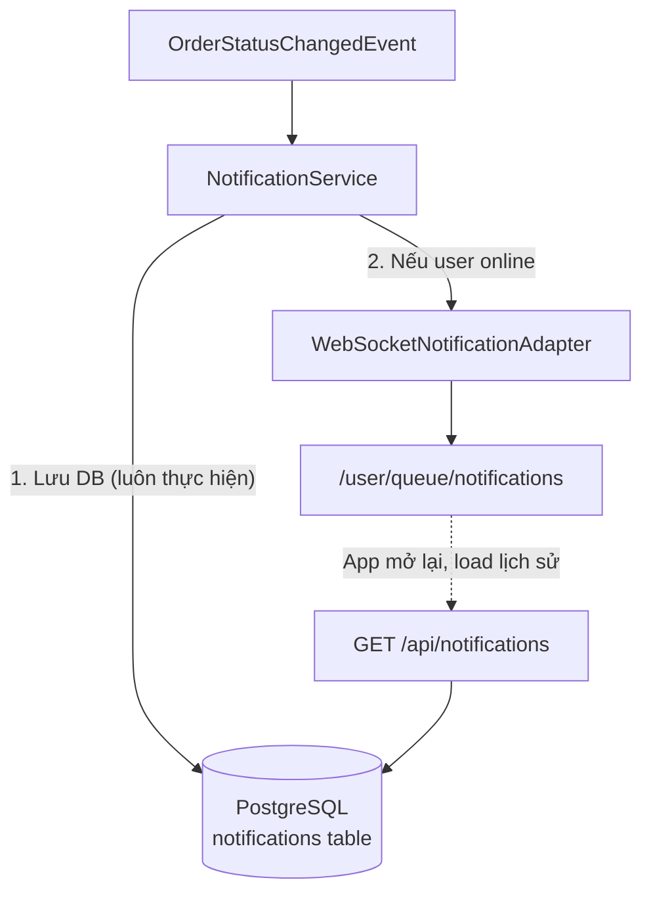
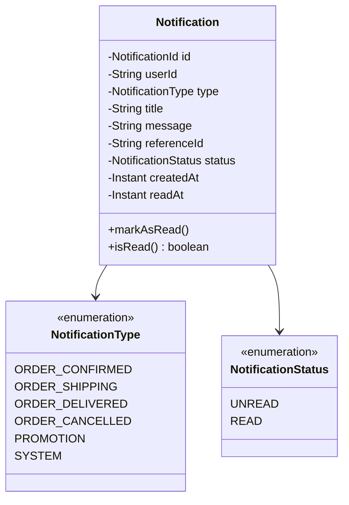
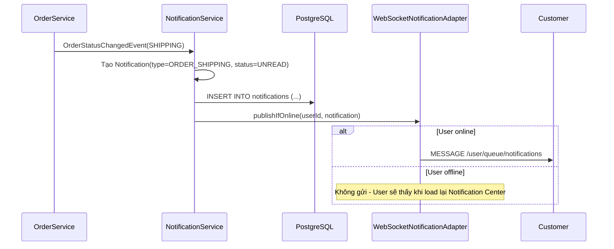
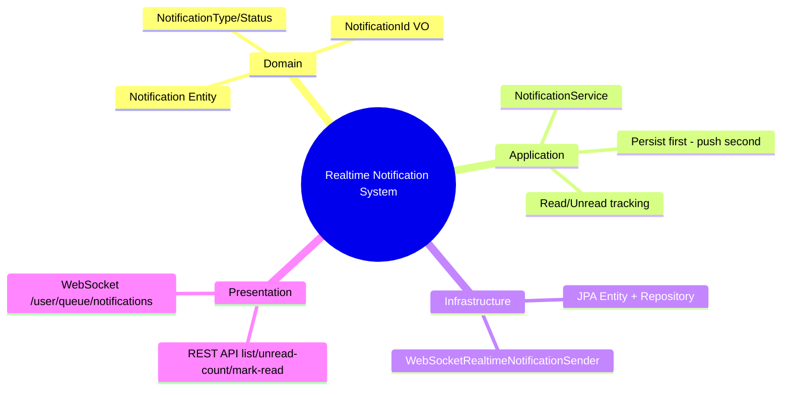

# CHƯƠNG 10 — REALTIME NOTIFICATION SYSTEM (HỆ THỐNG THÔNG BÁO HOÀN CHỈNH)

## 🎯 1. Learning Objectives

- Thiết kế **Notification Domain** theo DDD: Entity, Value Object, Repository.
- Định nghĩa các **Notification Event** chuẩn cho luồng đơn hàng:
  `OrderConfirmed`, `OrderShipping`, `OrderDelivered`.
- Xây dựng `NotificationService` kết hợp **WebSocket (realtime)** và **PostgreSQL (durability)**.
- Triển khai **Read/Unread Tracking**.
- Xây dựng **Notification Center** hoàn chỉnh (REST API + WebSocket).

---

## 📖 2. Lý thuyết

### 2.1. Vì sao cần lưu Notification vào Database?

Ở Chương 7, chúng ta đã nhận ra: nếu user offline, `convertAndSendToUser` sẽ "mất" message.
Một **Notification Center** đúng nghĩa (giống Shopee, Tiki, Lazada) cần:

1. **Persistent storage**: mọi thông báo được lưu vào PostgreSQL — user xem lại được dù đã offline.
2. **Realtime delivery**: nếu user đang online, đẩy ngay qua WebSocket.
3. **Read/Unread tracking**: user biết thông báo nào đã đọc/chưa đọc.
4. **REST API**: để load danh sách thông báo khi mở app (không chỉ dựa vào WebSocket).



### 2.2. Notification Domain Model (DDD)



**Value Object `NotificationId`**: thay vì dùng `String`/`Long` trực tiếp, bọc trong Value
Object giúp tránh nhầm lẫn (ví dụ truyền `orderId` vào chỗ cần `notificationId`).

### 2.3. Notification Events trong Order Lifecycle

| Sự kiện Domain | Notification Type | Title (Tiếng Việt) |
|---|---|---|
| `OrderConfirmed` | `ORDER_CONFIRMED` | "Đơn hàng đã được xác nhận" |
| `OrderShipping` | `ORDER_SHIPPING` | "Đơn hàng đang được giao" |
| `OrderDelivered` | `ORDER_DELIVERED` | "Đơn hàng đã giao thành công" |
| `OrderCancelled` | `ORDER_CANCELLED` | "Đơn hàng đã bị hủy" |



---

## 🛒 3. Ví dụ thực tế: Notification Center hoàn chỉnh

**Tính năng:**
- `GET /api/notifications` — lấy danh sách thông báo (phân trang, filter theo `unread`).
- `PATCH /api/notifications/{id}/read` — đánh dấu đã đọc.
- `GET /api/notifications/unread-count` — số lượng chưa đọc (hiển thị badge 🔴 trên icon chuông).
- WebSocket: nhận thông báo mới realtime, cập nhật badge ngay lập tức.

---

## 💻 4. Complete Source Code

### 4.1. Domain Layer

```java
package com.ecommerce.realtime.domain.notification.model;

import lombok.Getter;
import java.time.Instant;
import java.util.UUID;

@Getter
public class Notification {

    private final NotificationId id;
    private final String userId;
    private final NotificationType type;
    private final String title;
    private final String message;
    private final String referenceId; // ví dụ: orderId
    private NotificationStatus status;
    private final Instant createdAt;
    private Instant readAt;

    private Notification(NotificationId id, String userId, NotificationType type,
                          String title, String message, String referenceId,
                          NotificationStatus status, Instant createdAt, Instant readAt) {
        this.id = id;
        this.userId = userId;
        this.type = type;
        this.title = title;
        this.message = message;
        this.referenceId = referenceId;
        this.status = status;
        this.createdAt = createdAt;
        this.readAt = readAt;
    }

    /** Factory method - tạo Notification mới, luôn ở trạng thái UNREAD */
    public static Notification create(String userId, NotificationType type,
                                        String title, String message, String referenceId) {
        return new Notification(
                NotificationId.of(UUID.randomUUID().toString()),
                userId, type, title, message, referenceId,
                NotificationStatus.UNREAD, Instant.now(), null);
    }

    /** Reconstitute từ persistence (dùng bởi Repository Adapter) */
    public static Notification reconstitute(NotificationId id, String userId, NotificationType type,
                                              String title, String message, String referenceId,
                                              NotificationStatus status, Instant createdAt, Instant readAt) {
        return new Notification(id, userId, type, title, message, referenceId, status, createdAt, readAt);
    }

    public void markAsRead() {
        if (status == NotificationStatus.READ) return; // idempotent
        this.status = NotificationStatus.READ;
        this.readAt = Instant.now();
    }

    public boolean isRead() {
        return status == NotificationStatus.READ;
    }
}
```

```java
package com.ecommerce.realtime.domain.notification.model;

import java.util.Objects;

/** Value Object - bọc String id để tăng type-safety */
public record NotificationId(String value) {
    public static NotificationId of(String value) {
        Objects.requireNonNull(value, "NotificationId không được null");
        return new NotificationId(value);
    }
}
```

```java
package com.ecommerce.realtime.domain.notification.model;

public enum NotificationType {
    ORDER_CONFIRMED, ORDER_SHIPPING, ORDER_DELIVERED, ORDER_CANCELLED, PROMOTION, SYSTEM
}
```

```java
package com.ecommerce.realtime.domain.notification.model;

public enum NotificationStatus {
    UNREAD, READ
}
```

### 4.2. Application Layer — Ports

```java
package com.ecommerce.realtime.application.notification.port;

import com.ecommerce.realtime.domain.notification.model.Notification;
import com.ecommerce.realtime.domain.notification.model.NotificationId;
import org.springframework.data.domain.Page;
import org.springframework.data.domain.Pageable;

import java.util.Optional;

public interface NotificationRepositoryPort {
    Notification save(Notification notification);
    Optional<Notification> findById(NotificationId id);
    Page<Notification> findByUserId(String userId, boolean unreadOnly, Pageable pageable);
    long countUnread(String userId);
}
```

```java
package com.ecommerce.realtime.application.notification.port;

import com.ecommerce.realtime.domain.notification.model.Notification;

/**
 * Outbound Port - gửi notification realtime đến user (nếu online).
 * Implementation: WebSocketNotificationAdapter (Chương 6-7)
 */
public interface RealtimeNotificationSenderPort {
    void send(Notification notification);
}
```

### 4.3. Application Layer — `NotificationService`

```java
package com.ecommerce.realtime.application.notification.service;

import com.ecommerce.realtime.application.notification.port.NotificationRepositoryPort;
import com.ecommerce.realtime.application.notification.port.RealtimeNotificationSenderPort;
import com.ecommerce.realtime.domain.notification.model.*;
import com.ecommerce.realtime.domain.order.event.OrderStatusChangedEvent;
import lombok.RequiredArgsConstructor;
import org.springframework.context.event.EventListener;
import org.springframework.data.domain.Page;
import org.springframework.data.domain.Pageable;
import org.springframework.stereotype.Service;
import org.springframework.transaction.annotation.Transactional;

@Service
@RequiredArgsConstructor
public class NotificationService {

    private final NotificationRepositoryPort notificationRepository;
    private final RealtimeNotificationSenderPort realtimeSender;

    /**
     * Lắng nghe sự kiện thay đổi trạng thái đơn hàng,
     * chuyển đổi thành Notification, LƯU DB trước, sau đó gửi realtime.
     */
    @EventListener
    @Transactional
    public void onOrderStatusChanged(OrderStatusChangedEvent event) {
        NotificationContent content = NotificationContent.from(event);
        if (content == null) return; // trạng thái không cần thông báo (ví dụ PENDING)

        Notification notification = Notification.create(
                event.userId(), content.type(), content.title(), content.message(), event.orderId());

        notification = notificationRepository.save(notification); // 1. Durability TRƯỚC

        realtimeSender.send(notification); // 2. Realtime SAU (best-effort)
    }

    public Page<Notification> getNotifications(String userId, boolean unreadOnly, Pageable pageable) {
        return notificationRepository.findByUserId(userId, unreadOnly, pageable);
    }

    public long countUnread(String userId) {
        return notificationRepository.countUnread(userId);
    }

    @Transactional
    public void markAsRead(String userId, NotificationId notificationId) {
        Notification notification = notificationRepository.findById(notificationId)
                .orElseThrow(() -> new IllegalArgumentException("Notification not found"));

        if (!notification.getUserId().equals(userId)) {
            throw new SecurityException("Không có quyền với thông báo này");
        }

        notification.markAsRead();
        notificationRepository.save(notification);
    }

    /** Mapping từ Domain Event sang nội dung thông báo - tách riêng để dễ test & mở rộng */
    private record NotificationContent(NotificationType type, String title, String message) {
        static NotificationContent from(OrderStatusChangedEvent event) {
            return switch (event.newStatus()) {
                case "CONFIRMED" -> new NotificationContent(NotificationType.ORDER_CONFIRMED,
                        "Đơn hàng đã được xác nhận",
                        "Đơn hàng #" + event.orderId() + " của bạn đã được xác nhận.");
                case "SHIPPING" -> new NotificationContent(NotificationType.ORDER_SHIPPING,
                        "Đơn hàng đang được giao",
                        "Đơn hàng #" + event.orderId() + " đang trên đường đến bạn.");
                case "DELIVERED" -> new NotificationContent(NotificationType.ORDER_DELIVERED,
                        "Đơn hàng đã giao thành công",
                        "Đơn hàng #" + event.orderId() + " đã được giao thành công. Cảm ơn bạn đã mua hàng!");
                case "CANCELLED" -> new NotificationContent(NotificationType.ORDER_CANCELLED,
                        "Đơn hàng đã bị hủy",
                        "Đơn hàng #" + event.orderId() + " đã bị hủy.");
                default -> null; // PENDING, PACKED -> không tạo notification
            };
        }
    }
}
```

### 4.4. Infrastructure — JPA Entity & Repository Adapter

```java
package com.ecommerce.realtime.infrastructure.persistence.notification;

import jakarta.persistence.*;
import lombok.AllArgsConstructor;
import lombok.Getter;
import lombok.NoArgsConstructor;
import lombok.Setter;

import java.time.Instant;

@Entity
@Table(name = "notifications", indexes = {
        @Index(name = "idx_notifications_user_status", columnList = "user_id, status")
})
@Getter @Setter @NoArgsConstructor @AllArgsConstructor
public class NotificationJpaEntity {

    @Id
    private String id;

    @Column(name = "user_id", nullable = false)
    private String userId;

    @Enumerated(EnumType.STRING)
    private com.ecommerce.realtime.domain.notification.model.NotificationType type;

    private String title;

    @Column(length = 1000)
    private String message;

    @Column(name = "reference_id")
    private String referenceId;

    @Enumerated(EnumType.STRING)
    private com.ecommerce.realtime.domain.notification.model.NotificationStatus status;

    @Column(name = "created_at", nullable = false)
    private Instant createdAt;

    @Column(name = "read_at")
    private Instant readAt;
}
```

```java
package com.ecommerce.realtime.infrastructure.persistence.notification;

import com.ecommerce.realtime.domain.notification.model.NotificationStatus;
import org.springframework.data.domain.Page;
import org.springframework.data.domain.Pageable;
import org.springframework.data.jpa.repository.JpaRepository;

public interface NotificationJpaRepository extends JpaRepository<NotificationJpaEntity, String> {

    Page<NotificationJpaEntity> findByUserIdOrderByCreatedAtDesc(String userId, Pageable pageable);

    Page<NotificationJpaEntity> findByUserIdAndStatusOrderByCreatedAtDesc(
            String userId, NotificationStatus status, Pageable pageable);

    long countByUserIdAndStatus(String userId, NotificationStatus status);
}
```

```java
package com.ecommerce.realtime.infrastructure.persistence.notification;

import com.ecommerce.realtime.application.notification.port.NotificationRepositoryPort;
import com.ecommerce.realtime.domain.notification.model.*;
import lombok.RequiredArgsConstructor;
import org.springframework.data.domain.Page;
import org.springframework.data.domain.Pageable;
import org.springframework.stereotype.Component;

import java.util.Optional;

@Component
@RequiredArgsConstructor
public class NotificationRepositoryAdapter implements NotificationRepositoryPort {

    private final NotificationJpaRepository jpaRepository;

    @Override
    public Notification save(Notification notification) {
        NotificationJpaEntity entity = toEntity(notification);
        NotificationJpaEntity saved = jpaRepository.save(entity);
        return toDomain(saved);
    }

    @Override
    public Optional<Notification> findById(NotificationId id) {
        return jpaRepository.findById(id.value()).map(this::toDomain);
    }

    @Override
    public Page<Notification> findByUserId(String userId, boolean unreadOnly, Pageable pageable) {
        Page<NotificationJpaEntity> page = unreadOnly
                ? jpaRepository.findByUserIdAndStatusOrderByCreatedAtDesc(userId, NotificationStatus.UNREAD, pageable)
                : jpaRepository.findByUserIdOrderByCreatedAtDesc(userId, pageable);
        return page.map(this::toDomain);
    }

    @Override
    public long countUnread(String userId) {
        return jpaRepository.countByUserIdAndStatus(userId, NotificationStatus.UNREAD);
    }

    private NotificationJpaEntity toEntity(Notification n) {
        return new NotificationJpaEntity(n.getId().value(), n.getUserId(), n.getType(),
                n.getTitle(), n.getMessage(), n.getReferenceId(), n.getStatus(), n.getCreatedAt(), n.getReadAt());
    }

    private Notification toDomain(NotificationJpaEntity e) {
        return Notification.reconstitute(NotificationId.of(e.getId()), e.getUserId(), e.getType(),
                e.getTitle(), e.getMessage(), e.getReferenceId(), e.getStatus(), e.getCreatedAt(), e.getReadAt());
    }
}
```

### 4.5. Infrastructure — `WebSocketRealtimeNotificationSender`

```java
package com.ecommerce.realtime.infrastructure.messaging.websocket;

import com.ecommerce.realtime.application.notification.port.RealtimeNotificationSenderPort;
import com.ecommerce.realtime.application.session.port.OnlineUserRegistryPort;
import com.ecommerce.realtime.domain.notification.model.Notification;
import lombok.RequiredArgsConstructor;
import org.springframework.messaging.simp.SimpMessagingTemplate;
import org.springframework.stereotype.Component;

@Component
@RequiredArgsConstructor
public class WebSocketRealtimeNotificationSender implements RealtimeNotificationSenderPort {

    private final SimpMessagingTemplate messagingTemplate;
    private final OnlineUserRegistryPort onlineUserRegistry;

    @Override
    public void send(Notification notification) {
        // Best-effort: chỉ gửi nếu user đang online (đã lưu DB ở bước trước nên không mất dữ liệu)
        if (!onlineUserRegistry.isOnline(notification.getUserId())) return;

        messagingTemplate.convertAndSendToUser(
                notification.getUserId(),
                "/queue/notifications",
                NotificationPayload.from(notification));
    }

    public record NotificationPayload(String id, String type, String title, String message,
                                       String referenceId, boolean read, String createdAt) {
        static NotificationPayload from(Notification n) {
            return new NotificationPayload(n.getId().value(), n.getType().name(), n.getTitle(),
                    n.getMessage(), n.getReferenceId(), n.isRead(), n.getCreatedAt().toString());
        }
    }
}
```

### 4.6. Presentation — `NotificationController` (REST)

```java
package com.ecommerce.realtime.presentation.rest;

import com.ecommerce.realtime.application.notification.service.NotificationService;
import com.ecommerce.realtime.domain.notification.model.Notification;
import com.ecommerce.realtime.domain.notification.model.NotificationId;
import lombok.RequiredArgsConstructor;
import org.springframework.data.domain.Page;
import org.springframework.data.domain.Pageable;
import org.springframework.security.core.annotation.AuthenticationPrincipal;
import org.springframework.web.bind.annotation.*;

@RestController
@RequestMapping("/api/notifications")
@RequiredArgsConstructor
public class NotificationController {

    private final NotificationService notificationService;

    @GetMapping
    public Page<NotificationResponse> list(
            @AuthenticationPrincipal String userId,
            @RequestParam(defaultValue = "false") boolean unreadOnly,
            Pageable pageable) {
        return notificationService.getNotifications(userId, unreadOnly, pageable)
                .map(NotificationResponse::from);
    }

    @GetMapping("/unread-count")
    public UnreadCountResponse unreadCount(@AuthenticationPrincipal String userId) {
        return new UnreadCountResponse(notificationService.countUnread(userId));
    }

    @PatchMapping("/{id}/read")
    public void markAsRead(@AuthenticationPrincipal String userId, @PathVariable String id) {
        notificationService.markAsRead(userId, NotificationId.of(id));
    }

    public record NotificationResponse(String id, String type, String title, String message,
                                        String referenceId, boolean read, String createdAt) {
        static NotificationResponse from(Notification n) {
            return new NotificationResponse(n.getId().value(), n.getType().name(), n.getTitle(),
                    n.getMessage(), n.getReferenceId(), n.isRead(), n.getCreatedAt().toString());
        }
    }

    public record UnreadCountResponse(long count) {}
}
```

---

## 📝 5. Hands-on Exercises

**Bài 1:** Tạo bảng `notifications` (migration SQL bên dưới) và triển khai toàn bộ luồng:
khi `OrderStatusChangedEvent(SHIPPING)` xảy ra → Notification được lưu DB và gửi realtime
(nếu online).

```sql
CREATE TABLE notifications (
    id VARCHAR(36) PRIMARY KEY,
    user_id VARCHAR(64) NOT NULL,
    type VARCHAR(32) NOT NULL,
    title VARCHAR(255) NOT NULL,
    message VARCHAR(1000),
    reference_id VARCHAR(64),
    status VARCHAR(16) NOT NULL,
    created_at TIMESTAMP NOT NULL,
    read_at TIMESTAMP
);
CREATE INDEX idx_notifications_user_status ON notifications (user_id, status);
```

**Bài 2:** Xây dựng React component `NotificationCenter`:
- Load danh sách qua `GET /api/notifications` khi mount.
- Hiển thị badge số lượng chưa đọc (`GET /api/notifications/unread-count`).
- Subscribe `/user/queue/notifications` để cập nhật realtime + tăng badge.
- Click vào thông báo → gọi `PATCH /api/notifications/{id}/read` → giảm badge.

---

## 🚀 6. Advanced Exercises

**Bài 3:** Thiết kế tính năng **"Đánh dấu tất cả đã đọc"** (`PATCH /api/notifications/read-all`).
Cân nhắc: nên update từng record (N query) hay dùng 1 câu `UPDATE ... WHERE user_id = ? AND
status = 'UNREAD'`? Phân tích trade-off giữa việc giữ Domain Model "rich" và performance.

**Bài 4:** Mở rộng `NotificationContent` để hỗ trợ **đa ngôn ngữ** (i18n) — title/message
có thể là tiếng Việt hoặc tiếng Anh tùy theo `Locale` của user. Thiết kế lại cấu trúc dữ liệu
(gợi ý: lưu `messageKey` + `args` thay vì text đã render, render tại tầng Presentation hoặc
khi trả về client).

---

## ❓ 7. Interview Questions

1. Vì sao Notification cần được lưu vào DB *trước khi* gửi qua WebSocket, không phải song song hay sau?
2. `markAsRead()` được thiết kế là **idempotent** — tại sao điều này quan trọng?
3. Nếu `realtimeSender.send()` ném exception (ví dụ lỗi serialize payload), điều gì xảy ra với
   transaction lưu Notification? Có nên để 2 hành động này trong cùng 1 `@Transactional`?
4. Thiết kế index `(user_id, status)` cho bảng `notifications` phục vụ cho query nào cụ thể?
5. Phân biệt vai trò của `RealtimeNotificationSenderPort` so với `NotificationPublisherPort` (Chương 6).

---

## 📋 8. Chapter Summary

- **Notification Domain** gồm `Notification` (Entity), `NotificationId` (Value Object),
  `NotificationType`/`NotificationStatus` (Enum) — pure Domain, dễ test.
- Pattern **"Persist first, push second"**: đảm bảo không mất thông báo dù user online/offline.
- `NotificationService` là Application Layer điều phối: lắng nghe Domain Event, lưu DB, gửi realtime.
- REST API (`GET /api/notifications`, `PATCH .../read`) + WebSocket
  (`/user/queue/notifications`) tạo nên **Notification Center** hoàn chỉnh.
- Index DB hợp lý (`user_id, status`) là yếu tố quan trọng cho hiệu năng ở quy mô lớn.

---

## 🧠 9. Mindmap



---

## ✅ 10. Completion Checklist

- [ ] Tạo bảng `notifications` và migration thành công.
- [ ] `NotificationService` lưu DB và gửi realtime đúng pattern "persist first" (Bài 1).
- [ ] `NotificationCenter` React component hoạt động đầy đủ (Bài 2).
- [ ] Hiểu rõ trade-off giữa Domain Model rich và performance khi "đánh dấu tất cả đã đọc" (Bài 3).

---

## 📌 11. Reference Answers

**Bài 3 (gợi ý):**
- **Update từng record qua Domain**: tôn trọng Rich Domain Model (`notification.markAsRead()`),
  nhưng với N=1000 thông báo chưa đọc → 1000 lần load + save → rất chậm, không khả thi.
- **Bulk update qua câu SQL** (`@Modifying @Query("UPDATE NotificationJpaEntity n SET n.status =
  'READ', n.readAt = :now WHERE n.userId = :userId AND n.status = 'UNREAD')")`): hiệu năng tốt,
  nhưng **bỏ qua Domain logic** (`markAsRead()` không được gọi — nếu sau này có business rule
  phức tạp hơn trong `markAsRead()`, bulk update sẽ không tuân theo).
- **Khuyến nghị**: dùng bulk update cho hành động "Đánh dấu tất cả đã đọc" (vì logic đơn giản,
  chỉ đổi status + timestamp), nhưng giữ method `markAsRead()` trong Domain cho hành động đơn lẻ
  — đây là một trade-off thực tế thường gặp trong production, miễn là được ghi chú rõ trong code.

**Bài 4 (gợi ý):**
```java
// Thay vì lưu text đã render:
public record NotificationContent(NotificationType type, String messageKey, Map<String, String> args) {
    static NotificationContent from(OrderStatusChangedEvent event) {
        return switch (event.newStatus()) {
            case "SHIPPING" -> new NotificationContent(NotificationType.ORDER_SHIPPING,
                    "notification.order.shipping", Map.of("orderId", event.orderId()));
            // ...
        };
    }
}

// Khi trả về client (NotificationController), render theo Locale của request:
String message = messageSource.getMessage(notification.getMessageKey(), args, locale);
```
Cách này giúp **tách biệt dữ liệu (messageKey + args) khỏi cách hiển thị (i18n)** — cùng một
Notification có thể hiển thị khác nhau cho user dùng tiếng Việt hoặc tiếng Anh, mà không cần
lưu nhiều bản ghi.
- [Chương 9 - Session Management](./chap09.md)

- [Chương 11 - Scaling WebSocket](./chap11.md)
