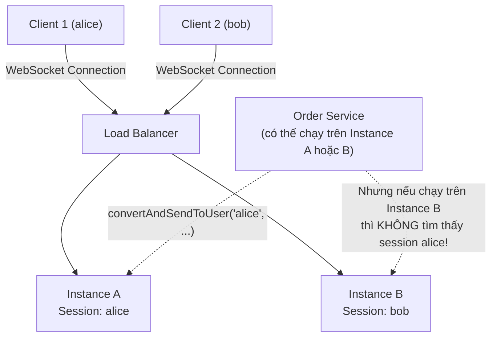
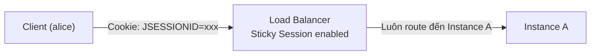
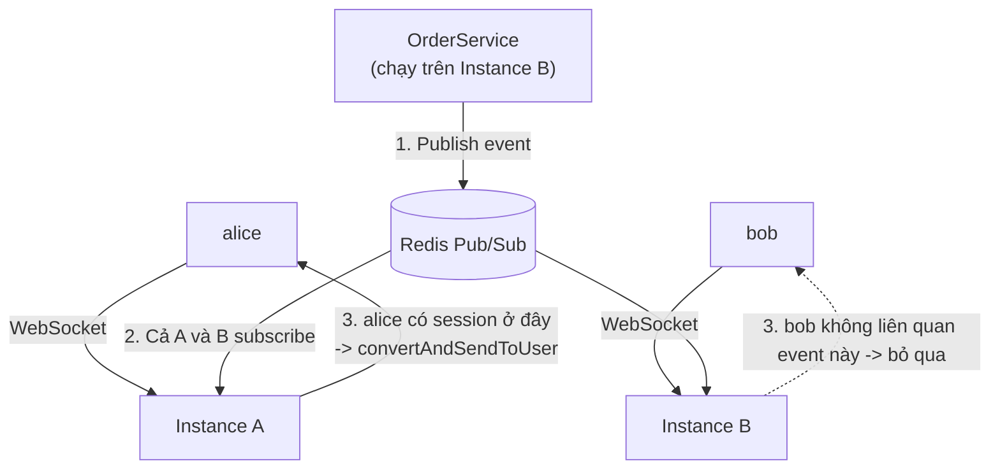
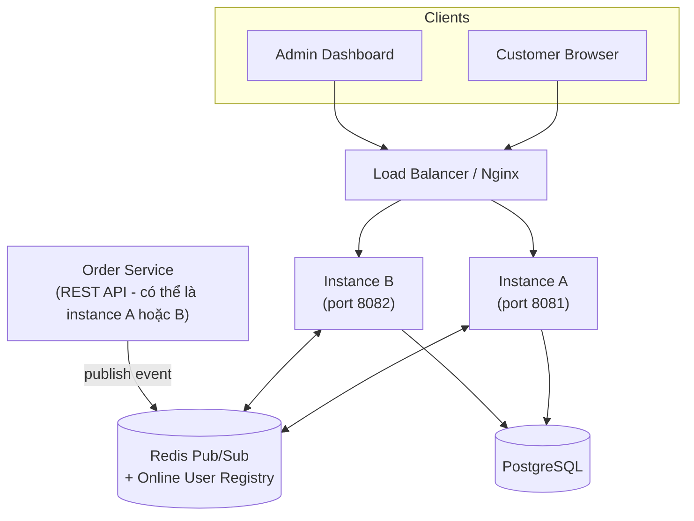
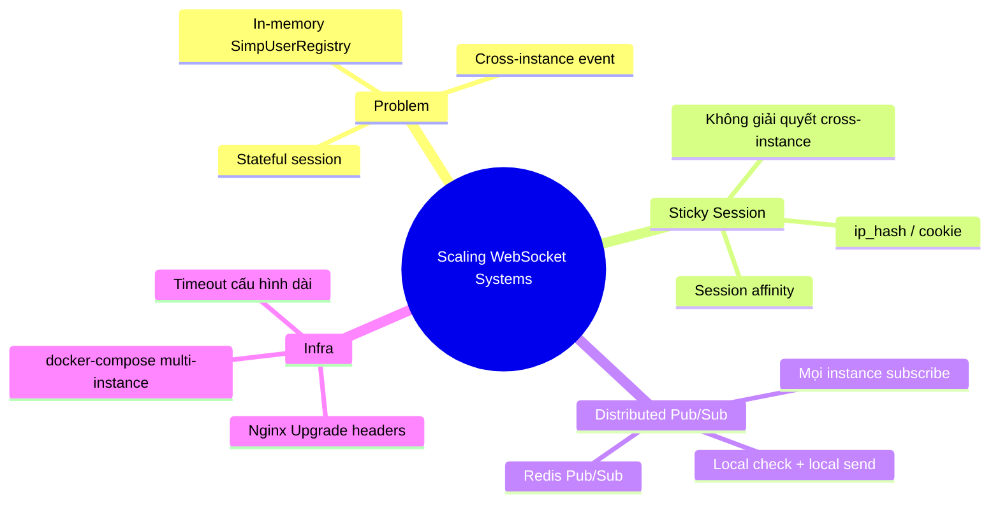

# CHƯƠNG 11 — SCALING WEBSOCKET SYSTEMS (MỞ RỘNG HỆ THỐNG WEBSOCKET)

## 🎯 1. Learning Objectives

- Hiểu các thách thức của **Horizontal Scaling** đối với WebSocket (stateful connection).
- Phân tích vai trò của **Load Balancer** và **Sticky Session** trong kiến trúc WebSocket.
- So sánh **Sticky Session** vs **Distributed Pub/Sub** (tiền đề cho Chương 12 - Redis).
- Thiết kế kiến trúc **Multi-Instance Deployment** cho Ecommerce Realtime Platform.
- Nhận diện các vấn đề: "Online User Count sai", "Notification không đến đúng user" khi scale.

---

## 📖 2. Lý thuyết

### 2.1. Vì sao WebSocket khó scale hơn REST API?

REST API là **stateless**: mỗi request độc lập, Load Balancer có thể route request đến **bất
kỳ instance nào** mà không ảnh hưởng đến kết quả.

WebSocket là **stateful**: một khi connection được thiết lập với **instance A**, toàn bộ
session (subscriptions, Principal, heartbeat...) được lưu **trong memory của instance A**.
Nếu một request/message khác liên quan đến session đó đến **instance B**, instance B **không
biết gì** về session này.



**Vấn đề cốt lõi:** Nếu `OrderService` (sinh ra domain event) chạy trên **Instance B**, nhưng
session của `alice` đang ở **Instance A**, thì lệnh `convertAndSendToUser("alice", ...)` được
gọi trên Instance B **sẽ không tìm thấy** session của alice (vì `SimpUserRegistry` là in-memory,
riêng theo từng instance) — **notification bị mất**.

### 2.2. Sticky Session

**Sticky Session** (hay "session affinity") là cấu hình Load Balancer để **luôn route các
request/connection của cùng một client đến cùng một instance** (dựa trên cookie, IP, hoặc
session ID).



**Ưu điểm:**
- Đơn giản — không cần thay đổi code application.
- Giải quyết được vấn đề `SimpUserRegistry` cục bộ cho **request từ client**.

**Nhược điểm:**
- **Không giải quyết được** vấn đề ở mục 2.1: nếu **domain event được sinh ra từ một instance
  khác** với instance giữ session của user, vẫn bị "mất" notification.
- **Mất cân bằng tải**: nếu nhiều user "dính" vào 1 instance (ví dụ do hashing theo IP của
  văn phòng công ty), instance đó bị quá tải.
- **Khi instance bị restart/crash**: tất cả session trên instance đó mất, user phải reconnect
  (và Load Balancer sẽ route đến instance khác — session cũ "biến mất hoàn toàn").

### 2.3. Giải pháp: Distributed Pub/Sub (Redis)

Giải pháp triệt để là dùng một **Message Broker trung tâm** (Redis Pub/Sub — Chương 12, hoặc
RabbitMQ/Kafka) làm "cầu nối" giữa các instance:



**Cách hoạt động:**
1. Khi có domain event (`OrderStatusChangedEvent`), instance sinh ra event **publish lên Redis
   channel** (không quan tâm ai đang giữ session của user nào).
2. **Mọi instance** đều subscribe Redis channel này.
3. Mỗi instance kiểm tra: *"User này có session đang kết nối với TÔI không?"* — nếu có, gửi
   qua `convertAndSendToUser` (local); nếu không, bỏ qua.

> Với giải pháp này, **không cần Sticky Session** cho việc nhận notification — Load Balancer
> có thể dùng **Round Robin** thông thường. Sticky Session vẫn có thể hữu ích để giảm số lần
> reconnect, nhưng không còn là **yêu cầu bắt buộc** về mặt đúng đắn dữ liệu.

### 2.4. Bảng so sánh

| | Sticky Session (only) | Sticky Session + Redis Pub/Sub | Redis Pub/Sub (no sticky) |
|---|---|---|---|
| Đúng đắn khi multi-instance | ❌ (vấn đề cross-instance event) | ✅ | ✅ |
| Load balancing | Kém (lệch tải) | Tốt hơn | Tốt nhất |
| Độ phức tạp triển khai | Thấp | Trung bình | Trung bình |
| Khi instance crash | Mất toàn bộ session trên instance đó | Mất session, nhưng dữ liệu vẫn đồng bộ qua Redis | Tương tự |
| Khuyến nghị | Không nên dùng riêng cho production | ✅ Phổ biến | ✅ Lý tưởng nếu hạ tầng cho phép |

---

## 🛒 3. Ví dụ thực tế: Multi-Instance Deployment cho Ecommerce Realtime



**Kịch bản:** Admin gọi `PUT /api/orders/ORD-1001/status` — request này được Load Balancer
route đến **Instance B** (REST API stateless, không cần sticky). `alice` (chủ đơn `ORD-1001`)
đang có WebSocket session ở **Instance A**.

- Instance B xử lý: lưu DB, publish `OrderStatusChangedEvent` lên Redis channel `order-events`.
- Cả Instance A và B nhận được message từ Redis.
- Instance A kiểm tra: `alice` có session ở đây → gửi `/user/queue/notifications` thành công.
- Instance B kiểm tra: `alice` không có session ở đây → bỏ qua.

---

## 💻 4. Source Code minh họa (Chuẩn bị cho Chương 12)

### 4.1. Cấu hình Nginx — Load Balancer với WebSocket support

```nginx
upstream ecommerce_realtime_backend {
    server instance-a:8080;
    server instance-b:8080;
    # Không bắt buộc sticky session nếu dùng Redis Pub/Sub
    # ip_hash; # <- bật nếu muốn sticky session (theo IP)
}

server {
    listen 80;

    location /ws {
        proxy_pass http://ecommerce_realtime_backend;
        proxy_http_version 1.1;

        # Bắt buộc cho WebSocket: forward header Upgrade/Connection
        proxy_set_header Upgrade $http_upgrade;
        proxy_set_header Connection "upgrade";

        proxy_set_header Host $host;
        proxy_set_header X-Real-IP $remote_addr;

        # Timeout dài hơn cho long-lived connection
        proxy_read_timeout 3600s;
        proxy_send_timeout 3600s;
    }

    location /api {
        proxy_pass http://ecommerce_realtime_backend;
        proxy_set_header Host $host;
    }
}
```

### 4.2. `docker-compose.yml` — 2 instance + Redis + PostgreSQL

```yaml
version: "3.9"

services:
  postgres:
    image: postgres:16-alpine
    environment:
      POSTGRES_DB: ecommerce_realtime
      POSTGRES_USER: app
      POSTGRES_PASSWORD: app_password
    ports:
      - "5432:5432"

  redis:
    image: redis:7-alpine
    ports:
      - "6379:6379"

  instance-a:
    build: .
    environment:
      SPRING_DATASOURCE_URL: jdbc:postgresql://postgres:5432/ecommerce_realtime
      SPRING_REDIS_HOST: redis
      INSTANCE_ID: instance-a
    depends_on: [postgres, redis]

  instance-b:
    build: .
    environment:
      SPRING_DATASOURCE_URL: jdbc:postgresql://postgres:5432/ecommerce_realtime
      SPRING_REDIS_HOST: redis
      INSTANCE_ID: instance-b
    depends_on: [postgres, redis]

  nginx:
    image: nginx:alpine
    volumes:
      - ./nginx.conf:/etc/nginx/conf.d/default.conf
    ports:
      - "80:80"
    depends_on: [instance-a, instance-b]
```

---

## 📝 5. Hands-on Exercises

**Bài 1:** Dùng `docker-compose.yml` ở trên (chưa cần Redis Pub/Sub logic — Chương 12), chạy 2
instance + Nginx **không** bật `ip_hash`. Quan sát: khi connect WebSocket nhiều lần, các session
được route đến instance nào (log `INSTANCE_ID` ra console khi `SessionConnectedEvent`)?

**Bài 2:** Lặp lại Bài 1 nhưng **bật `ip_hash`** trong Nginx. So sánh kết quả routing.

---

## 🚀 6. Advanced Exercises

**Bài 3:** Giả sử hệ thống **chưa** triển khai Redis Pub/Sub (chỉ có in-memory
`SimpUserRegistry` + `OnlineUserRegistryPort` từ Chương 9). Thiết kế một bài test (kịch bản,
không cần code) để **chứng minh** rằng "Online User Count" hiển thị trên Admin Dashboard bị
**sai** khi có 2 instance.

**Bài 4:** Phân tích chi phí/lợi ích của 3 chiến lược scale WebSocket:
- (a) Sticky Session + Redis Pub/Sub (phổ biến nhất).
- (b) WebSocket Gateway riêng biệt (tách service WebSocket khỏi business logic, dùng Kafka
  làm trung gian — gợi mở Chương 20).
- (c) Serverless WebSocket (ví dụ AWS API Gateway WebSocket) — kiến trúc khác hoàn toàn.

---

## ❓ 7. Interview Questions

1. Vì sao WebSocket được coi là "stateful" trong khi REST API là "stateless"? Điều này ảnh
   hưởng gì đến horizontal scaling?
2. Sticky Session giải quyết được vấn đề gì, và KHÔNG giải quyết được vấn đề gì?
3. Nếu một instance bị restart, điều gì xảy ra với các WebSocket session đang mở trên instance đó?
4. `convertAndSendToUser` hoạt động dựa trên `SimpUserRegistry` cục bộ của từng instance — điều
   này có ý nghĩa gì khi scale ra nhiều instance?
5. Trình bày kiến trúc bạn sẽ chọn để scale hệ thống Notification từ 1 instance lên 10 instance,
   phục vụ 1 triệu user.

---

## 📋 8. Chapter Summary

- WebSocket là **stateful** — session chỉ tồn tại trên instance đã thiết lập connection.
- **Sticky Session** giúp Load Balancer route đúng client đến đúng instance, nhưng **không**
  giải quyết vấn đề cross-instance khi domain event sinh ra từ instance khác.
- **Redis Pub/Sub** (Chương 12) là giải pháp phổ biến: mọi instance subscribe cùng channel,
  mỗi instance tự kiểm tra "user này có ở đây không" để quyết định gửi.
- Nginx cần cấu hình đúng để **forward header Upgrade/Connection** và **tăng timeout** cho
  WebSocket.
- `docker-compose` với nhiều instance + Redis + PostgreSQL là baseline cho kiến trúc
  multi-instance.

---

## 🧠 9. Mindmap



---

## ✅ 10. Completion Checklist

- [ ] Giải thích được vì sao WebSocket khó scale hơn REST API.
- [ ] Phân biệt rõ Sticky Session và Distributed Pub/Sub.
- [ ] Chạy thành công multi-instance với Nginx + docker-compose (Bài 1, 2).
- [ ] Thiết kế được kịch bản chứng minh "Online Count sai" khi multi-instance (Bài 3).
- [ ] Sẵn sàng cho Chương 12 — triển khai Redis Pub/Sub thực tế.

---

## 📌 11. Reference Answers

**Bài 3 (gợi ý kịch bản test):**
1. Chạy 2 instance A, B (không Redis Pub/Sub), mỗi instance có `InMemoryOnlineUserRegistry` riêng.
2. Client `alice` connect → Load Balancer route đến Instance A → `InMemoryOnlineUserRegistry`
   của A có `{alice}`, B có `{}`.
3. Client `bob` connect → Load Balancer route đến Instance B → A có `{alice}`, B có `{bob}`.
4. Admin Dashboard connect → Load Balancer route đến Instance A, subscribe
   `/topic/admin/dashboard/online-users`.
5. **Kết quả sai**: Admin Dashboard chỉ nhận được `onlineCount = 1` (từ Instance A, chỉ biết
   về `alice`), trong khi thực tế có 2 user online (`alice` và `bob`).
6. **Kết luận**: cần "Single Source of Truth" cho Online User Registry — đó là Redis (Chương 12).

**Bài 4 (gợi ý phân tích):**
- **(a) Sticky Session + Redis Pub/Sub**: chi phí thấp, dễ triển khai với hạ tầng hiện có
  (Spring Boot + Redis), phù hợp với hầu hết hệ thống Ecommerce vừa và lớn. Nhược điểm: vẫn
  phải tự quản lý connection lifecycle, reconnect, heartbeat.
- **(b) WebSocket Gateway riêng + Kafka**: tách biệt rõ "WebSocket concerns" khỏi "business
  logic concerns" — business service không cần biết gì về WebSocket, chỉ publish event lên
  Kafka. Phù hợp hệ thống lớn, nhiều service cùng cần gửi notification. Chi phí vận hành cao
  hơn (thêm Kafka cluster, thêm 1 service).
- **(c) Serverless WebSocket (AWS API Gateway)**: giảm gánh nặng vận hành (không cần tự quản
  lý connection, scaling tự động), nhưng **vendor lock-in**, chi phí có thể tăng nhanh theo
  số lượng message/connection, và khó tùy biến sâu (ví dụ custom heartbeat, custom protocol
  như STOMP).
- **Khuyến nghị cho khóa học**: (a) là lựa chọn thực tế nhất cho phần lớn dự án — đây là hướng
  chúng ta triển khai ở Chương 12 và Chương 15.

- [Chương 10 - Notification System](./chap10.md)

- [Chương 12 - Redis Pub/Sub Integration](./chap12.md)
