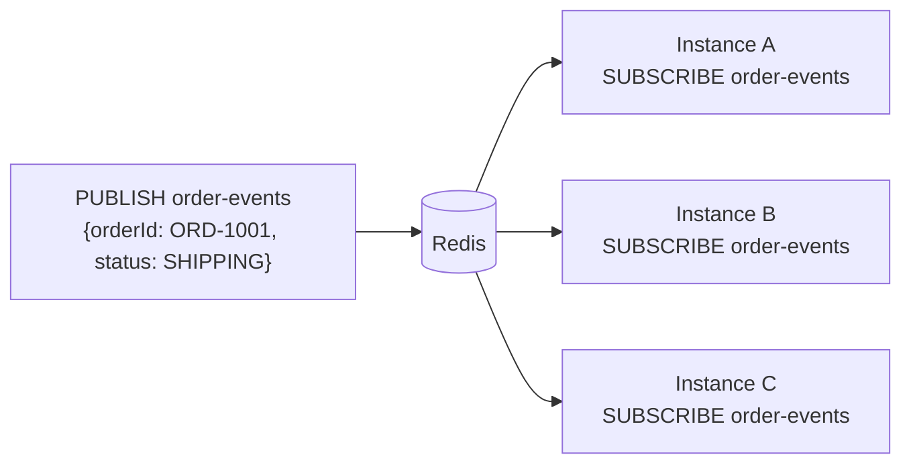
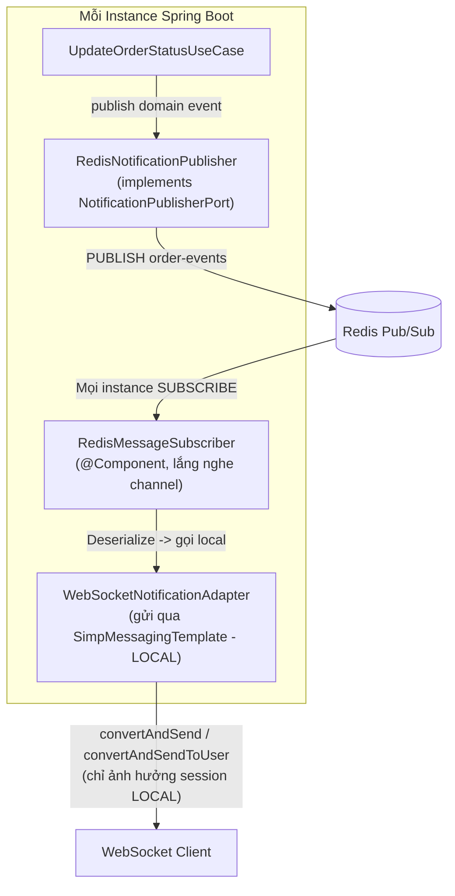
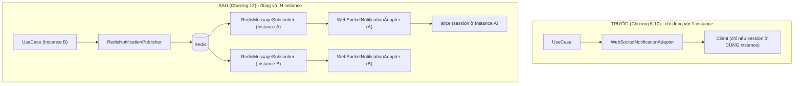
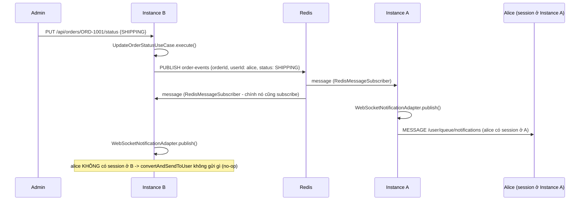

# CHƯƠNG 12 — REDIS PUB/SUB INTEGRATION

## 🎯 1. Learning Objectives

- Triển khai **Redis Publisher** và **Redis Subscriber** với Spring Data Redis.
- Xây dựng **Distributed Messaging** giữa nhiều instance Spring Boot.
- Refactor `WebSocketNotificationAdapter` (Chương 6-10) để hoạt động đúng trong môi trường
  **multi-instance** bằng Redis Pub/Sub.
- Triển khai `RedisOnlineUserRegistry` thay cho `InMemoryOnlineUserRegistry` (Chương 9).
- Đồng bộ **Realtime Broadcast** across nhiều server.

---

## 📖 2. Lý thuyết

### 2.1. Redis Pub/Sub là gì?

Redis Pub/Sub là một cơ chế **messaging đơn giản** của Redis: một client `PUBLISH` message lên
một `channel`, tất cả client đang `SUBSCRIBE` channel đó **nhận được message ngay lập tức**.



**Đặc điểm quan trọng:**
- **Fire-and-forget**: Redis Pub/Sub **không lưu trữ** message — nếu subscriber offline tại
  thời điểm publish, message bị mất vĩnh viễn (khác với Redis Streams hoặc Kafka).
- **At-most-once delivery**: phù hợp cho "broadcast trạng thái hiện tại", **không phù hợp** cho
  dữ liệu cần đảm bảo không mất (ví dụ: đó là lý do Notification vẫn cần lưu PostgreSQL — Chương 10).
- Độ trễ rất thấp, đơn giản triển khai — lý tưởng để đồng bộ giữa các instance Spring Boot.

### 2.2. Kiến trúc tổng thể: Order Service → Redis → WebSocket Service



**Điểm mấu chốt:** `WebSocketNotificationAdapter` (Chương 6) **không thay đổi logic publish
đến client** — nó vẫn dùng `SimpMessagingTemplate` như cũ. Điều thay đổi là: **NGUỒN GỌI**
`WebSocketNotificationAdapter` không còn là trực tiếp từ `UpdateOrderStatusUseCase` nữa, mà
từ `RedisMessageSubscriber` — đảm bảo **MỌI instance** đều nhận được event và tự quyết định
có client local nào cần nhận hay không.

### 2.3. So sánh trước/sau khi thêm Redis



---

## 🛒 3. Ví dụ thực tế: Synchronize Notifications Across Multiple Servers

**Bài toán:** Hệ thống chạy 2 instance (A, B). `alice` có session ở Instance A. Admin gọi
`PUT /api/orders/ORD-1001/status` — request được Load Balancer route đến Instance B (Round
Robin, không sticky). Đảm bảo `alice` **vẫn nhận được** thông báo realtime.



---

## 💻 4. Complete Source Code

### 4.1. Cấu hình Redis

```xml
<dependency>
    <groupId>org.springframework.boot</groupId>
    <artifactId>spring-boot-starter-data-redis</artifactId>
</dependency>
```

```yaml
# application.yml
spring:
  data:
    redis:
      host: ${SPRING_REDIS_HOST:localhost}
      port: 6379
```

```java
package com.ecommerce.realtime.infrastructure.config;

import com.fasterxml.jackson.databind.ObjectMapper;
import org.springframework.context.annotation.Bean;
import org.springframework.context.annotation.Configuration;
import org.springframework.data.redis.connection.RedisConnectionFactory;
import org.springframework.data.redis.listener.ChannelTopic;
import org.springframework.data.redis.listener.RedisMessageListenerContainer;
import org.springframework.data.redis.listener.adapter.MessageListenerAdapter;
import org.springframework.data.redis.serializer.Jackson2JsonRedisSerializer;
import org.springframework.data.redis.serializer.StringRedisSerializer;
import org.springframework.data.redis.core.RedisTemplate;

@Configuration
public class RedisConfig {

    public static final String ORDER_EVENTS_CHANNEL = "order-events";

    @Bean
    public ChannelTopic orderEventsTopic() {
        return new ChannelTopic(ORDER_EVENTS_CHANNEL);
    }

    @Bean
    public RedisTemplate<String, Object> redisTemplate(RedisConnectionFactory connectionFactory,
                                                          ObjectMapper objectMapper) {
        RedisTemplate<String, Object> template = new RedisTemplate<>();
        template.setConnectionFactory(connectionFactory);
        template.setKeySerializer(new StringRedisSerializer());
        template.setValueSerializer(new Jackson2JsonRedisSerializer<>(objectMapper, Object.class));
        return template;
    }

    @Bean
    public RedisMessageListenerContainer redisContainer(RedisConnectionFactory connectionFactory,
                                                          MessageListenerAdapter listenerAdapter,
                                                          ChannelTopic orderEventsTopic) {
        RedisMessageListenerContainer container = new RedisMessageListenerContainer();
        container.setConnectionFactory(connectionFactory);
        container.addMessageListener(listenerAdapter, orderEventsTopic);
        return container;
    }

    @Bean
    public MessageListenerAdapter listenerAdapter(RedisMessageSubscriber subscriber) {
        return new MessageListenerAdapter(subscriber, "onMessage");
    }
}
```

### 4.2. `RedisNotificationPublisher` — Producer (implements `NotificationPublisherPort`)

```java
package com.ecommerce.realtime.infrastructure.messaging.redis;

import com.ecommerce.realtime.application.notification.port.NotificationPublisherPort;
import com.ecommerce.realtime.domain.order.event.OrderStatusChangedEvent;
import lombok.RequiredArgsConstructor;
import lombok.extern.slf4j.Slf4j;
import org.springframework.data.redis.core.RedisTemplate;
import org.springframework.stereotype.Component;

import static com.ecommerce.realtime.infrastructure.config.RedisConfig.ORDER_EVENTS_CHANNEL;

/**
 * Thay thế trực tiếp gọi WebSocketNotificationAdapter (Chương 6) bằng việc
 * PUBLISH lên Redis - mọi instance (bao gồm cả chính nó) sẽ nhận và xử lý qua RedisMessageSubscriber.
 */
@Slf4j
@Component
@RequiredArgsConstructor
public class RedisNotificationPublisher implements NotificationPublisherPort {

    private final RedisTemplate<String, Object> redisTemplate;

    @Override
    public void publish(Object domainEvent) {
        if (domainEvent instanceof OrderStatusChangedEvent event) {
            log.info("Publishing to Redis channel '{}': orderId={}, status={}",
                    ORDER_EVENTS_CHANNEL, event.orderId(), event.newStatus());
            redisTemplate.convertAndSend(ORDER_EVENTS_CHANNEL, event);
        }
    }
}
```

### 4.3. `RedisMessageSubscriber` — Consumer (chạy trên MỌI instance)

```java
package com.ecommerce.realtime.infrastructure.messaging.redis;

import com.ecommerce.realtime.domain.order.event.OrderStatusChangedEvent;
import com.fasterxml.jackson.databind.ObjectMapper;
import lombok.RequiredArgsConstructor;
import lombok.extern.slf4j.Slf4j;
import org.springframework.data.redis.connection.Message;
import org.springframework.messaging.simp.SimpMessagingTemplate;
import org.springframework.stereotype.Component;

@Slf4j
@Component
@RequiredArgsConstructor
public class RedisMessageSubscriber {

    private final ObjectMapper objectMapper;
    private final SimpMessagingTemplate messagingTemplate; // LOCAL - chỉ gửi đến session trên instance này

    /**
     * Được gọi bởi RedisMessageListenerContainer mỗi khi có message trên channel "order-events".
     * Chạy trên TẤT CẢ instance (bao gồm cả instance đã publish).
     */
    public void onMessage(Message message, byte[] pattern) {
        try {
            OrderStatusChangedEvent event = objectMapper.readValue(message.getBody(), OrderStatusChangedEvent.class);
            log.debug("Received from Redis: orderId={}, status={}", event.orderId(), event.newStatus());

            // 1. Broadcast - mọi client subscribe /topic/orders/{id} trên INSTANCE NÀY sẽ nhận
            messagingTemplate.convertAndSend("/topic/orders/" + event.orderId(),
                    new OrderStatusPayload(event.orderId(), event.newStatus(), event.occurredAt().toString()));

            // 2. Point-to-point - chỉ có hiệu lực nếu user này có session trên INSTANCE NÀY
            messagingTemplate.convertAndSendToUser(event.userId(), "/queue/notifications",
                    NotificationPayload.fromOrderEvent(event));

        } catch (Exception e) {
            log.error("Lỗi khi xử lý message từ Redis", e);
        }
    }

    public record OrderStatusPayload(String orderId, String status, String occurredAt) {}

    public record NotificationPayload(String title, String message, String orderId) {
        static NotificationPayload fromOrderEvent(OrderStatusChangedEvent e) {
            String title = switch (e.newStatus()) {
                case "CONFIRMED" -> "Đơn hàng đã được xác nhận";
                case "SHIPPING" -> "Đơn hàng đang được giao";
                case "DELIVERED" -> "Đơn hàng đã được giao thành công";
                case "CANCELLED" -> "Đơn hàng đã bị hủy";
                default -> "Cập nhật đơn hàng";
            };
            return new NotificationPayload(title, "Đơn hàng #" + e.orderId() + " - " + e.newStatus(), e.orderId());
        }
    }
}
```

### 4.4. `RedisOnlineUserRegistry` — thay thế Chương 9

```java
package com.ecommerce.realtime.infrastructure.session;

import com.ecommerce.realtime.application.session.port.OnlineUserRegistryPort;
import lombok.RequiredArgsConstructor;
import org.springframework.data.redis.core.RedisTemplate;
import org.springframework.stereotype.Component;

import java.time.Duration;
import java.util.Set;
import java.util.stream.Collectors;

/**
 * Thay thế InMemoryOnlineUserRegistry (Chương 9).
 * Dùng Redis Set: key "online_users:{userId}" -> Set<sessionKey>
 * sessionKey = "{instanceId}:{sessionId}" để tránh đụng độ giữa các instance.
 */
@Component
@RequiredArgsConstructor
public class RedisOnlineUserRegistry implements OnlineUserRegistryPort {

    private static final String KEY_PREFIX = "online_users:";
    private static final Duration SESSION_TTL = Duration.ofMinutes(5); // tự dọn dẹp nếu instance crash

    private final RedisTemplate<String, Object> redisTemplate;
    private final String instanceId; // inject từ @Value("${instance.id}")

    @Override
    public void addSession(String userId, String sessionId) {
        String key = KEY_PREFIX + userId;
        redisTemplate.opsForSet().add(key, instanceId + ":" + sessionId);
        redisTemplate.expire(key, SESSION_TTL); // reset TTL mỗi khi có session mới
    }

    @Override
    public void removeSession(String userId, String sessionId) {
        String key = KEY_PREFIX + userId;
        redisTemplate.opsForSet().remove(key, instanceId + ":" + sessionId);
        Long size = redisTemplate.opsForSet().size(key);
        if (size != null && size == 0) {
            redisTemplate.delete(key);
        }
    }

    @Override
    public boolean isOnline(String userId) {
        return Boolean.TRUE.equals(redisTemplate.hasKey(KEY_PREFIX + userId));
    }

    @Override
    public int countOnlineUsers() {
        // Lưu ý: dùng SCAN trong production thay vì KEYS (KEYS block Redis ở dataset lớn)
        return redisTemplate.keys(KEY_PREFIX + "*").size();
    }

    @Override
    public Set<String> getOnlineUserIds() {
        return redisTemplate.keys(KEY_PREFIX + "*").stream()
                .map(key -> key.substring(KEY_PREFIX.length()))
                .collect(Collectors.toSet());
    }
}
```

---

## 📝 5. Hands-on Exercises

**Bài 1:** Triển khai `RedisNotificationPublisher` + `RedisMessageSubscriber`, refactor lại
`NotificationPublisherPort` binding (đổi từ `WebSocketNotificationAdapter` sang
`RedisNotificationPublisher`). Test với 2 instance (dùng `docker-compose` Chương 11):
- `alice` connect đến Instance A.
- Gọi `PUT /api/orders/.../status` qua Instance B.
- Xác nhận `alice` vẫn nhận được `/user/queue/notifications`.

**Bài 2:** Triển khai `RedisOnlineUserRegistry`, thay thế `InMemoryOnlineUserRegistry` trong
`WebSocketSessionEventListener` (Chương 9). Test: `alice` connect Instance A, `bob` connect
Instance B → `countOnlineUsers()` trả về `2` từ **cả 2** instance.

---

## 🚀 6. Advanced Exercises

**Bài 3:** Redis Pub/Sub là **fire-and-forget** — nếu Redis server **restart** đúng lúc đang
publish message, message đó bị mất hoàn toàn, **không có cách nào** instance khác biết được.
Phân tích: với hệ thống Ecommerce, mất 1 message `OrderStatusChangedEvent` trên Redis Pub/Sub
có ảnh hưởng nghiêm trọng không? Tại sao (gợi ý: liên hệ Chương 10 - "Persist first, push
second")? Nếu cần đảm bảo "at-least-once", nên dùng **Redis Streams** hay **Kafka** (gợi mở
Chương 20) thay vì Pub/Sub?

**Bài 4:** Thiết kế cơ chế "**self-healing**" cho `RedisOnlineUserRegistry`: nếu một instance
**crash** mà không gọi được `removeSession()` (ví dụ OOM kill), session "rác" sẽ tồn tại trong
Redis Set mãi mãi (memory leak). Giải pháp đã có gợi ý ở `SESSION_TTL` — hãy mô tả chi tiết cơ
chế **heartbeat refresh TTL** để giải quyết triệt để vấn đề này.

---

## ❓ 7. Interview Questions

1. Redis Pub/Sub có đảm bảo delivery không? So sánh với Redis Streams và Kafka.
2. Vì sao `RedisMessageSubscriber` cần chạy trên **mọi** instance, bao gồm cả instance đã publish?
3. `convertAndSendToUser` sau khi tích hợp Redis có còn hoạt động đúng nếu user có session trên
   nhiều instance khác nhau (đa thiết bị)? Giải thích.
4. Tại sao không nên dùng lệnh `KEYS` trong production Redis? Thay thế bằng gì?
5. Thiết kế của Chương 6 (`NotificationPublisherPort`) giúp ích gì khi chuyển từ
   `WebSocketNotificationAdapter` sang `RedisNotificationPublisher`? Có cần sửa Domain/Application Layer không?

---

## 📋 8. Chapter Summary

- **Redis Pub/Sub** cho phép đồng bộ message giữa nhiều instance Spring Boot với độ trễ thấp,
  nhưng là **fire-and-forget** (không đảm bảo delivery).
- Kiến trúc: `RedisNotificationPublisher` (PUBLISH) → Redis channel → `RedisMessageSubscriber`
  (chạy trên mọi instance) → `SimpMessagingTemplate` (chỉ ảnh hưởng session local).
- `RedisOnlineUserRegistry` thay thế in-memory registry (Chương 9), dùng Redis Set với TTL để
  tự "dọn dẹp" session rác khi instance crash.
- Nhờ kiến trúc Hexagonal (Chương 6), việc chuyển từ in-memory sang Redis **chỉ cần thay đổi
  Infrastructure Layer** — Domain/Application Layer không đổi.
- Với dữ liệu cần đảm bảo không mất (Notification), vẫn cần **persist vào PostgreSQL** (Chương
  10) — Redis Pub/Sub chỉ là "kênh đồng bộ realtime", không phải "nguồn sự thật" (source of truth).

---

## 🧠 9. Mindmap

```mermaid
mindmap
  root((Redis Pub/Sub Integration))
    Pub/Sub Mechanism
      PUBLISH/SUBSCRIBE
      Fire-and-forget
      At-most-once
    Architecture
      RedisNotificationPublisher
      RedisMessageSubscriber - mọi instance
      Local SimpMessagingTemplate
    Online User Registry
      Redis Set + TTL
      Self-healing
      countOnlineUsers across instances
    Limitations
      Mất message khi Redis restart
      Cần Persist (Chương 10) cho durability
      KEYS vs SCAN
```

---

## ✅ 10. Completion Checklist

- [ ] Triển khai `RedisNotificationPublisher` + `RedisMessageSubscriber` (Bài 1).
- [ ] Test thành công cross-instance notification (Bài 1).
- [ ] Triển khai `RedisOnlineUserRegistry` với TTL (Bài 2).
- [ ] Hiểu rõ giới hạn "fire-and-forget" của Redis Pub/Sub và mối liên hệ với Chương 10 (Bài 3).
- [ ] Thiết kế cơ chế heartbeat refresh TTL (Bài 4).

---

## 📌 11. Reference Answers

**Bài 3 (gợi ý):**
Mất 1 message `OrderStatusChangedEvent` trên Redis Pub/Sub có nghĩa là **chỉ phần "thông báo
realtime qua WebSocket" bị ảnh hưởng** — `alice` sẽ **không nhận được pop-up notification
ngay lập tức**. Tuy nhiên, nhờ pattern "Persist first, push second" (Chương 10):
- `Notification` đã được **lưu vào PostgreSQL** ở bước trước khi publish lên Redis (trong
  `NotificationService.onOrderStatusChanged`).
- Khi `alice` mở lại app, `GET /api/notifications` vẫn trả về thông báo này (với trạng thái
  `UNREAD`).
- → **Không mất dữ liệu nghiệp vụ**, chỉ mất "tính tức thời" của một lần thông báo.

Nếu cần đảm bảo **at-least-once cho chính kênh realtime** (ví dụ: hệ thống trading, nơi độ trễ
thông báo có ý nghĩa tài chính), nên dùng **Redis Streams** (có consumer group, ack, replay) hoặc
**Kafka** (Chương 20) — đánh đổi độ phức tạp triển khai cao hơn để có đảm bảo delivery tốt hơn.

**Bài 4 (gợi ý):**
- Mỗi instance, định kỳ (ví dụ mỗi 60 giây), với **mỗi session đang active**, gọi lại:
  ```java
  redisTemplate.opsForSet().add(key, instanceId + ":" + sessionId);
  redisTemplate.expire(key, SESSION_TTL); // refresh TTL = 5 phút
  ```
- Nếu instance **crash**, nó sẽ **không còn refresh TTL** cho các session của nó →
  sau tối đa `SESSION_TTL` (5 phút), Redis tự động xóa key — session "rác" tự biến mất.
- Trade-off: trong khoảng thời gian `SESSION_TTL`, "Online User Count" có thể bị **đếm dư**
  (overcount) một chút — đây là sự đánh đổi hợp lý giữa độ chính xác tức thời và độ phức tạp
  triển khai (so với việc cần một cơ chế "heartbeat ack" phức tạp hơn).

- [Chương 11 - Scaling WebSocket](./chap11.md)

- [Chương 13 - Realtime Order Tracking](./chap13.md)
