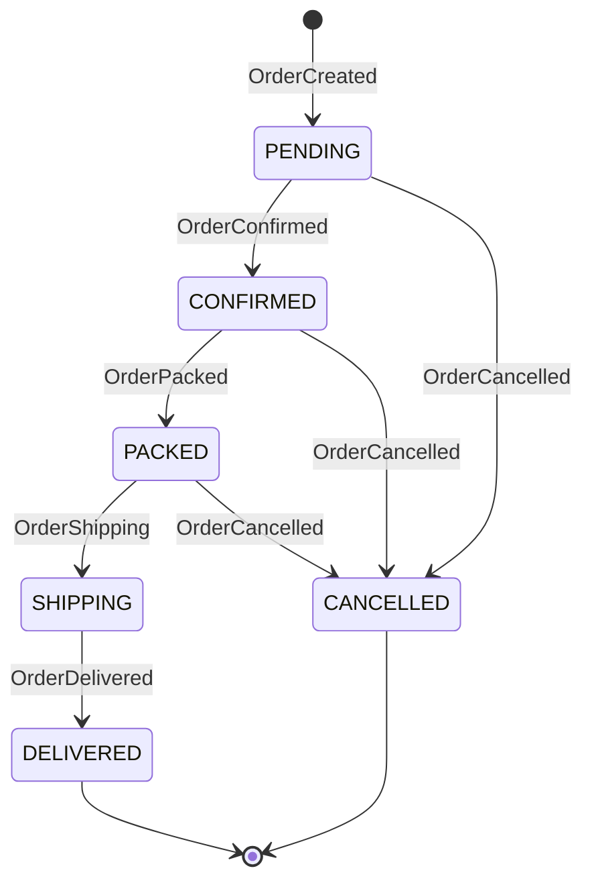
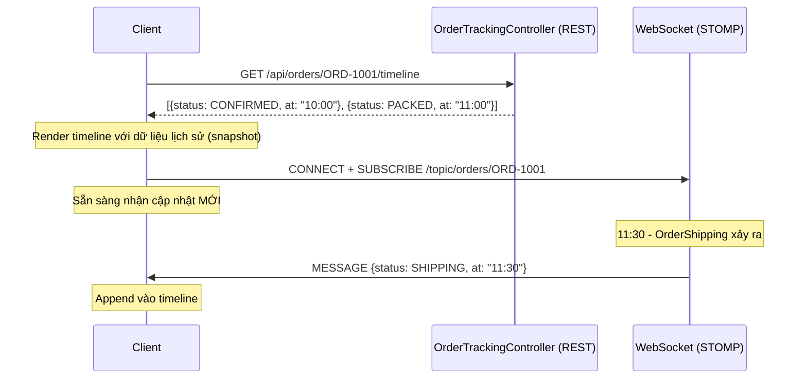
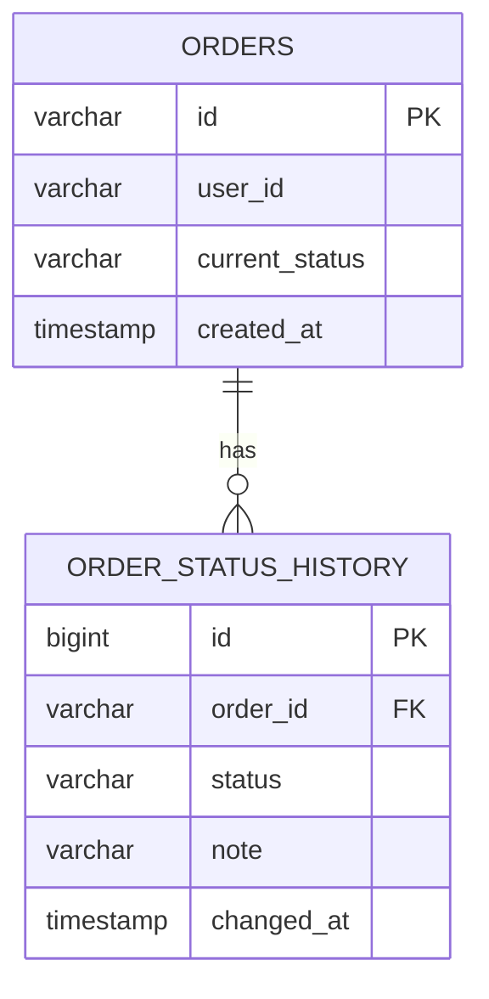
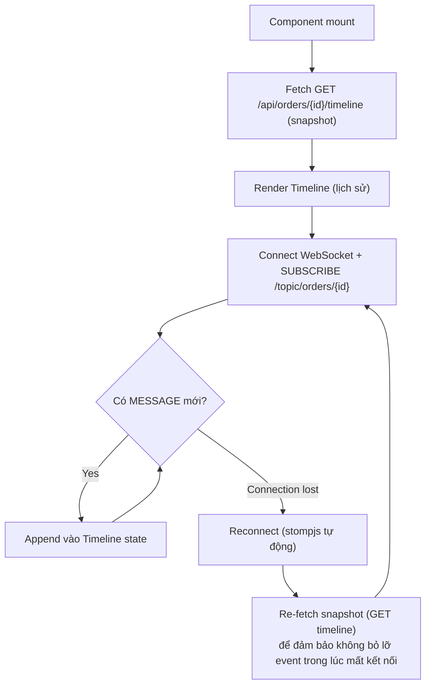
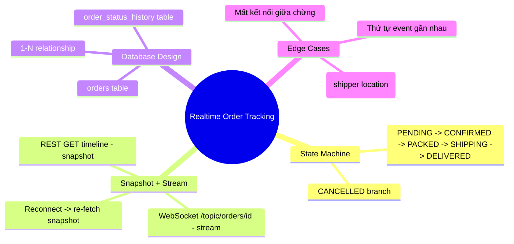

# CHƯƠNG 13 — REALTIME ORDER TRACKING (THEO DÕI ĐƠN HÀNG THỰC TẾ)

## 🎯 1. Learning Objectives

- Tổng hợp toàn bộ kiến thức từ Chương 1-12 để xây dựng **trang Order Tracking hoàn chỉnh**.
- Định nghĩa đầy đủ State Machine của đơn hàng:
  `OrderCreated → OrderConfirmed → OrderShipping → OrderDelivered` (và nhánh `OrderCancelled`).
- Xây dựng **React Order Tracking Page** với timeline trực quan, cập nhật realtime.
- Xử lý **edge cases**: load trang lần đầu (cần snapshot trạng thái hiện tại + lịch sử), mất
  kết nối giữa chừng (reconnect + resync).

---

## 📖 2. Lý thuyết

### 2.1. State Machine hoàn chỉnh của Order



| Trạng thái | Domain Event | Mô tả cho khách hàng |
|---|---|---|
| `PENDING` | `OrderCreated` | "Đơn hàng đã được tạo, đang chờ xác nhận" |
| `CONFIRMED` | `OrderConfirmed` | "Đơn hàng đã được xác nhận" |
| `PACKED` | `OrderPacked` | "Đơn hàng đang được đóng gói" |
| `SHIPPING` | `OrderShipping` | "Đơn hàng đang được giao đến bạn" |
| `DELIVERED` | `OrderDelivered` | "Đơn hàng đã được giao thành công" |
| `CANCELLED` | `OrderCancelled` | "Đơn hàng đã bị hủy" |

### 2.2. Vấn đề "Snapshot + Stream" — Load trang lần đầu

Khi khách hàng mở trang "Theo dõi đơn hàng", họ cần thấy:
1. **Lịch sử đầy đủ** các trạng thái đã qua (ví dụ: đã CONFIRMED lúc 10h, đã PACKED lúc 11h...).
2. **Trạng thái hiện tại**.
3. **Cập nhật realtime** cho các thay đổi tiếp theo.

WebSocket/STOMP **chỉ cung cấp (3)** — nó không "phát lại" các message đã gửi trước khi client
subscribe. Do đó, cần kết hợp:



> **Nguyên tắc:** REST API cung cấp **snapshot** (trạng thái + lịch sử tại thời điểm load),
> WebSocket cung cấp **stream** (thay đổi từ thời điểm subscribe trở đi). Đây là pattern
> "Snapshot + Stream" rất phổ biến trong các hệ thống realtime.

### 2.3. Order Status History — Thiết kế DB



Mỗi lần `Order.changeStatus()` (Chương 6) thành công, một record mới được thêm vào
`order_status_history` — đây chính là dữ liệu cho "snapshot" (timeline).

---

## 🛒 3. Ví dụ thực tế: React Order Tracking Page



---

## 💻 4. Complete Source Code

### 4.1. Domain — `OrderStatusHistory` (Entity con trong Aggregate `Order`)

```java
package com.ecommerce.realtime.domain.order.model;

import java.time.Instant;

public record OrderStatusHistoryEntry(OrderStatus status, Instant changedAt, String note) {
    public static OrderStatusHistoryEntry of(OrderStatus status, String note) {
        return new OrderStatusHistoryEntry(status, Instant.now(), note);
    }
}
```

### 4.2. Cập nhật `Order` Aggregate — ghi lịch sử mỗi lần đổi trạng thái

```java
package com.ecommerce.realtime.domain.order.model;

import com.ecommerce.realtime.domain.order.event.OrderStatusChangedEvent;
import lombok.Getter;

import java.util.ArrayList;
import java.util.List;

@Getter
public class Order {

    private final String id;
    private final String userId;
    private OrderStatus status;
    private final List<OrderStatusHistoryEntry> history = new ArrayList<>();
    private final List<Object> domainEvents = new ArrayList<>();

    public Order(String id, String userId, OrderStatus status, List<OrderStatusHistoryEntry> history) {
        this.id = id;
        this.userId = userId;
        this.status = status;
        this.history.addAll(history);
    }

    public void changeStatus(OrderStatus newStatus, String note) {
        if (!status.canTransitionTo(newStatus)) {
            throw new IllegalStateException(
                    "Không thể chuyển trạng thái từ " + status + " sang " + newStatus);
        }
        OrderStatus previous = this.status;
        this.status = newStatus;
        this.history.add(OrderStatusHistoryEntry.of(newStatus, note));
        this.domainEvents.add(OrderStatusChangedEvent.of(id, userId, previous.name(), newStatus.name()));
    }

    public List<Object> pullDomainEvents() {
        List<Object> events = new ArrayList<>(domainEvents);
        domainEvents.clear();
        return events;
    }
}
```

### 4.3. Application — `GetOrderTimelineUseCase`

```java
package com.ecommerce.realtime.application.order.usecase;

import com.ecommerce.realtime.application.order.port.OrderRepositoryPort;
import com.ecommerce.realtime.domain.order.model.Order;
import com.ecommerce.realtime.domain.order.model.OrderStatusHistoryEntry;
import lombok.RequiredArgsConstructor;
import org.springframework.stereotype.Service;

import java.util.List;

@Service
@RequiredArgsConstructor
public class GetOrderTimelineUseCase {

    private final OrderRepositoryPort orderRepository;

    public OrderTimelineResult execute(String orderId) {
        Order order = orderRepository.findById(orderId)
                .orElseThrow(() -> new IllegalArgumentException("Order not found: " + orderId));

        return new OrderTimelineResult(order.getId(), order.getStatus().name(), order.getHistory());
    }

    public record OrderTimelineResult(String orderId, String currentStatus, List<OrderStatusHistoryEntry> history) {}
}
```

### 4.4. Presentation — `OrderTrackingController` (REST + WebSocket)

```java
package com.ecommerce.realtime.presentation.rest;

import com.ecommerce.realtime.application.order.usecase.GetOrderTimelineUseCase;
import com.ecommerce.realtime.domain.order.model.OrderStatusHistoryEntry;
import lombok.RequiredArgsConstructor;
import org.springframework.web.bind.annotation.*;

import java.util.List;

@RestController
@RequestMapping("/api/orders")
@RequiredArgsConstructor
public class OrderTrackingController {

    private final GetOrderTimelineUseCase getOrderTimelineUseCase;

    /**
     * Snapshot - dùng khi client mới mở trang Order Tracking.
     */
    @GetMapping("/{orderId}/timeline")
    public TimelineResponse getTimeline(@PathVariable String orderId) {
        var result = getOrderTimelineUseCase.execute(orderId);
        return new TimelineResponse(result.orderId(), result.currentStatus(),
                result.history().stream().map(TimelineEntry::from).toList());
    }

    public record TimelineResponse(String orderId, String currentStatus, List<TimelineEntry> history) {}

    public record TimelineEntry(String status, String changedAt, String note) {
        static TimelineEntry from(OrderStatusHistoryEntry e) {
            return new TimelineEntry(e.status().name(), e.changedAt().toString(), e.note());
        }
    }
}
```

### 4.5. React — `OrderTrackingPage`

```jsx
import { useEffect, useRef, useState } from "react";
import { Client } from "@stomp/stompjs";
import SockJS from "sockjs-client";

const STATUS_LABELS = {
  PENDING: "Đơn hàng đã được tạo",
  CONFIRMED: "Đơn hàng đã được xác nhận",
  PACKED: "Đơn hàng đang được đóng gói",
  SHIPPING: "Đơn hàng đang được giao",
  DELIVERED: "Đơn hàng đã được giao thành công",
  CANCELLED: "Đơn hàng đã bị hủy",
};

export default function OrderTrackingPage({ orderId, jwtToken }) {
  const [timeline, setTimeline] = useState([]);
  const [currentStatus, setCurrentStatus] = useState(null);
  const clientRef = useRef(null);

  // 1. Load snapshot ban đầu
  const loadSnapshot = async () => {
    const res = await fetch(`/api/orders/${orderId}/timeline`, {
      headers: { Authorization: `Bearer ${jwtToken}` },
    });
    const data = await res.json();
    setTimeline(data.history);
    setCurrentStatus(data.currentStatus);
  };

  useEffect(() => {
    loadSnapshot();

    const client = new Client({
      webSocketFactory: () => new SockJS("/ws"),
      connectHeaders: { Authorization: `Bearer ${jwtToken}` },
      reconnectDelay: 5000,
      onConnect: () => {
        client.subscribe(`/topic/orders/${orderId}`, (message) => {
          const payload = JSON.parse(message.body);
          setCurrentStatus(payload.status);
          setTimeline((prev) => [...prev, { status: payload.status, changedAt: payload.occurredAt }]);
        });
      },
      onWebSocketClose: () => {
        // 2. Sau khi reconnect thành công, re-fetch snapshot để không bỏ lỡ event
        // (stompjs tự reconnect; ta hook vào onConnect lần sau để gọi lại loadSnapshot)
      },
    });

    // Re-sync snapshot mỗi khi reconnect thành công (trừ lần đầu)
    let firstConnect = true;
    client.onConnect = () => {
      if (!firstConnect) loadSnapshot();
      firstConnect = false;

      client.subscribe(`/topic/orders/${orderId}`, (message) => {
        const payload = JSON.parse(message.body);
        setCurrentStatus(payload.status);
        setTimeline((prev) => [...prev, { status: payload.status, changedAt: payload.occurredAt }]);
      });
    };

    client.activate();
    clientRef.current = client;
    return () => client.deactivate();
  }, [orderId]);

  return (
    <div className="order-tracking">
      <h2>Theo dõi đơn hàng #{orderId}</h2>
      <p>Trạng thái hiện tại: <strong>{STATUS_LABELS[currentStatus] ?? "Đang tải..."}</strong></p>

      <ol className="timeline">
        {timeline.map((entry, idx) => (
          <li key={idx}>
            <strong>{STATUS_LABELS[entry.status]}</strong>
            <span> — {new Date(entry.changedAt).toLocaleString("vi-VN")}</span>
          </li>
        ))}
      </ol>
    </div>
  );
}
```

---

## 📝 5. Hands-on Exercises

**Bài 1:** Triển khai đầy đủ `order_status_history` table, `OrderStatusHistoryEntry`, và
`GetOrderTimelineUseCase`. Tạo dữ liệu seed: 1 đơn hàng đã qua các trạng thái
`PENDING → CONFIRMED → PACKED` (3 record lịch sử), test `GET /api/orders/{id}/timeline`.

**Bài 2:** Triển khai `OrderTrackingPage` (React). Test luồng:
1. Load trang → thấy 3 mốc lịch sử.
2. Admin cập nhật trạng thái → `SHIPPING` → trang tự động thêm mốc thứ 4 (không cần reload).

---

## 🚀 6. Advanced Exercises

**Bài 3:** Mô phỏng "mất kết nối giữa chừng": ngắt WebSocket của client trong 10 giây, trong
lúc đó admin cập nhật trạng thái `SHIPPING → DELIVERED`. Sau khi client reconnect (tự động qua
`reconnectDelay`), trang có hiển thị đúng `DELIVERED` không? Giải thích cơ chế `onConnect` +
`loadSnapshot()` ở mục 4.5 giải quyết vấn đề này như thế nào.

**Bài 4:** Thiết kế thêm tính năng "**Vị trí Shipper Realtime**" trên trang tracking — khi đơn
hàng ở trạng thái `SHIPPING`, hiển thị vị trí shipper trên bản đồ, cập nhật mỗi 5 giây qua
`/topic/orders/{orderId}/shipper-location`. Phân tích: dữ liệu vị trí này có cần lưu vào
`order_status_history` không? Vì sao (gợi ý: tần suất cập nhật rất cao, có cần "lịch sử đầy
đủ" hay chỉ cần "vị trí hiện tại")?

---

## ❓ 7. Interview Questions

1. Giải thích pattern "Snapshot + Stream" và vì sao WebSocket một mình không đủ cho Order Tracking.
2. Thiết kế bảng `order_status_history` — vì sao nên tách riêng khỏi bảng `orders` (thay vì
   lưu JSON array trong 1 cột)?
3. Khi client reconnect WebSocket sau khi mất kết nối, làm sao đảm bảo không bị "lỗ hổng dữ
   liệu" (data gap)?
4. Trong ví dụ Bài 4 (vị trí shipper), tại sao không nên áp dụng pattern "Persist first, push
   second" (Chương 10) cho MỌI loại dữ liệu realtime?
5. Nếu 2 sự kiện `OrderShipping` và `OrderDelivered` xảy ra **rất gần nhau** (trong < 1 giây) và
   client đang trong quá trình reconnect, có rủi ro gì về thứ tự hiển thị trên timeline?

---

## 📋 8. Chapter Summary

- **State Machine** đầy đủ của Order: `PENDING → CONFIRMED → PACKED → SHIPPING → DELIVERED`
  (và nhánh `CANCELLED`).
- Pattern **"Snapshot + Stream"**: REST API cung cấp lịch sử đầy đủ tại thời điểm load (snapshot),
  WebSocket cung cấp cập nhật từ lúc đó trở đi (stream).
- Bảng `order_status_history` riêng biệt cho phép truy vấn lịch sử hiệu quả và đúng chuẩn
  database design (1NF).
- React component cần xử lý **reconnect**: re-fetch snapshot sau khi reconnect để tránh "lỗ
  hổng dữ liệu" trong thời gian mất kết nối.
- Không phải mọi dữ liệu realtime đều cần "Persist first" — dữ liệu tần suất cao, chỉ cần giá
  trị hiện tại (như vị trí shipper) có thể chỉ cần Redis cache hoặc không lưu trữ.

---

## 🧠 9. Mindmap



---

## ✅ 10. Completion Checklist

- [ ] Thiết kế và tạo bảng `order_status_history`.
- [ ] `GetOrderTimelineUseCase` trả về đúng snapshot (Bài 1).
- [ ] `OrderTrackingPage` hiển thị timeline + cập nhật realtime (Bài 2).
- [ ] Xử lý đúng trường hợp reconnect (re-fetch snapshot) (Bài 3).
- [ ] Phân tích được khi nào KHÔNG cần "Persist first" (Bài 4).

---

## 📌 11. Reference Answers

**Bài 3:** Có, nếu `onConnect` được cấu hình gọi `loadSnapshot()` (trừ lần đầu) như ở mục 4.5.
Khi client mất kết nối 10 giây, admin cập nhật `SHIPPING → DELIVERED` — message này được publish
qua `/topic/orders/{orderId}`, nhưng **client không nhận được** vì đang mất kết nối (Redis
Pub/Sub và STOMP đều không "phát lại" cho subscriber đến muộn). Sau khi `reconnectDelay` (5s)
trôi qua, `stompjs` tự động reconnect → `onConnect` được gọi lại → `loadSnapshot()` fetch lại
`GET /api/orders/{id}/timeline` từ DB → trả về **toàn bộ lịch sử** bao gồm cả `DELIVERED` →
trang hiển thị đúng. Đây chính là lý do "Snapshot + Stream" quan trọng.

**Bài 4 (gợi ý):**
Vị trí shipper **không nên** lưu vào `order_status_history` vì:
- Tần suất cập nhật rất cao (mỗi 5 giây) → nếu lưu mỗi lần vào DB, bảng sẽ phình to rất nhanh
  (1 đơn hàng giao trong 1 giờ = 720 record chỉ cho vị trí).
- Khách hàng chỉ cần biết **vị trí HIỆN TẠI**, không cần xem "lịch sử di chuyển" của shipper
  (khác với trạng thái đơn hàng — cần lưu lịch sử để audit/khiếu nại).
- **Giải pháp**: lưu vị trí hiện tại vào **Redis** (key `shipper_location:{orderId}`, TTL ngắn),
  publish qua `/topic/orders/{orderId}/shipper-location` (Redis Pub/Sub - Chương 12). Không cần
  "Persist first" vào PostgreSQL cho dữ liệu này — mất 1-2 lần cập nhật vị trí không ảnh hưởng
  nghiêm trọng đến trải nghiệm hay nghiệp vụ.

- [Chương 12 - Redis Pub/Sub Integration](./chap12.md)

- [Chương 14 - Realtime Dashboard](./chap14.md)
