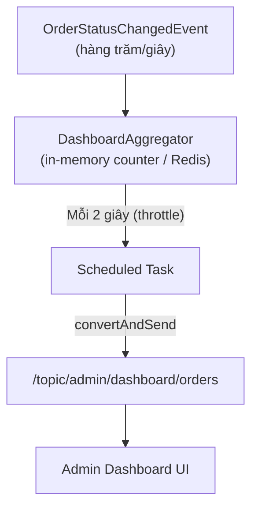
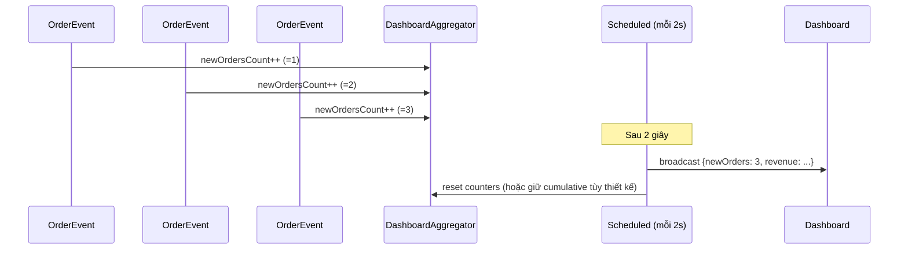
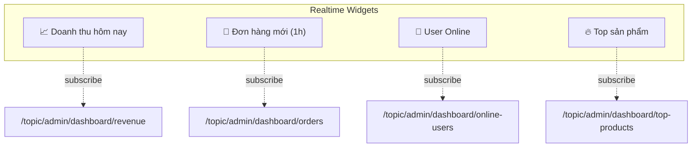
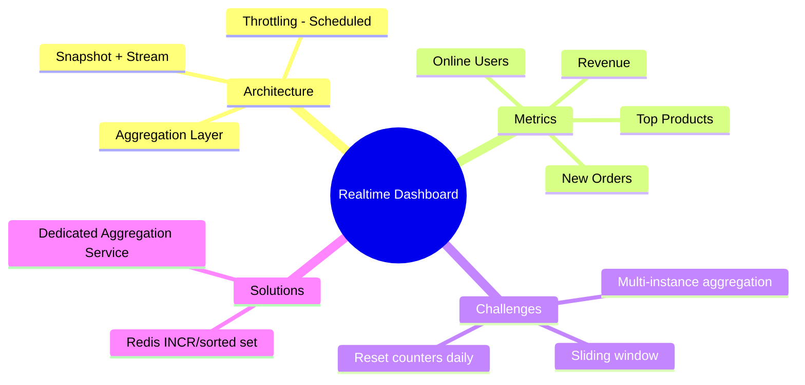

# CHƯƠNG 14 — REALTIME DASHBOARD (DASHBOARD QUẢN TRỊ THỜI GIAN THỰC)

## 🎯 1. Learning Objectives

- Thiết kế kiến trúc cho **Admin Dashboard Realtime**: doanh thu, đơn hàng mới, hoạt động khách hàng.
- Áp dụng kỹ thuật **Aggregation + Throttling** để tránh "flood" dữ liệu lên dashboard.
- Kết hợp **WebSocket** (cập nhật tức thì) và **REST API** (snapshot ban đầu, giống Chương 13).
- Xây dựng **Realtime Monitoring** cho các chỉ số kinh doanh (KPI) của Ecommerce.

---

## 📖 2. Lý thuyết

### 2.1. Đặc thù của Dashboard so với Order Tracking

| | Order Tracking (Chương 13) | Admin Dashboard |
|---|---|---|
| Đối tượng theo dõi | 1 đơn hàng cụ thể | Toàn bộ hệ thống (hàng nghìn đơn hàng/giây) |
| Tần suất event | Thấp (vài lần/đơn) | Rất cao (có thể hàng trăm event/giây) |
| Yêu cầu hiển thị | Chính xác từng event | Xu hướng/tổng hợp (aggregate) quan trọng hơn từng event |
| Rủi ro | Thiếu update | "Flood" UI nếu update quá nhanh |

**Hệ quả kiến trúc:** Dashboard **không nên** push trực tiếp từng `OrderStatusChangedEvent` lên
client — cần **Aggregation Layer** ở giữa.

### 2.2. Kiến trúc Aggregation + Throttling



- **Aggregator**: nhận mọi event, **cộng dồn** vào counter (ví dụ: `newOrdersCount++`,
  `totalRevenue += orderAmount`).
- **Throttling**: dùng `@Scheduled` để **đọc snapshot counter và broadcast định kỳ** (ví dụ
  mỗi 2 giây) — thay vì broadcast mỗi khi counter thay đổi.



### 2.3. Các loại chỉ số Dashboard cho Ecommerce

| Chỉ số | Nguồn dữ liệu | Cách tính |
|---|---|---|
| Doanh thu hôm nay | `OrderConfirmed`/`OrderDelivered` events | Tổng `order.totalAmount` |
| Số đơn hàng mới (1h gần nhất) | `OrderCreated` events | Counter, reset theo cửa sổ trượt (sliding window) |
| Số user online | `RedisOnlineUserRegistry` (Chương 12) | Đọc trực tiếp từ Redis |
| Top sản phẩm bán chạy | `OrderItemCreated` events | Aggregate theo `productId`, top N |
| Tỷ lệ hủy đơn | `OrderCancelled` / total orders | Tính theo cửa sổ thời gian |

---

## 🛒 3. Ví dụ thực tế: Admin Dashboard



---

## 💻 4. Complete Source Code

### 4.1. `DashboardAggregator` — gom counter

```java
package com.ecommerce.realtime.application.dashboard;

import com.ecommerce.realtime.domain.order.event.OrderStatusChangedEvent;
import lombok.Getter;
import org.springframework.context.event.EventListener;
import org.springframework.stereotype.Component;

import java.math.BigDecimal;
import java.util.concurrent.atomic.AtomicInteger;
import java.util.concurrent.atomic.AtomicReference;

/**
 * Lắng nghe domain event ở tần suất cao, cộng dồn vào counter trong bộ nhớ.
 * Việc "đọc và broadcast" được tách riêng (DashboardBroadcastScheduler) để throttle.
 */
@Component
@Getter
public class DashboardAggregator {

    private final AtomicInteger newOrdersCount = new AtomicInteger(0);
    private final AtomicInteger deliveredCount = new AtomicInteger(0);
    private final AtomicInteger cancelledCount = new AtomicInteger(0);
    private final AtomicReference<BigDecimal> revenueToday =
            new AtomicReference<>(BigDecimal.ZERO);

    @EventListener
    public void onOrderStatusChanged(OrderStatusChangedEvent event) {
        switch (event.newStatus()) {
            case "CONFIRMED" -> newOrdersCount.incrementAndGet();
            case "DELIVERED" -> deliveredCount.incrementAndGet();
            case "CANCELLED" -> cancelledCount.incrementAndGet();
            default -> { /* không tính */ }
        }
    }

    /** Gọi khi có đơn hàng confirmed - cộng doanh thu (đơn giản hóa: amount truyền trực tiếp) */
    public void addRevenue(BigDecimal amount) {
        revenueToday.updateAndGet(current -> current.add(amount));
    }

    /** Snapshot hiện tại - dùng cho cả broadcast định kỳ và REST API snapshot ban đầu */
    public DashboardSnapshot snapshot() {
        return new DashboardSnapshot(
                newOrdersCount.get(), deliveredCount.get(), cancelledCount.get(), revenueToday.get());
    }

    public record DashboardSnapshot(int newOrders, int delivered, int cancelled, BigDecimal revenue) {}
}
```

### 4.2. `DashboardBroadcastScheduler` — throttling

```java
package com.ecommerce.realtime.infrastructure.messaging.websocket;

import com.ecommerce.realtime.application.dashboard.DashboardAggregator;
import com.ecommerce.realtime.application.session.port.OnlineUserRegistryPort;
import lombok.RequiredArgsConstructor;
import org.springframework.messaging.simp.SimpMessagingTemplate;
import org.springframework.scheduling.annotation.Scheduled;
import org.springframework.stereotype.Component;

@Component
@RequiredArgsConstructor
public class DashboardBroadcastScheduler {

    private final DashboardAggregator aggregator;
    private final OnlineUserRegistryPort onlineUserRegistry;
    private final SimpMessagingTemplate messagingTemplate;

    /**
     * Throttling: chỉ broadcast mỗi 2 giây, bất kể có bao nhiêu event xảy ra trong khoảng đó.
     * Điều này tránh "flood" UI khi traffic cao (Black Friday, Flash Sale).
     */
    @Scheduled(fixedRate = 2000)
    public void broadcastDashboardMetrics() {
        var snapshot = aggregator.snapshot();

        messagingTemplate.convertAndSend("/topic/admin/dashboard/orders",
                new OrdersMetricPayload(snapshot.newOrders(), snapshot.delivered(), snapshot.cancelled()));

        messagingTemplate.convertAndSend("/topic/admin/dashboard/revenue",
                new RevenueMetricPayload(snapshot.revenue()));

        messagingTemplate.convertAndSend("/topic/admin/dashboard/online-users",
                new OnlineUsersPayload(onlineUserRegistry.countOnlineUsers()));
    }

    public record OrdersMetricPayload(int newOrders, int delivered, int cancelled) {}
    public record RevenueMetricPayload(java.math.BigDecimal revenue) {}
    public record OnlineUsersPayload(int onlineCount) {}
}
```

> Cần thêm `@EnableScheduling` trong configuration chính của application.

### 4.3. REST snapshot endpoint (cho lần load đầu của Dashboard - giống pattern Chương 13)

```java
package com.ecommerce.realtime.presentation.rest;

import com.ecommerce.realtime.application.dashboard.DashboardAggregator;
import com.ecommerce.realtime.application.session.port.OnlineUserRegistryPort;
import lombok.RequiredArgsConstructor;
import org.springframework.web.bind.annotation.GetMapping;
import org.springframework.web.bind.annotation.RequestMapping;
import org.springframework.web.bind.annotation.RestController;

@RestController
@RequestMapping("/api/admin/dashboard")
@RequiredArgsConstructor
public class DashboardController {

    private final DashboardAggregator aggregator;
    private final OnlineUserRegistryPort onlineUserRegistry;

    @GetMapping("/snapshot")
    public DashboardSnapshotResponse snapshot() {
        var s = aggregator.snapshot();
        return new DashboardSnapshotResponse(s.newOrders(), s.delivered(), s.cancelled(),
                s.revenue(), onlineUserRegistry.countOnlineUsers());
    }

    public record DashboardSnapshotResponse(int newOrders, int delivered, int cancelled,
                                              java.math.BigDecimal revenue, int onlineUsers) {}
}
```

### 4.4. React — `AdminDashboard`

```jsx
import { useEffect, useState } from "react";
import { Client } from "@stomp/stompjs";
import SockJS from "sockjs-client";

export default function AdminDashboard({ jwtToken }) {
  const [metrics, setMetrics] = useState({
    newOrders: 0, delivered: 0, cancelled: 0, revenue: 0, onlineUsers: 0,
  });

  useEffect(() => {
    // 1. Snapshot ban đầu
    fetch("/api/admin/dashboard/snapshot", { headers: { Authorization: `Bearer ${jwtToken}` } })
      .then((r) => r.json())
      .then(setMetrics);

    // 2. Stream realtime
    const client = new Client({
      webSocketFactory: () => new SockJS("/ws"),
      connectHeaders: { Authorization: `Bearer ${jwtToken}` },
      reconnectDelay: 5000,
      onConnect: () => {
        client.subscribe("/topic/admin/dashboard/orders", (msg) => {
          const p = JSON.parse(msg.body);
          setMetrics((prev) => ({ ...prev, newOrders: p.newOrders, delivered: p.delivered, cancelled: p.cancelled }));
        });
        client.subscribe("/topic/admin/dashboard/revenue", (msg) => {
          const p = JSON.parse(msg.body);
          setMetrics((prev) => ({ ...prev, revenue: p.revenue }));
        });
        client.subscribe("/topic/admin/dashboard/online-users", (msg) => {
          const p = JSON.parse(msg.body);
          setMetrics((prev) => ({ ...prev, onlineUsers: p.onlineCount }));
        });
      },
    });

    client.activate();
    return () => client.deactivate();
  }, [jwtToken]);

  return (
    <div className="dashboard-grid">
      <MetricCard title="📈 Doanh thu hôm nay" value={`${metrics.revenue.toLocaleString("vi-VN")} ₫`} />
      <MetricCard title="🛒 Đơn hàng mới" value={metrics.newOrders} />
      <MetricCard title="✅ Đã giao" value={metrics.delivered} />
      <MetricCard title="❌ Đã hủy" value={metrics.cancelled} />
      <MetricCard title="👥 User Online" value={metrics.onlineUsers} />
    </div>
  );
}

function MetricCard({ title, value }) {
  return (
    <div className="metric-card">
      <h4>{title}</h4>
      <p className="metric-value">{value}</p>
    </div>
  );
}
```

---

## 📝 5. Hands-on Exercises

**Bài 1:** Triển khai `DashboardAggregator` + `DashboardBroadcastScheduler` với
`@Scheduled(fixedRate = 2000)`. Mô phỏng tải cao: dùng script gửi 100 request
`PUT /api/orders/{id}/status` liên tục trong 1 giây. Quan sát: Dashboard nhận bao nhiêu message
WebSocket trong khoảng thời gian đó (kỳ vọng: ít hơn nhiều so với 100, do throttling).

**Bài 2:** Triển khai `AdminDashboard` React component với snapshot + stream như mục 4.4.

---

## 🚀 6. Advanced Exercises

**Bài 3:** "Số đơn hàng mới (1h gần nhất)" yêu cầu **sliding window** — không thể chỉ dùng
`AtomicInteger` tăng dần mãi (counter sẽ không bao giờ giảm). Thiết kế cấu trúc dữ liệu phù hợp
(gợi ý: lưu timestamp của từng order trong một cấu trúc, định kỳ loại bỏ các entry > 1h; hoặc
dùng Redis Sorted Set với `ZADD`/`ZREMRANGEBYSCORE`).

**Bài 4:** Trong kiến trúc multi-instance (Chương 11-12), mỗi instance có `DashboardAggregator`
**riêng** (in-memory). Nếu Admin Dashboard kết nối đến Instance A nhưng order events được xử
lý rải rác trên cả Instance A và B, `DashboardAggregator` của A sẽ **thiếu dữ liệu** từ B.
Đề xuất 2 giải pháp:
- (a) Aggregate tại tầng Redis (counter dùng `INCR`/`INCRBYFLOAT`, mọi instance cùng cập nhật
  vào Redis, scheduler đọc từ Redis).
- (b) Một service riêng (Dashboard Aggregation Service) subscribe tất cả event qua Redis
  Pub/Sub, là nơi duy nhất tính toán và broadcast.

So sánh ưu/nhược điểm.

---

## ❓ 7. Interview Questions

1. Vì sao Dashboard cần "Aggregation + Throttling" trong khi Order Tracking (Chương 13) không cần?
2. `@Scheduled(fixedRate = 2000)` có đảm bảo broadcast đúng mỗi 2 giây nếu method xử lý mất > 2 giây? Giải thích `fixedRate` vs `fixedDelay`.
3. Nếu không reset counter sau mỗi lần broadcast, điều gì xảy ra với "Số đơn hàng mới hôm nay"
   vào ngày tiếp theo? Thiết kế reset hàng ngày như thế nào?
4. Trong môi trường multi-instance, vì sao `AtomicInteger` trong `DashboardAggregator` không
   đủ để có số liệu chính xác?
5. Trade-off giữa độ trễ throttling (ví dụ 2 giây) và "tính realtime" của dashboard — làm sao
   chọn giá trị phù hợp?

---

## 📋 8. Chapter Summary

- Dashboard cần **Aggregation** (gom số liệu từ nhiều event) và **Throttling** (broadcast định
  kỳ, không phải mỗi event) để tránh "flood" UI khi traffic cao.
- `@Scheduled(fixedRate = 2000)` kết hợp `DashboardAggregator` (counter in-memory) là cách đơn
  giản cho single-instance.
- Pattern "Snapshot + Stream" (Chương 13) cũng áp dụng cho Dashboard: REST API trả snapshot
  ban đầu, WebSocket broadcast cập nhật định kỳ.
- "Sliding window" (ví dụ: đơn hàng trong 1h gần nhất) cần cấu trúc dữ liệu phù hợp (Redis
  Sorted Set), không thể dùng counter đơn giản.
- Trong multi-instance, cần **Aggregate tập trung** (qua Redis hoặc service riêng) để đảm bảo
  số liệu chính xác trên toàn hệ thống.

---

## 🧠 9. Mindmap



---

## ✅ 10. Completion Checklist

- [ ] Triển khai `DashboardAggregator` + `DashboardBroadcastScheduler` (Bài 1).
- [ ] Quan sát hiệu quả throttling dưới tải cao (Bài 1).
- [ ] `AdminDashboard` React hiển thị đầy đủ 5 metric (Bài 2).
- [ ] Thiết kế sliding window cho "đơn hàng 1h gần nhất" (Bài 3).
- [ ] Phân tích và chọn giải pháp aggregation cho multi-instance (Bài 4).

---

## 📌 11. Reference Answers

**Bài 3 (gợi ý — Redis Sorted Set):**
```java
// Khi có đơn hàng mới: lưu timestamp (score) = thời điểm tạo, member = orderId
redisTemplate.opsForZSet().add("recent_orders", orderId, Instant.now().getEpochSecond());

// Khi cần đếm "đơn hàng trong 1h gần nhất":
long oneHourAgo = Instant.now().minus(Duration.ofHours(1)).getEpochSecond();
redisTemplate.opsForZSet().removeRangeByScore("recent_orders", 0, oneHourAgo); // dọn dẹp entry cũ
Long count = redisTemplate.opsForZSet().count("recent_orders", oneHourAgo, Double.MAX_VALUE);
```
Cách này cho phép tính "sliding window" chính xác mà không cần lưu toàn bộ lịch sử trong memory.

**Bài 4 (gợi ý so sánh):**
- **(a) Aggregate qua Redis (`INCR`/`INCRBYFLOAT`)**: đơn giản, ít thay đổi kiến trúc — mỗi
  instance khi xử lý event gọi `redisTemplate.opsForValue().increment("metric:new_orders")`.
  `DashboardBroadcastScheduler` trên **mọi instance** đọc cùng giá trị từ Redis → tất cả
  instance broadcast **số liệu giống nhau** (idempotent). Nhược điểm: nếu nhiều instance đều
  `@Scheduled` broadcast, dashboard sẽ nhận **N message giống nhau** mỗi 2 giây (N = số
  instance) — cần dedupe ở client hoặc chỉ cho 1 instance làm "leader" broadcast (Redis lock).
- **(b) Dashboard Aggregation Service riêng**: tách hẳn thành 1 service nhỏ, subscribe Redis
  Pub/Sub `order-events`, tự tính toán, là **nơi duy nhất** broadcast đến `/topic/admin/dashboard/**`.
  Ưu điểm: không có vấn đề "N message giống nhau", dễ scale độc lập. Nhược điểm: thêm 1 service
  cần vận hành, thêm độ trễ (qua Redis Pub/Sub).
- **Khuyến nghị**: với hệ thống vừa, (a) kèm "leader election" đơn giản (dùng Redis `SETNX`
  với TTL để chỉ 1 instance là "leader" chạy `@Scheduled`) là đủ. Với hệ thống lớn, (b) phù hợp
  hơn về lâu dài.


- [Chương 13 - Realtime Order Tracking](./chap13.md)

- [Chương 15 - Production Project (Capstone)](./chap15.md)
