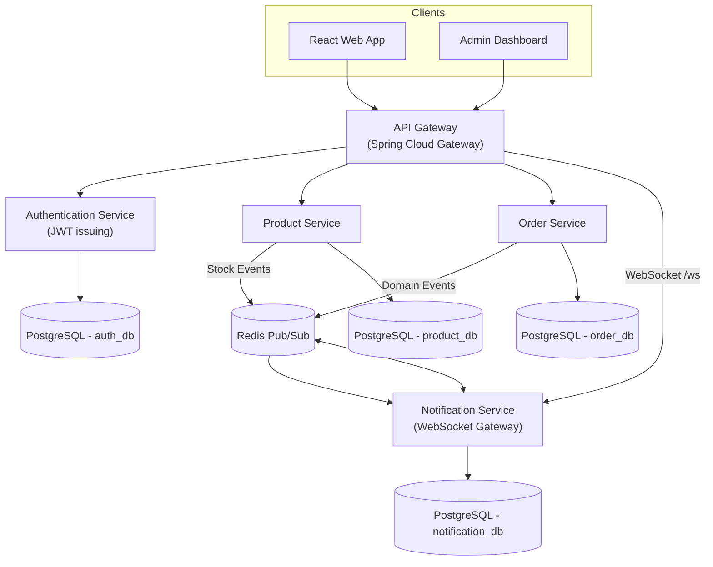
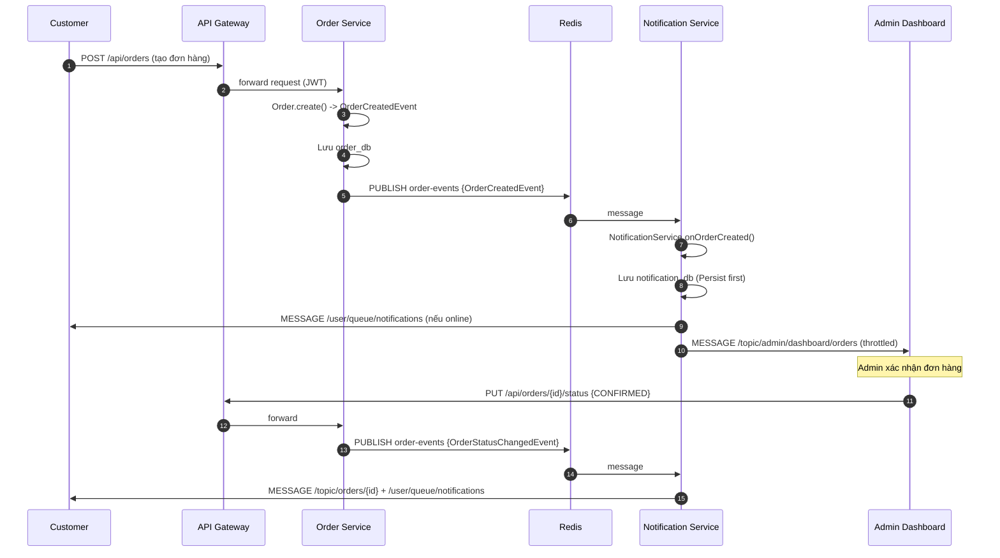
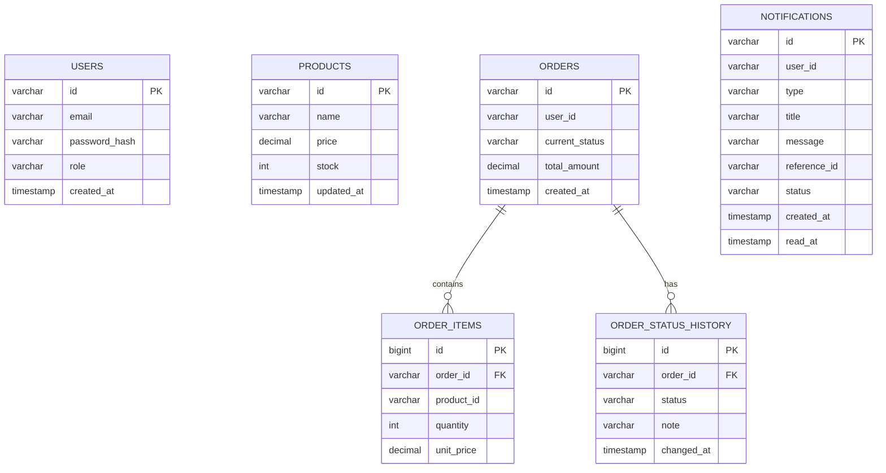
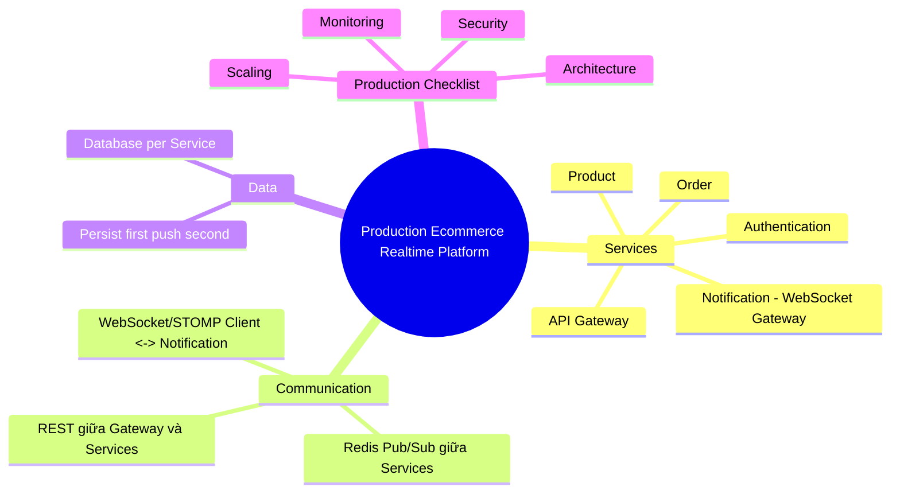

# CHƯƠNG 15 — PRODUCTION ECOMMERCE REALTIME PROJECT (CAPSTONE)

## 🎯 1. Learning Objectives

- Tổng hợp **toàn bộ kiến thức Chương 1-14** thành một **Ecommerce Realtime Platform** hoàn chỉnh.
- Thiết kế kiến trúc **microservices**: API Gateway, Authentication Service, Product Service,
  Order Service, Notification Service.
- Hoàn thiện **Database Design** cho toàn hệ thống.
- Viết **Deployment Guide** với Docker Compose.
- Xây dựng **Production Checklist** đầy đủ trước khi go-live.

---

## 📖 2. Tổng quan kiến trúc hệ thống

### 2.1. Kiến trúc tổng thể



### 2.2. Vai trò từng service

| Service | Trách nhiệm | Công nghệ chính |
|---|---|---|
| **API Gateway** | Routing, rate limiting, CORS, forward JWT | Spring Cloud Gateway |
| **Authentication Service** | Đăng ký/đăng nhập, phát hành JWT | Spring Security, JWT, PostgreSQL |
| **Product Service** | Quản lý sản phẩm, tồn kho | Spring Boot, PostgreSQL |
| **Order Service** | Quản lý đơn hàng, State Machine (Chương 6, 13) | Spring Boot, PostgreSQL, publish Redis events |
| **Notification Service** | WebSocket Gateway: STOMP endpoint, Notification Center (Chương 5-12) | Spring WebSocket, STOMP, Redis, PostgreSQL |

> **Lưu ý kiến trúc quan trọng:** `Notification Service` là **service duy nhất** expose
> WebSocket endpoint (`/ws`). `Order Service` và `Product Service` **không biết gì về
> WebSocket** — chúng chỉ publish domain event lên **Redis** (Chương 12). Đây là sự mở rộng
> tự nhiên của **Hexagonal Architecture** (Chương 6) ra cấp độ microservices: `Notification
> Service` chính là "Adapter tổng hợp" cho toàn hệ thống.

### 2.3. Sequence Diagram: Luồng đặt hàng → thông báo realtime



---

## 🗄️ 3. Database Design

### 3.1. ERD tổng thể (mỗi service có DB riêng — Database per Service)



> **Database per Service**: `auth_db` (USERS), `product_db` (PRODUCTS), `order_db` (ORDERS,
> ORDER_ITEMS, ORDER_STATUS_HISTORY), `notification_db` (NOTIFICATIONS) — mỗi service sở hữu
> schema riêng, không truy vấn trực tiếp DB của service khác (chỉ giao tiếp qua API/event).

---

## 💻 4. Source Code: Notification Service (trọng tâm WebSocket)

> Các service `Authentication`, `Product`, `Order` áp dụng cùng cấu trúc Clean Architecture đã
> học ở Chương 6, 10, 13 — chương này tập trung vào **Notification Service**, là service
> "mới" quan trọng nhất về mặt WebSocket, đóng vai trò **WebSocket Gateway** cho toàn hệ thống.

### 4.1. Cấu trúc package — Notification Service

```
notification-service/
└── src/main/java/com/ecommerce/notification
    ├── domain
    │   └── notification/model/ (Notification, NotificationId, NotificationType...)
    ├── application
    │   ├── notification/
    │   │   ├── usecase/ (CreateNotificationFromEventUseCase, MarkAsReadUseCase...)
    │   │   └── port/ (NotificationRepositoryPort, RealtimeNotificationSenderPort)
    │   └── session/port/ (OnlineUserRegistryPort)
    ├── infrastructure
    │   ├── messaging/redis/ (RedisMessageSubscriber, RedisConfig)
    │   ├── messaging/websocket/ (WebSocketRealtimeNotificationSender)
    │   ├── persistence/ (NotificationJpaEntity, Adapter)
    │   ├── session/ (RedisOnlineUserRegistry, WebSocketSessionEventListener)
    │   └── security/ (JwtHandshakeInterceptor, StompAuthChannelInterceptor)
    ├── presentation
    │   ├── rest/ (NotificationController, DashboardController)
    │   └── websocket/ (OrderTrackingController for refresh)
    └── shared/
```

> Đây chính là **tổng hợp** của Chương 6 (Clean Architecture), Chương 8 (Security), Chương 9
> (Session), Chương 10 (Notification), Chương 12 (Redis), Chương 14 (Dashboard) — toàn bộ
> source code đã được trình bày chi tiết ở các chương đó. Chương này chỉ trình bày **điểm tích
> hợp mới**: `RedisMessageSubscriber` mở rộng để xử lý **nhiều loại event** từ nhiều service
> khác nhau (`order-events` từ Order Service, `product-events` từ Product Service).

### 4.2. `RedisMessageSubscriber` mở rộng — đa nguồn event

```java
package com.ecommerce.notification.infrastructure.messaging.redis;

import com.ecommerce.notification.application.notification.usecase.CreateNotificationFromEventUseCase;
import com.fasterxml.jackson.databind.JsonNode;
import com.fasterxml.jackson.databind.ObjectMapper;
import lombok.RequiredArgsConstructor;
import lombok.extern.slf4j.Slf4j;
import org.springframework.data.redis.connection.Message;
import org.springframework.stereotype.Component;

/**
 * Notification Service - WebSocket Gateway cho toàn hệ thống.
 * Subscribe nhiều channel từ các service khác (Order, Product) qua Redis Pub/Sub.
 */
@Slf4j
@Component
@RequiredArgsConstructor
public class RedisMessageSubscriber {

    private final ObjectMapper objectMapper;
    private final CreateNotificationFromEventUseCase createNotificationUseCase;

    /** Channel: order-events (từ Order Service) */
    public void onOrderEvent(Message message, byte[] pattern) {
        handle(message, "order-events");
    }

    /** Channel: product-events (từ Product Service) */
    public void onProductEvent(Message message, byte[] pattern) {
        handle(message, "product-events");
    }

    private void handle(Message message, String channel) {
        try {
            JsonNode node = objectMapper.readTree(message.getBody());
            log.debug("Received event from channel '{}': {}", channel, node);
            createNotificationUseCase.execute(channel, node);
        } catch (Exception e) {
            log.error("Lỗi khi xử lý message từ channel {}", channel, e);
        }
    }
}
```

### 4.3. `CreateNotificationFromEventUseCase` — điều phối theo loại event

```java
package com.ecommerce.notification.application.notification.usecase;

import com.ecommerce.notification.application.notification.port.NotificationRepositoryPort;
import com.ecommerce.notification.application.notification.port.RealtimeNotificationSenderPort;
import com.ecommerce.notification.domain.notification.model.Notification;
import com.ecommerce.notification.domain.notification.model.NotificationType;
import com.fasterxml.jackson.databind.JsonNode;
import lombok.RequiredArgsConstructor;
import org.springframework.stereotype.Service;
import org.springframework.transaction.annotation.Transactional;

@Service
@RequiredArgsConstructor
public class CreateNotificationFromEventUseCase {

    private final NotificationRepositoryPort notificationRepository;
    private final RealtimeNotificationSenderPort realtimeSender;

    @Transactional
    public void execute(String channel, JsonNode eventPayload) {
        Notification notification = switch (channel) {
            case "order-events" -> fromOrderEvent(eventPayload);
            case "product-events" -> fromProductEvent(eventPayload);
            default -> null;
        };

        if (notification == null) return; // event không cần tạo notification (ví dụ trạng thái PACKED)

        notification = notificationRepository.save(notification); // Persist first (Chương 10)
        realtimeSender.send(notification);                         // Push second
    }

    private Notification fromOrderEvent(JsonNode event) {
        String status = event.get("newStatus").asText();
        String orderId = event.get("orderId").asText();
        String userId = event.get("userId").asText();

        return switch (status) {
            case "CONFIRMED" -> Notification.create(userId, NotificationType.ORDER_CONFIRMED,
                    "Đơn hàng đã được xác nhận", "Đơn hàng #" + orderId + " đã được xác nhận.", orderId);
            case "SHIPPING" -> Notification.create(userId, NotificationType.ORDER_SHIPPING,
                    "Đơn hàng đang được giao", "Đơn hàng #" + orderId + " đang trên đường đến bạn.", orderId);
            case "DELIVERED" -> Notification.create(userId, NotificationType.ORDER_DELIVERED,
                    "Đơn hàng đã giao thành công", "Đơn hàng #" + orderId + " đã được giao thành công.", orderId);
            case "CANCELLED" -> Notification.create(userId, NotificationType.ORDER_CANCELLED,
                    "Đơn hàng đã bị hủy", "Đơn hàng #" + orderId + " đã bị hủy.", orderId);
            default -> null;
        };
    }

    private Notification fromProductEvent(JsonNode event) {
        // Ví dụ: ProductPriceDroppedEvent cho user có sản phẩm trong wishlist
        if (!"PRICE_DROPPED".equals(event.get("type").asText())) return null;

        String userId = event.get("wishlistUserId").asText();
        String productId = event.get("productId").asText();
        String productName = event.get("productName").asText();

        return Notification.create(userId, NotificationType.PROMOTION,
                "Sản phẩm trong wishlist giảm giá!",
                "Sản phẩm \"" + productName + "\" trong wishlist của bạn đang giảm giá.", productId);
    }
}
```

---

## 🚀 5. Deployment Guide

### 5.1. `docker-compose.yml` — toàn hệ thống

```yaml
version: "3.9"

services:
  # ===== Infrastructure =====
  postgres:
    image: postgres:16-alpine
    environment:
      POSTGRES_USER: app
      POSTGRES_PASSWORD: app_password
    volumes:
      - ./init-db:/docker-entrypoint-initdb.d  # script tạo auth_db, product_db, order_db, notification_db
    ports: ["5432:5432"]

  redis:
    image: redis:7-alpine
    ports: ["6379:6379"]

  # ===== Services =====
  auth-service:
    build: ./auth-service
    environment:
      SPRING_DATASOURCE_URL: jdbc:postgresql://postgres:5432/auth_db
      JWT_SECRET: ${JWT_SECRET}
    depends_on: [postgres]

  product-service:
    build: ./product-service
    environment:
      SPRING_DATASOURCE_URL: jdbc:postgresql://postgres:5432/product_db
      SPRING_REDIS_HOST: redis
    depends_on: [postgres, redis]

  order-service:
    build: ./order-service
    environment:
      SPRING_DATASOURCE_URL: jdbc:postgresql://postgres:5432/order_db
      SPRING_REDIS_HOST: redis
    depends_on: [postgres, redis]

  notification-service:
    build: ./notification-service
    environment:
      SPRING_DATASOURCE_URL: jdbc:postgresql://postgres:5432/notification_db
      SPRING_REDIS_HOST: redis
      JWT_SECRET: ${JWT_SECRET}
    deploy:
      replicas: 2 # Multi-instance (Chương 11-12)
    depends_on: [postgres, redis]

  api-gateway:
    build: ./api-gateway
    ports: ["8080:8080"]
    depends_on: [auth-service, product-service, order-service, notification-service]
```

### 5.2. API Gateway — routing config (Spring Cloud Gateway)

```yaml
spring:
  cloud:
    gateway:
      routes:
        - id: auth-service
          uri: lb://auth-service
          predicates: [Path=/api/auth/**]
        - id: product-service
          uri: lb://product-service
          predicates: [Path=/api/products/**]
        - id: order-service
          uri: lb://order-service
          predicates: [Path=/api/orders/**]
        - id: notification-rest
          uri: lb://notification-service
          predicates: [Path=/api/notifications/**, Path=/api/admin/dashboard/**]
        - id: notification-ws
          uri: lb://notification-service
          predicates: [Path=/ws/**]
          # Lưu ý: Gateway cần hỗ trợ forward WebSocket (Spring Cloud Gateway hỗ trợ qua ws://)
```

### 5.3. Thứ tự triển khai (Deployment Order)

1. `postgres`, `redis` (infrastructure trước).
2. Chạy migration cho từng DB (`auth_db`, `product_db`, `order_db`, `notification_db`).
3. `auth-service` (các service khác cần validate JWT do auth-service phát hành).
4. `product-service`, `order-service`, `notification-service` (có thể parallel).
5. `api-gateway` (sau cùng, vì cần route đến các service đã chạy).

---

## ✅ 6. Production Checklist

### 6.1. Kiến trúc & Code
- [ ] Mọi service tuân theo Clean Architecture (Domain không phụ thuộc Framework — Chương 6).
- [ ] `NotificationPublisherPort` / Adapter pattern cho phép thay đổi messaging (Redis/Kafka)
      mà không sửa Domain/Application.
- [ ] Domain Event được test bằng Unit Test (không cần Spring context).

### 6.2. WebSocket & Realtime
- [ ] `WebSocketConfig` giới hạn `setAllowedOriginPatterns` theo domain production (Chương 3, 17).
- [ ] Heartbeat được cấu hình hợp lý (Chương 18).
- [ ] `RedisMessageSubscriber` chạy đúng trên mọi instance Notification Service (Chương 12).
- [ ] `RedisOnlineUserRegistry` dùng TTL để self-healing (Chương 12).

### 6.3. Security
- [ ] JWT có thời gian sống hợp lý, có refresh token (Chương 8, 17).
- [ ] RBAC cho `/topic/admin/**` chỉ cho phép `ROLE_ADMIN` (Chương 8).
- [ ] Rate limiting cho WebSocket connection/message (Chương 17).
- [ ] CORS/Origin được giới hạn đúng domain (Chương 17).

### 6.4. Database
- [ ] Index đầy đủ cho các truy vấn thường gặp (`notifications(user_id, status)`,
      `order_status_history(order_id)`).
- [ ] Mỗi service có DB riêng (Database per Service).
- [ ] Migration được quản lý bằng Flyway/Liquibase.

### 6.5. Scaling & Resilience
- [ ] Notification Service chạy ≥ 2 replica (Chương 11).
- [ ] Load Balancer cấu hình đúng cho WebSocket (Upgrade headers, timeout — Chương 11).
- [ ] Redis có cấu hình persistence/HA nếu cần giảm rủi ro mất Pub/Sub message (Chương 12, 20).
- [ ] "Persist first, push second" áp dụng cho mọi loại Notification quan trọng (Chương 10).

### 6.6. Monitoring & Observability
- [ ] Log có `sessionId`, `userId`, `orderId` để trace luồng end-to-end (Chương 18).
- [ ] Metrics: số connection hiện tại, message/giây, latency broadcast (Chương 16, 18).
- [ ] Alerting khi "Online User Count" hoặc "message queue lag" bất thường.

### 6.7. Performance
- [ ] `TaskExecutor` riêng cho inbound/outbound channel, đã load test (Chương 3, 16).
- [ ] Throttling cho Dashboard đã được benchmark với traffic giả lập (Chương 14, 16).

---

## 📝 7. Hands-on Exercise (Capstone)

**Bài tập tổng hợp:** Triển khai đầy đủ 5 service theo `docker-compose.yml` ở mục 5.1. Thực
hiện kịch bản end-to-end:

1. `POST /api/auth/register` + `POST /api/auth/login` → nhận JWT.
2. `GET /api/products` → chọn 1 sản phẩm.
3. `POST /api/orders` → tạo đơn hàng.
4. Mở `OrderTrackingPage` (Chương 13) — subscribe `/topic/orders/{id}`.
5. Mở `AdminDashboard` (Chương 14) — subscribe các topic dashboard.
6. Dùng tài khoản `ADMIN`, gọi `PUT /api/orders/{id}/status` để chuyển qua các trạng thái.
7. Xác nhận: `OrderTrackingPage` cập nhật realtime, `NotificationCenter` (Chương 10) hiện
   thông báo mới, `AdminDashboard` cập nhật số liệu.
8. Scale `notification-service` lên 2 replica — lặp lại bước 6, xác nhận vẫn hoạt động đúng
   (Chương 11-12).

---

## ❓ 8. Interview Questions (Tổng hợp Capstone)

1. Vì sao chỉ `Notification Service` expose WebSocket endpoint, không phải `Order Service`?
2. Giải thích "Database per Service" và hệ quả với việc truy vấn dữ liệu liên service
   (ví dụ: hiển thị tên sản phẩm trong notification).
3. Nếu `Order Service` down, điều gì xảy ra với các WebSocket connection hiện tại của
   `Notification Service`?
4. Thiết kế của hệ thống có Single Point of Failure nào? Đề xuất giảm thiểu.
5. Trình bày toàn bộ luồng dữ liệu từ lúc Admin xác nhận đơn hàng đến lúc khách hàng thấy
   thông báo trên UI — nêu rõ từng thành phần tham gia.

---

## 📋 9. Chapter Summary

- Hệ thống Ecommerce Realtime hoàn chỉnh gồm 5 service: **API Gateway, Authentication, Product,
  Order, Notification** — mỗi service có DB riêng (Database per Service).
- **Notification Service** đóng vai trò **WebSocket Gateway** duy nhất, nhận event từ các
  service khác qua **Redis Pub/Sub**, áp dụng toàn bộ pattern đã học: Clean Architecture
  (Chương 6), User Messaging (Chương 7), Security (Chương 8), Session (Chương 9), Notification
  Center (Chương 10), Redis (Chương 12), Dashboard (Chương 14).
- `docker-compose.yml` + API Gateway routing là baseline triển khai.
- Production Checklist bao quát 7 nhóm: Architecture, WebSocket, Security, Database, Scaling,
  Monitoring, Performance.

---

## 🧠 10. Mindmap



---

## 🧾 11. Completion Checklist (Tổng kết toàn khóa)

- [ ] Hoàn thành toàn bộ Capstone Exercise (mục 7).
- [ ] Có thể giải thích kiến trúc tổng thể cho người khác (whiteboard interview).
- [ ] Hoàn thành Production Checklist (mục 6) cho project cá nhân/portfolio.
- [ ] Tự tin trả lời mọi Interview Question từ Chương 1-15.
- [ ] Sẵn sàng cho các chương Nâng cao (16-20): Performance, Security, Best Practices,
      Comparisons, Kafka Integration.

---

## 📌 12. Reference Notes

Đây là chương capstone — "Reference Answers" chính là **toàn bộ source code từ Chương 1-14**
được tổng hợp lại. Khuyến khích bạn:

1. Tạo một **monorepo hoặc multi-module Maven project** chứa 5 service.
2. Bắt đầu với `notification-service` (đã có hầu hết code từ Chương 5-12, 14).
3. Viết `order-service`, `product-service` theo cùng Clean Architecture pattern (Chương 6).
4. `auth-service` đơn giản: chỉ cần `POST /register`, `POST /login` trả JWT (dùng
   `JwtTokenProvider` từ Chương 8).
5. `api-gateway`: dùng Spring Cloud Gateway, tham khảo cấu hình mục 5.2.

Việc tự triển khai toàn bộ capstone là cách tốt nhất để biến kiến thức từ khóa học thành
**kinh nghiệm thực chiến** — đây chính là sự khác biệt giữa Middle và Senior Engineer.
- [Chương 14 - Realtime Dashboard](./chap14.md)

- [Chương 16 - Performance Tuning](./chap16.md)
