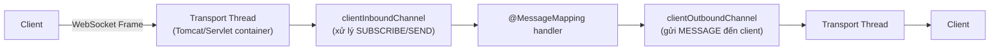
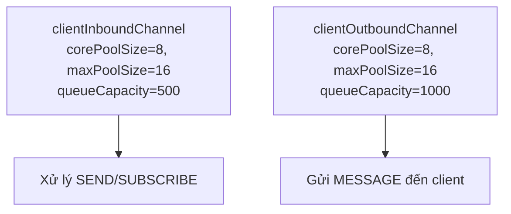
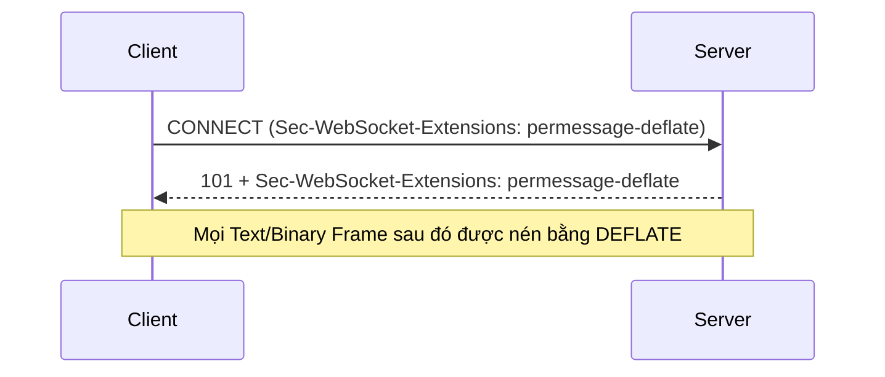
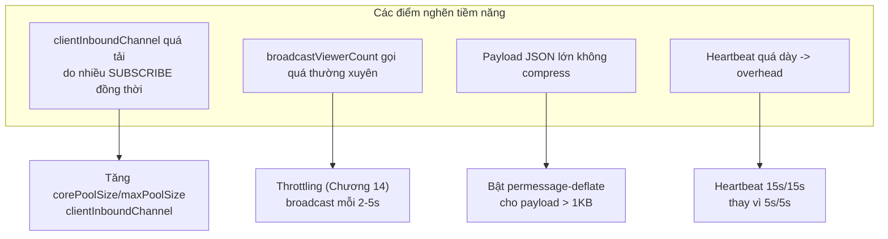
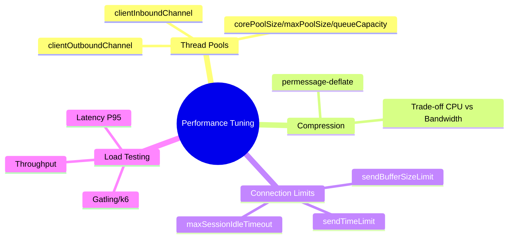

# CHƯƠNG 16 — WEBSOCKET PERFORMANCE TUNING (TỐI ƯU HIỆU NĂNG)

## 🎯 1. Learning Objectives

- Hiểu và cấu hình **Thread Pool / Executor** cho các channel inbound/outbound của Spring WebSocket.
- Áp dụng **Message Compression** để giảm băng thông.
- Tối ưu **Connection Management**: heartbeat interval, buffer size, idle timeout.
- Thực hiện **Load Testing** và **Benchmarking** cho hệ thống WebSocket.
- Phân tích bottleneck thường gặp trong hệ thống Ecommerce Realtime ở quy mô lớn (Black Friday, Flash Sale).

---

## 📖 2. Lý thuyết

### 2.1. Thread Pool trong Spring WebSocket

Spring WebSocket sử dụng nhiều thread pool cho các giai đoạn xử lý khác nhau:



| Channel | Vai trò | Cấu hình |
|---|---|---|
| `clientInboundChannel` | Xử lý message từ client (SUBSCRIBE, SEND, CONNECT) | `configureClientInboundChannel` |
| `clientOutboundChannel` | Gửi message đến client (MESSAGE) | `configureClientOutboundChannel` |
| `brokerChannel` | Giao tiếp nội bộ với Simple Broker | `configureMessageBroker().setPreservePublishOrder()` |

**Vấn đề mặc định:** Spring dùng `ThreadPoolExecutor` với cấu hình mặc định khá nhỏ
(`corePoolSize` = số core CPU). Nếu một `@MessageMapping` xử lý chậm (gọi DB, gọi service
ngoài), nó **chiếm thread** trong pool — các message khác phải **chờ** (queue).

### 2.2. Cấu hình Thread Pool tối ưu



**Nguyên tắc tính toán:**
- `corePoolSize`: bắt đầu với `2 * số core CPU` cho I/O-bound workload (gọi DB, Redis).
- `maxPoolSize`: gấp 2-4 lần `corePoolSize`, dùng cho burst traffic (Flash Sale).
- `queueCapacity`: giới hạn để tránh **OutOfMemoryError** khi traffic vượt khả năng xử lý —
  khi queue đầy, áp dụng **rejection policy** (ví dụ: `CallerRunsPolicy` để giảm tốc producer).

### 2.3. Message Compression

WebSocket hỗ trợ extension **`permessage-deflate`** (RFC 7692) — nén dữ liệu trước khi gửi qua
frame, giảm băng thông đáng kể cho payload JSON lớn (ví dụ: Dashboard với nhiều metric).



**Trade-off:** Compression giảm băng thông nhưng **tăng CPU usage** (nén/giải nén). Với
payload nhỏ (vài chục byte như `{"status":"SHIPPING"}`), compression **không đáng** —
overhead CPU có thể lớn hơn lợi ích băng thông. Compression đáng giá với payload lớn (>1KB),
ví dụ: Dashboard trả về danh sách top sản phẩm.

### 2.4. Connection Optimization

| Tham số | Ý nghĩa | Khuyến nghị |
|---|---|---|
| Heartbeat interval | Tần suất ping/pong | 10s-25s (cân bằng giữa phát hiện disconnect và overhead — Chương 18) |
| `setSendTimeLimit` | Timeout khi gửi message (tránh client chậm "treo" server) | 10-20 giây |
| `setSendBufferSizeLimit` | Giới hạn buffer outbound mỗi session | 512KB - 1MB |
| `setMessageSizeLimit` | Giới hạn kích thước message inbound | Theo nhu cầu (ví dụ: 64KB cho JSON) |

```java
@Bean
public ServletServerContainerFactoryBean createWebSocketContainer() {
    ServletServerContainerFactoryBean container = new ServletServerContainerFactoryBean();
    container.setMaxTextMessageBufferSize(64 * 1024);   // 64KB
    container.setMaxBinaryMessageBufferSize(64 * 1024);
    container.setMaxSessionIdleTimeout(60_000L);        // 60s
    return container;
}
```

---

## 🛒 3. Ví dụ thực tế: Tối ưu cho Flash Sale

**Bối cảnh:** Trong sự kiện Flash Sale, hệ thống có thể có:
- 50,000 WebSocket connection đồng thời (trang sản phẩm Flash Sale).
- `ProductViewerTracker` (Chương 9) cập nhật `viewerCount` mỗi vài giây cho hàng trăm sản phẩm.
- Dashboard admin cần theo dõi doanh thu realtime.



---

## 💻 4. Source Code: Cấu hình Performance-tuned

### 4.1. `WebSocketConfig` với Thread Pool tối ưu

```java
package com.ecommerce.realtime.infrastructure.config;

import org.springframework.context.annotation.Bean;
import org.springframework.context.annotation.Configuration;
import org.springframework.messaging.simp.config.ChannelRegistration;
import org.springframework.messaging.simp.config.MessageBrokerRegistry;
import org.springframework.scheduling.concurrent.ThreadPoolTaskScheduler;
import org.springframework.web.socket.config.annotation.*;
import org.springframework.web.socket.server.standard.ServletServerContainerFactoryBean;

@Configuration
@EnableWebSocketMessageBroker
public class PerformanceTunedWebSocketConfig implements WebSocketMessageBrokerConfigurer {

    @Override
    public void registerStompEndpoints(StompEndpointRegistry registry) {
        registry.addEndpoint("/ws")
                .setAllowedOriginPatterns("https://shop.example.com")
                .withSockJS()
                .setStreamBytesLimit(512 * 1024)     // 512KB cho SockJS streaming fallback
                .setHttpMessageCacheSize(1000)
                .setDisconnectDelay(30 * 1000);
    }

    @Override
    public void configureMessageBroker(MessageBrokerRegistry registry) {
        registry.enableSimpleBroker("/topic", "/queue")
                .setHeartbeatValue(new long[]{15000, 15000}) // 15s/15s - cân bằng cho hệ thống lớn
                .setTaskScheduler(heartBeatScheduler());

        registry.setApplicationDestinationPrefixes("/app");
        registry.setUserDestinationPrefix("/user");

        // preservePublishOrder: đảm bảo thứ tự message khi broadcast - quan trọng cho Order Tracking
        registry.setPreservePublishOrder(true);
    }

    @Override
    public void configureClientInboundChannel(ChannelRegistration registration) {
        registration.taskExecutor()
                .corePoolSize(8)
                .maxPoolSize(32)
                .queueCapacity(500)
                .keepAliveSeconds(60);
    }

    @Override
    public void configureClientOutboundChannel(ChannelRegistration registration) {
        registration.taskExecutor()
                .corePoolSize(8)
                .maxPoolSize(32)
                .queueCapacity(1000)
                .keepAliveSeconds(60);
    }

    @Bean
    public ServletServerContainerFactoryBean createWebSocketContainer() {
        ServletServerContainerFactoryBean container = new ServletServerContainerFactoryBean();
        container.setMaxTextMessageBufferSize(64 * 1024);
        container.setMaxBinaryMessageBufferSize(64 * 1024);
        container.setMaxSessionIdleTimeout(60_000L);
        return container;
    }

    @Bean
    public ThreadPoolTaskScheduler heartBeatScheduler() {
        ThreadPoolTaskScheduler scheduler = new ThreadPoolTaskScheduler();
        scheduler.setPoolSize(2);
        scheduler.setThreadNamePrefix("ws-heartbeat-");
        scheduler.initialize();
        return scheduler;
    }
}
```

### 4.2. Bật `permessage-deflate` (Tomcat)

```java
package com.ecommerce.realtime.infrastructure.config;

import org.apache.tomcat.websocket.server.WsServerContainer;
import org.apache.catalina.startup.Tomcat;
import org.springframework.boot.web.embedded.tomcat.TomcatServletWebServerFactory;
import org.springframework.boot.web.server.WebServerFactoryCustomizer;
import org.springframework.context.annotation.Configuration;

/**
 * Lưu ý: permessage-deflate có thể cấu hình ở tầng container hoặc qua
 * thư viện client (stompjs hỗ trợ negotiate compression nếu server hỗ trợ).
 * Trong production, cân nhắc bật compression ở tầng Nginx/Load Balancer
 * cho các response REST lớn, và chỉ bật WebSocket compression nếu payload
 * thường > 1KB (ví dụ Dashboard), KHÔNG bật cho payload nhỏ (Order status).
 */
@Configuration
public class CompressionConfig implements WebServerFactoryCustomizer<TomcatServletWebServerFactory> {

    @Override
    public void customize(TomcatServletWebServerFactory factory) {
        factory.addConnectorCustomizers(connector -> {
            connector.setProperty("compression", "on");
            connector.setProperty("compressionMinSize", "1024"); // chỉ compress > 1KB
        });
    }
}
```

### 4.3. Load Testing với Gatling (Scala DSL minh họa)

```scala
import io.gatling.core.Predef._
import io.gatling.http.Predef._
import scala.concurrent.duration._

class WebSocketLoadTest extends Simulation {

  val httpProtocol = http.baseUrl("http://localhost:8080")

  val scn = scenario("Order Tracking WebSocket Load")
    .exec(
      ws("Connect WS").connect("/ws")
    )
    .exec(
      ws("Subscribe Order Topic")
        .sendText("""{"command":"SUBSCRIBE","destination":"/topic/orders/ORD-1001"}""")
    )
    .pause(30.seconds) // giữ connection mở, mô phỏng user xem trang tracking
    .exec(ws("Close").close)

  setUp(
    scn.inject(rampUsers(5000).during(60.seconds)) // 5000 connection trong 60s
  ).protocols(httpProtocol)
}
```

### 4.4. Benchmark Checklist

| Chỉ số cần đo | Công cụ | Ngưỡng tham khảo (tùy hạ tầng) |
|---|---|---|
| Số connection đồng thời tối đa | Gatling/k6/JMeter | ≥ 50,000/instance (tùy RAM/CPU) |
| Latency broadcast (publish → client nhận) | Custom timestamp trong payload | < 200ms (P95) |
| CPU usage khi heartbeat 15s vs 5s | Prometheus/Grafana | So sánh % CPU idle |
| Memory per connection | JVM heap dump, `jcmd` | ~10-50KB/session (tùy session attributes) |
| Throughput message/giây | Gatling | Đo theo kịch bản Flash Sale |

---

## 📝 5. Hands-on Exercises

**Bài 1:** Áp dụng `PerformanceTunedWebSocketConfig` vào project. So sánh log thread pool
(`ThreadPoolExecutor` metrics qua Actuator `/actuator/metrics`) trước và sau khi tăng
`corePoolSize`/`maxPoolSize` dưới tải giả lập (dùng script gửi 1000 STOMP message liên tục).

**Bài 2:** Viết một test đo **latency broadcast**: client gửi `SEND /app/order/{id}/refresh`
với `timestamp` hiện tại trong payload; server broadcast lại `timestamp` đó; client tính
`latency = now() - timestamp`. Chạy với 100, 1000, 10000 client subscriber và so sánh latency.

---

## 🚀 6. Advanced Exercises

**Bài 3:** Thiết kế thử nghiệm A/B: so sánh hiệu năng (CPU, latency) giữa heartbeat `5s/5s` và
`25s/25s` dưới tải 10,000 connection. Phân tích trade-off giữa "tốc độ phát hiện
disconnect" (Chương 9, 18) và "overhead heartbeat".

**Bài 4:** Trong môi trường multi-instance (Chương 11-12), nếu một instance có
`maxPoolSize` quá nhỏ cho `clientInboundChannel`, điều gì xảy ra với các STOMP `SUBSCRIBE`
request bị queue quá lâu? Có ảnh hưởng đến tính đúng đắn của `RedisOnlineUserRegistry` (Chương
12) không? Đề xuất cách giám sát (metric) để phát hiện sớm vấn đề này.

---

## ❓ 7. Interview Questions

1. Phân biệt `clientInboundChannel` và `clientOutboundChannel`. Khi nào cần tăng `maxPoolSize` của mỗi channel?
2. `permessage-deflate` có nên bật cho mọi WebSocket connection không? Phân tích trade-off.
3. `setSendTimeLimit` và `setSendBufferSizeLimit` giải quyết vấn đề gì? (Gợi ý: "slow consumer")
4. Khi `queueCapacity` của `clientInboundChannel` đầy, điều gì xảy ra với message mới? Rejection
   policy nào phù hợp cho hệ thống realtime?
5. Thiết kế một load test cho hệ thống WebSocket Ecommerce — bạn sẽ đo những chỉ số gì và vì sao?

---

## 📋 8. Chapter Summary

- Spring WebSocket dùng các **thread pool riêng** cho `clientInboundChannel` và
  `clientOutboundChannel` — cần tinh chỉnh `corePoolSize`/`maxPoolSize`/`queueCapacity` theo
  tải thực tế.
- **`permessage-deflate`** giúp giảm băng thông cho payload lớn, nhưng tăng CPU — chỉ nên
  dùng có chọn lọc.
- **Connection limits** (`setSendTimeLimit`, `setSendBufferSizeLimit`, `MaxSessionIdleTimeout`)
  bảo vệ server khỏi "slow consumer" làm cạn tài nguyên.
- **Heartbeat interval** là trade-off giữa độ chính xác phát hiện disconnect và overhead.
- **Load Testing** (Gatling/k6) là bắt buộc trước khi go-live cho các sự kiện traffic cao
  (Flash Sale, Black Friday).

---

## 🧠 9. Mindmap



---

## ✅ 10. Completion Checklist

- [ ] Cấu hình thread pool cho inbound/outbound channel (Bài 1).
- [ ] Đo và so sánh latency broadcast với số lượng subscriber khác nhau (Bài 2).
- [ ] Thực hiện A/B test heartbeat interval (Bài 3).
- [ ] Thiết lập monitoring cho thread pool queue size (Bài 4).

---

## 📌 11. Reference Answers

**Bài 3 (gợi ý):**
- Heartbeat `5s/5s`: phát hiện disconnect nhanh (~5-10s), nhưng với 10,000 connection →
  10,000 × 2 (ping+pong) message mỗi 5s = 4,000 message/giây chỉ cho heartbeat → CPU
  overhead đáng kể.
- Heartbeat `25s/25s`: giảm overhead xuống ~800 message/giây, nhưng thời gian phát hiện
  disconnect tăng lên ~25-50s — "Online User Count" (Chương 9) có thể sai trong khoảng thời
  gian này.
- **Khuyến nghị**: với hệ thống Ecommerce (không phải trading tần suất cao), `15s/15s` là điểm
  cân bằng hợp lý — đủ nhanh để Online Count chính xác trong vài chục giây, đủ thưa để không
  tạo overhead lớn.

**Bài 4 (gợi ý):**
Khi `clientInboundChannel` bị nghẽn (queue đầy), STOMP `SUBSCRIBE` từ client có thể bị **delay
đáng kể** hoặc bị **reject** (tùy rejection policy). Hệ quả:
- User có thể thấy "Online" trên `RedisOnlineUserRegistry` (đã `addSession` ở
  `SessionConnectedEvent` — event này thường được xử lý sớm) nhưng **subscription thực tế**
  (`/topic/orders/{id}`) bị trễ → user **không nhận được update kịp thời**, dù họ "online".
- **Giám sát**: expose metric `clientInboundChannel.queueSize` qua Micrometer/Actuator, đặt
  alert khi `queueSize` gần `queueCapacity` trong thời gian dài — đây là dấu hiệu cần tăng
  `maxPoolSize` hoặc scale thêm instance (Chương 11).
  
- [Chương 15 - Production Project (Capstone)](./chap15.md)

- [Chương 17 - WebSocket Security](./chap17.md)
