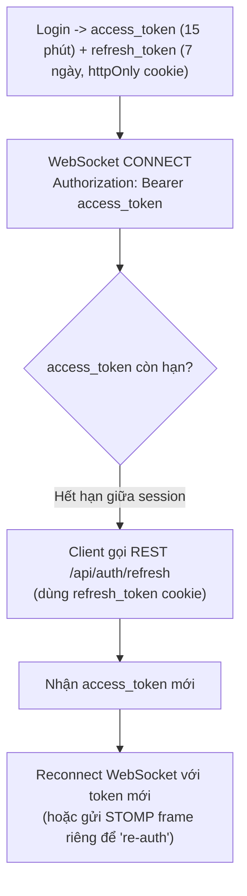
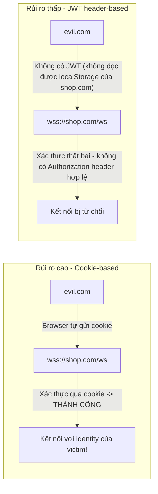
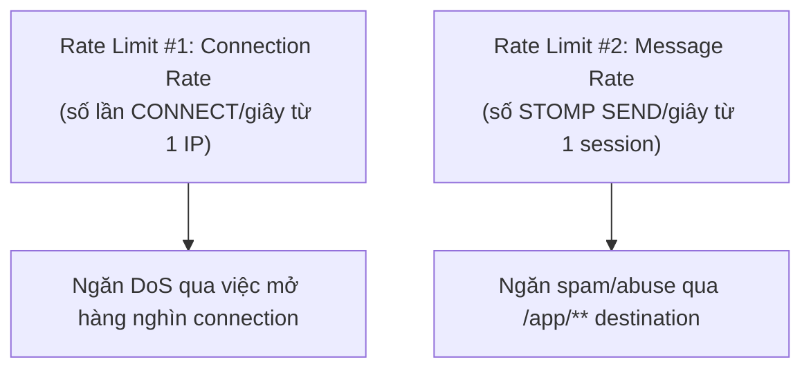
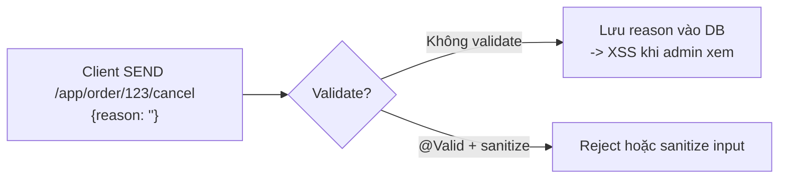
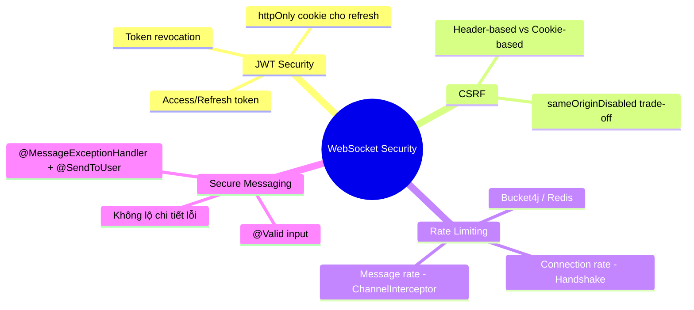

# CHƯƠNG 17 — WEBSOCKET SECURITY (BẢO MẬT CHUYÊN SÂU)

## 🎯 1. Learning Objectives

- Đào sâu **JWT Security** cho WebSocket: lưu trữ token, refresh, revoke.
- Hiểu **CSRF Protection** trong context WebSocket — vì sao khác với REST API.
- Triển khai **Rate Limiting** cho connection và message.
- Bảo vệ **Session** khỏi hijacking, replay attack.
- Áp dụng **Secure Messaging**: validate input, tránh injection qua payload.

---

## 📖 2. Lý thuyết

### 2.1. JWT Security — Sâu hơn Chương 8

Chương 8 đã triển khai JWT cơ bản. Ở mức production, cần xem xét thêm:

| Vấn đề | Rủi ro | Giải pháp |
|---|---|---|
| Token lưu ở `localStorage` | XSS có thể đánh cắp token | Ưu tiên `httpOnly cookie` cho refresh token; access token ngắn hạn có thể chấp nhận ở memory |
| Token quá dài hạn | Token bị lộ → kẻ tấn công dùng được lâu | Access token 5-15 phút, refresh token dài hạn nhưng có thể **revoke** |
| Token bị revoke nhưng session WebSocket vẫn dùng `Principal` cũ | User bị khóa nhưng vẫn nhận message | Kiểm tra blacklist token định kỳ hoặc dùng token ngắn hạn + reconnect |



### 2.2. CSRF Protection — WebSocket khác REST như thế nào?

**CSRF (Cross-Site Request Forgery)** truyền thống dựa vào việc browser **tự động gửi cookie**
đến domain target khi có request từ trang khác. Với WebSocket:

- Nếu xác thực dựa vào **cookie session** (không phải JWT trong header), WebSocket handshake
  **cũng tự động mang cookie** — tạo ra rủi ro CSRF tương tự.
- Nếu xác thực dựa vào **JWT trong STOMP CONNECT header** (như Chương 8), kẻ tấn công từ
  domain khác **không thể đọc được** JWT (do Same-Origin Policy với `localStorage`/memory) →
  rủi ro CSRF **thấp hơn nhiều**.



> **Khuyến nghị:** Với kiến trúc JWT trong STOMP CONNECT header (Chương 8), rủi ro CSRF giảm
> đáng kể, đó là lý do `sameOriginDisabled()` (Chương 8, mục 4.4) có thể được set `true` một
> cách an toàn — **nhưng chỉ khi** không có cơ chế nào khác (cookie session) dùng để xác thực
> WebSocket. Nếu hệ thống dùng **cả 2** (cookie cho REST, JWT header cho WS), cần audit kỹ.

### 2.3. Rate Limiting cho WebSocket

Hai loại rate limit cần xem xét:



| Loại | Vị trí áp dụng | Công cụ |
|---|---|---|
| Connection rate | `HandshakeInterceptor` hoặc API Gateway | Bucket4j, Redis (sliding window) |
| Message rate | `ChannelInterceptor` (`preSend`) | Bucket4j per-session |

### 2.4. Secure Messaging — Validate Input từ STOMP

`@MessageMapping` payload **không tự động validate** như `@RequestBody` với `@Valid` trong một
số phiên bản cũ — cần đảm bảo dùng đúng cách và luôn validate input từ client (không tin tưởng
payload từ `/app/**`).



---

## 🛒 3. Ví dụ thực tế: Secure Messaging cho Ecommerce

**Bài toán:** Endpoint `/app/order/{orderId}/cancel` cho phép khách hàng hủy đơn với lý do
(`reason`). Cần:
1. Validate `reason` (độ dài, không chứa HTML/script).
2. Rate limit: mỗi user tối đa 5 request hủy đơn/phút (tránh spam).
3. Kiểm tra ownership (chỉ chủ đơn mới hủy được — đã có ở Chương 8, Bài 4).

---

## 💻 4. Source Code

### 4.1. `@MessageMapping` với Validation

```java
package com.ecommerce.realtime.presentation.websocket;

import jakarta.validation.Valid;
import jakarta.validation.constraints.NotBlank;
import jakarta.validation.constraints.Size;
import lombok.RequiredArgsConstructor;
import org.springframework.messaging.handler.annotation.DestinationVariable;
import org.springframework.messaging.handler.annotation.MessageMapping;
import org.springframework.security.core.Authentication;
import org.springframework.stereotype.Controller;
import org.springframework.validation.annotation.Validated;

@Controller
@Validated
@RequiredArgsConstructor
public class OrderCancelController {

    private final CancelOrderUseCase cancelOrderUseCase;

    @MessageMapping("/order/{orderId}/cancel")
    public void cancelOrder(@DestinationVariable String orderId,
                             @Valid CancelOrderRequest request,
                             Authentication authentication) {
        // @Valid kích hoạt validation cho @NotBlank, @Size bên dưới
        // Nếu invalid -> MethodArgumentNotValidException -> xử lý bởi @MessageExceptionHandler
        cancelOrderUseCase.execute(orderId, authentication.getName(), request.reason());
    }

    public record CancelOrderRequest(
            @NotBlank(message = "Lý do hủy không được để trống")
            @Size(max = 255, message = "Lý do hủy không quá 255 ký tự")
            String reason
    ) {}
}
```

> **Lưu ý:** cần `@EnableWebSocketMessageBroker` kèm `@Bean MethodValidationPostProcessor` để
> `@Valid` trên `@MessageMapping` hoạt động.

### 4.2. `@MessageExceptionHandler` — xử lý lỗi an toàn

```java
package com.ecommerce.realtime.presentation.websocket;

import lombok.extern.slf4j.Slf4j;
import org.springframework.messaging.handler.annotation.MessageExceptionHandler;
import org.springframework.messaging.simp.annotation.SendToUser;
import org.springframework.validation.method.MethodValidationException;
import org.springframework.stereotype.Controller;

@Slf4j
@Controller
public class WebSocketExceptionHandler {

    /**
     * Trả lỗi về cho ĐÚNG client gây ra lỗi (qua /user/queue/errors),
     * KHÔNG broadcast lỗi cho tất cả - tránh lộ thông tin nội bộ.
     */
    @MessageExceptionHandler(MethodValidationException.class)
    @SendToUser("/queue/errors")
    public ErrorPayload handleValidationException(MethodValidationException ex) {
        log.warn("Validation error on WebSocket message: {}", ex.getMessage());
        return new ErrorPayload("VALIDATION_ERROR", "Dữ liệu không hợp lệ");
        // KHÔNG trả ex.getMessage() trực tiếp - có thể lộ chi tiết implementation
    }

    @MessageExceptionHandler(SecurityException.class)
    @SendToUser("/queue/errors")
    public ErrorPayload handleSecurityException(SecurityException ex) {
        log.warn("Security violation on WebSocket: {}", ex.getMessage());
        return new ErrorPayload("FORBIDDEN", "Bạn không có quyền thực hiện hành động này");
    }

    public record ErrorPayload(String code, String message) {}
}
```

### 4.3. Rate Limiting với Bucket4j (Message Rate)

```java
package com.ecommerce.realtime.infrastructure.security;

import io.github.bucket4j.Bandwidth;
import io.github.bucket4j.Bucket;
import io.github.bucket4j.Refill;
import org.springframework.messaging.Message;
import org.springframework.messaging.MessageChannel;
import org.springframework.messaging.simp.stomp.StompCommand;
import org.springframework.messaging.simp.stomp.StompHeaderAccessor;
import org.springframework.messaging.support.ChannelInterceptor;
import org.springframework.stereotype.Component;

import java.time.Duration;
import java.util.Map;
import java.util.concurrent.ConcurrentHashMap;

/**
 * Rate limit cho STOMP SEND - mỗi user tối đa 5 lệnh hủy đơn/phút.
 * Production: nên dùng Redis-backed Bucket4j (distributed) cho multi-instance (Chương 11-12).
 */
@Component
public class CancelOrderRateLimitInterceptor implements ChannelInterceptor {

    private static final String CANCEL_DESTINATION_PREFIX = "/app/order/";
    private static final String CANCEL_DESTINATION_SUFFIX = "/cancel";

    private final Map<String, Bucket> buckets = new ConcurrentHashMap<>();

    @Override
    public Message<?> preSend(Message<?> message, MessageChannel channel) {
        StompHeaderAccessor accessor = StompHeaderAccessor.wrap(message);

        if (StompCommand.SEND.equals(accessor.getCommand())) {
            String destination = accessor.getDestination();
            if (destination != null && destination.startsWith(CANCEL_DESTINATION_PREFIX)
                    && destination.endsWith(CANCEL_DESTINATION_SUFFIX)) {

                String userId = accessor.getUser().getName();
                Bucket bucket = buckets.computeIfAbsent(userId, this::newBucket);

                if (!bucket.tryConsume(1)) {
                    throw new org.springframework.messaging.MessagingException(
                            "Bạn đã gửi quá nhiều yêu cầu hủy đơn. Vui lòng thử lại sau.");
                }
            }
        }
        return message;
    }

    private Bucket newBucket(String userId) {
        Bandwidth limit = Bandwidth.classic(5, Refill.intervally(5, Duration.ofMinutes(1)));
        return Bucket.builder().addLimit(limit).build();
    }
}
```

### 4.4. Connection Rate Limiting (HandshakeInterceptor)

```java
package com.ecommerce.realtime.infrastructure.security;

import io.github.bucket4j.Bandwidth;
import io.github.bucket4j.Bucket;
import io.github.bucket4j.Refill;
import org.springframework.http.HttpStatus;
import org.springframework.http.server.ServerHttpRequest;
import org.springframework.http.server.ServerHttpResponse;
import org.springframework.web.socket.WebSocketHandler;
import org.springframework.web.socket.server.HandshakeInterceptor;

import java.time.Duration;
import java.util.Map;
import java.util.concurrent.ConcurrentHashMap;

/**
 * Giới hạn số lần handshake/phút từ 1 địa chỉ IP - ngăn chặn DoS qua connection flood.
 */
public class ConnectionRateLimitInterceptor implements HandshakeInterceptor {

    private final Map<String, Bucket> ipBuckets = new ConcurrentHashMap<>();

    @Override
    public boolean beforeHandshake(ServerHttpRequest request, ServerHttpResponse response,
                                    WebSocketHandler wsHandler, Map<String, Object> attributes) {
        String ip = request.getRemoteAddress() != null
                ? request.getRemoteAddress().getAddress().getHostAddress() : "unknown";

        Bucket bucket = ipBuckets.computeIfAbsent(ip, k ->
                Bucket.builder().addLimit(Bandwidth.classic(20, Refill.intervally(20, Duration.ofMinutes(1)))).build());

        if (!bucket.tryConsume(1)) {
            response.setStatusCode(HttpStatus.TOO_MANY_REQUESTS);
            return false;
        }
        return true;
    }

    @Override
    public void afterHandshake(ServerHttpRequest request, ServerHttpResponse response,
                                WebSocketHandler wsHandler, Exception exception) {}
}
```

---

## 📝 5. Hands-on Exercises

**Bài 1:** Triển khai `CancelOrderController` + `WebSocketExceptionHandler`. Test:
- Gửi `reason` rỗng → nhận `ErrorPayload(VALIDATION_ERROR, ...)` qua `/user/queue/errors`.
- Gửi `reason` hợp lệ nhưng `orderId` không thuộc về user → nhận `ErrorPayload(FORBIDDEN, ...)`.

**Bài 2:** Triển khai `CancelOrderRateLimitInterceptor`. Test: gửi 6 lệnh hủy đơn trong 1
phút từ cùng 1 user → request thứ 6 bị reject.

---

## 🚀 6. Advanced Exercises

**Bài 3:** Phân tích: `CancelOrderRateLimitInterceptor` dùng `ConcurrentHashMap` in-memory —
trong môi trường multi-instance (Chương 11), một user có thể "lách" rate limit bằng cách nào?
Đề xuất giải pháp dùng **Redis-backed Bucket4j** (`bucket4j-redis`).

**Bài 4:** Thiết kế cơ chế "**Token Revocation**" cho WebSocket: khi admin khóa tài khoản
`alice` (set `account_locked = true` trong DB), làm sao đảm bảo:
- WebSocket session hiện tại của `alice` bị **đóng** trong thời gian ngắn (không cần chờ JWT hết hạn)?
- `alice` không thể reconnect với token cũ?

(Gợi ý: kết hợp Redis blacklist + `@Scheduled` job kiểm tra session, hoặc publish event
"AccountLocked" qua Redis Pub/Sub để `Notification Service` chủ động đóng session.)

---

## ❓ 7. Interview Questions

1. Vì sao xác thực WebSocket bằng JWT trong header (thay vì cookie) giúp giảm rủi ro CSRF?
2. Phân biệt 2 loại rate limiting cho WebSocket: Connection rate và Message rate. Áp dụng ở đâu?
3. `@MessageExceptionHandler` với `@SendToUser` quan trọng như thế nào về mặt bảo mật so với `@SendTo`?
4. Tại sao không nên trả `ex.getMessage()` trực tiếp cho client trong exception handler?
5. Thiết kế cơ chế force-disconnect một WebSocket session khi tài khoản bị khóa — các thành
   phần nào cần tham gia?

---

## 📋 8. Chapter Summary

- JWT trong STOMP CONNECT header **giảm rủi ro CSRF** đáng kể so với cookie-based authentication.
- **Rate Limiting** cần áp dụng ở 2 cấp: **Connection rate** (HandshakeInterceptor) và
  **Message rate** (ChannelInterceptor) — dùng Bucket4j, production nên dùng bản Redis-backed.
- **Validation** input từ `@MessageMapping` (`@Valid`) là bắt buộc — không tin tưởng payload từ client.
- **`@MessageExceptionHandler` + `@SendToUser`** đảm bảo lỗi chỉ trả về cho đúng client gây
  ra, không lộ thông tin và không broadcast nhầm.
- **Token Revocation** cho WebSocket cần cơ chế chủ động (force-disconnect), vì session WebSocket
  không tự kiểm tra lại token sau khi `Principal` đã được gắn.

---

## 🧠 9. Mindmap



---

## ✅ 10. Completion Checklist

- [ ] Validation hoạt động đúng cho `@MessageMapping` (Bài 1).
- [ ] Lỗi chỉ trả về cho đúng client qua `/user/queue/errors` (Bài 1).
- [ ] Rate limiting message hoạt động đúng (Bài 2).
- [ ] Phân tích và đề xuất Redis-backed rate limit cho multi-instance (Bài 3).
- [ ] Thiết kế cơ chế force-disconnect khi tài khoản bị khóa (Bài 4).

---

## 📌 11. Reference Answers

**Bài 3 (gợi ý):**
Với `ConcurrentHashMap` in-memory, mỗi instance có bucket riêng cho từng `userId`. Nếu hệ
thống có 2 instance và Load Balancer không sticky, user có thể gửi 5 request đến Instance A
(đạt limit) và **5 request khác đến Instance B** (bucket riêng, chưa đạt limit) → tổng cộng
10 request/phút, vượt giới hạn thiết kế (5/phút).

Giải pháp: dùng `bucket4j-redis` — bucket state được lưu trong Redis, **chia sẻ giữa mọi
instance**:
```java
ProxyManager<String> proxyManager = Bucket4jRedis.casBasedBuilder(redisConnection)
        .expirationAfterWrite(ExpirationAfterWriteStrategy.basedOnTimeForRefillingBucketUpToMax())
        .build();

Bucket bucket = proxyManager.builder().build(userId, () ->
        BucketConfiguration.builder()
                .addLimit(Bandwidth.classic(5, Refill.intervally(5, Duration.ofMinutes(1))))
                .build());
```
Với cách này, dù request đến instance nào, `tryConsume()` đều kiểm tra **cùng một bucket
trong Redis** → rate limit chính xác trên toàn hệ thống.

**Bài 4 (gợi ý):**
1. Admin gọi `PATCH /api/users/{id}/lock` → `Authentication Service` set `account_locked = true`
   và publish event `AccountLockedEvent(userId)` lên Redis channel `account-events`.
2. `Notification Service` (mọi instance) subscribe channel này. Instance nào có session của
   `alice` sẽ:
   - Thêm `alice` vào **Redis blacklist** (`SADD blacklisted_users alice`, TTL = thời gian
     sống còn lại của access token).
   - Gọi API của `SimpUserRegistry` để lấy session, sau đó **đóng session** (gửi STOMP `ERROR`
     frame + đóng `WebSocketSession`).
3. Khi `alice` thử reconnect với token cũ: `JwtHandshakeInterceptor` (Chương 8) **kiểm tra
   thêm** Redis blacklist — nếu `userId` nằm trong blacklist, từ chối handshake (401), dù
   token còn hạn theo `exp` claim.
4. Blacklist entry tự hết hạn (TTL) sau khi access token hết hạn tự nhiên → không cần dọn dẹp thủ công.
   
- [Chương 16 - Performance Tuning](./chap16.md)

- [Chương 18 - Best Practices](./chap18.md)
