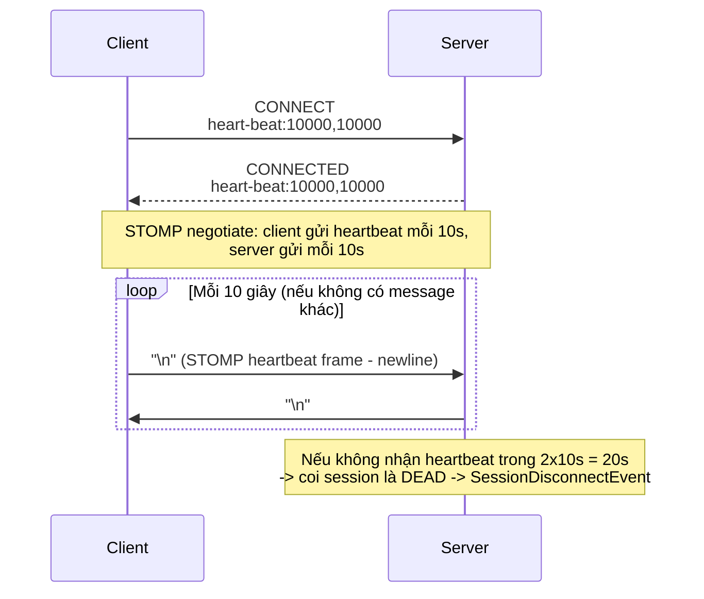
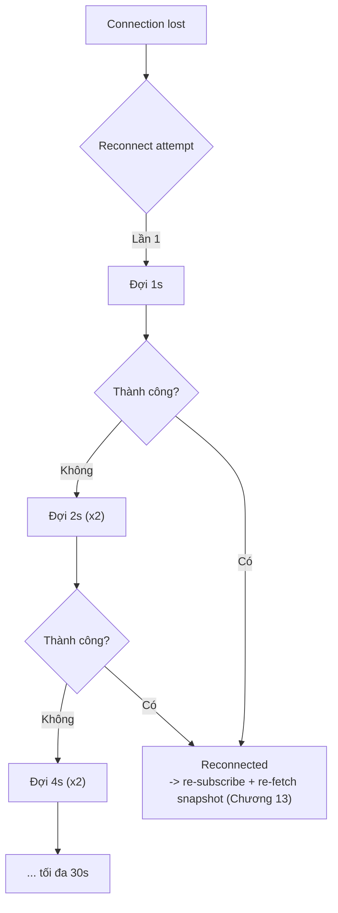
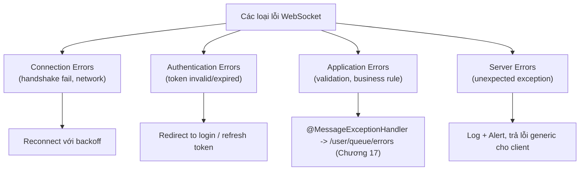
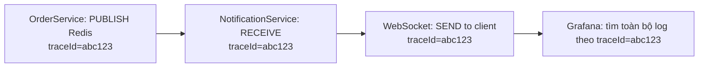
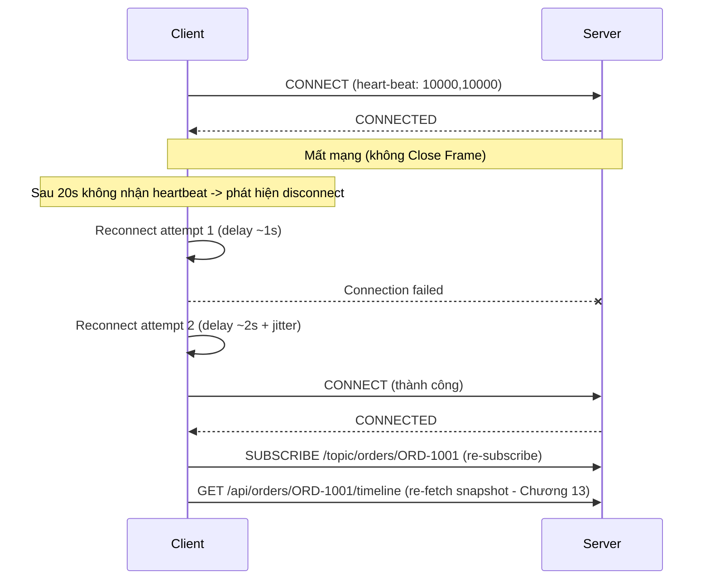
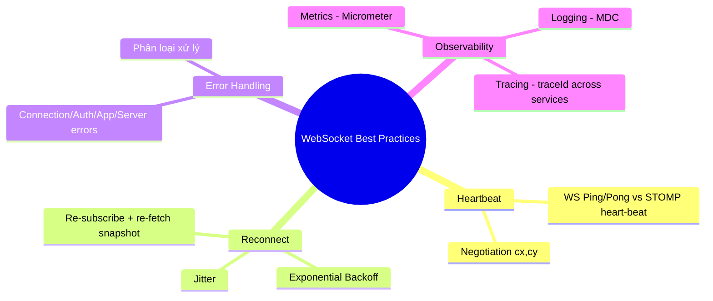
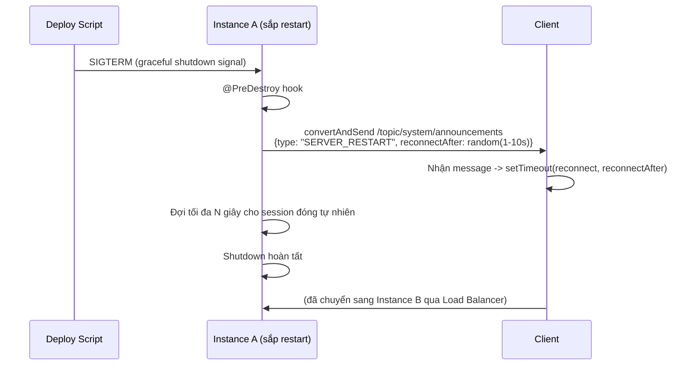

# CHƯƠNG 18 — WEBSOCKET BEST PRACTICES (THỰC HÀNH TỐT NHẤT)

## 🎯 1. Learning Objectives

- Thiết kế **Heartbeat Mechanism** đúng cách (STOMP heartbeat vs WebSocket Ping/Pong).
- Triển khai **Reconnect Strategy** với exponential backoff.
- Xây dựng **Error Handling** toàn diện (client + server).
- Thiết lập **Monitoring, Logging, Observability** cho hệ thống WebSocket production.

---

## 📖 2. Lý thuyết

### 2.1. Heartbeat Mechanism — STOMP Heartbeat vs WebSocket Ping/Pong

Có **2 loại heartbeat** dễ gây nhầm lẫn:

| Loại | Tầng | Cấu hình |
|---|---|---|
| **WebSocket Ping/Pong** | Transport (RFC 6455, Chương 2) | Thường do container (Tomcat) xử lý tự động |
| **STOMP Heartbeat** | Application (STOMP CONNECT header `heart-beat`) | `setHeartbeatValue(new long[]{10000, 10000})` (Chương 3) |



**Nguyên tắc cấu hình `heart-beat` header**: `heart-beat:<cx>,<cy>` nghĩa là:
- `cx`: client có thể gửi heartbeat mỗi `cx` ms (0 = không gửi).
- `cy`: client kỳ vọng nhận heartbeat từ server mỗi `cy` ms (0 = không cần).

Server và client **negotiate** giá trị thực tế = `max(server_value, client_value)` cho mỗi
chiều.

### 2.2. Reconnect Strategy



**Exponential Backoff với Jitter** (tránh "thundering herd" khi server vừa restart, hàng nghìn
client cùng reconnect cùng lúc):

```javascript
function getReconnectDelay(attempt) {
  const base = Math.min(30000, 1000 * Math.pow(2, attempt)); // tối đa 30s
  const jitter = Math.random() * 1000; // +0-1s ngẫu nhiên
  return base + jitter;
}
```

### 2.3. Error Handling — Phân loại lỗi



### 2.4. Monitoring, Logging, Observability

**3 trụ cột Observability cho WebSocket:**

| Trụ cột | Nội dung | Công cụ |
|---|---|---|
| **Metrics** | Số connection hiện tại, message/giây, latency, thread pool usage (Chương 16) | Micrometer + Prometheus + Grafana |
| **Logging** | Structured log với `sessionId`, `userId`, `destination` | SLF4J + MDC (Mapped Diagnostic Context) |
| **Tracing** | Trace 1 message từ producer (Order Service) đến consumer (Client) qua Redis (Chương 12) | Distributed Tracing (OpenTelemetry) |



---

## 🛒 3. Ví dụ thực tế: Production-grade Client Reconnect cho Order Tracking

Mở rộng `OrderTrackingPage` (Chương 13) với reconnect strategy đầy đủ.



---

## 💻 4. Source Code

### 4.1. Cấu hình STOMP Heartbeat (server)

```java
@Override
public void configureMessageBroker(MessageBrokerRegistry registry) {
    registry.enableSimpleBroker("/topic", "/queue")
            .setHeartbeatValue(new long[]{10000, 10000}) // server gửi/nhận mỗi 10s
            .setTaskScheduler(heartBeatTaskScheduler());
    registry.setApplicationDestinationPrefixes("/app");
    registry.setUserDestinationPrefix("/user");
}

@Bean
public org.springframework.scheduling.concurrent.ThreadPoolTaskScheduler heartBeatTaskScheduler() {
    var scheduler = new org.springframework.scheduling.concurrent.ThreadPoolTaskScheduler();
    scheduler.setPoolSize(2);
    scheduler.setThreadNamePrefix("ws-heartbeat-");
    scheduler.initialize();
    return scheduler;
}
```

### 4.2. React Client — Reconnect Strategy hoàn chỉnh

```jsx
import { Client } from "@stomp/stompjs";
import SockJS from "sockjs-client";

export function createResilientStompClient({ url, jwtToken, onReconnect }) {
  let reconnectAttempt = 0;

  const client = new Client({
    webSocketFactory: () => new SockJS(url),
    connectHeaders: { Authorization: `Bearer ${jwtToken}` },

    // STOMP heartbeat - client gửi/nhận mỗi 10s
    heartbeatIncoming: 10000,
    heartbeatOutgoing: 10000,

    // stompjs hỗ trợ reconnectDelay tĩnh - để có exponential backoff,
    // ta tự quản lý qua reconnectDelay function (custom logic)
    reconnectDelay: 0, // tắt auto-reconnect mặc định để tự kiểm soát

    onConnect: () => {
      reconnectAttempt = 0; // reset khi connect thành công
      onReconnect(reconnectAttempt === 0 ? "initial" : "reconnect");
    },

    onWebSocketClose: () => {
      const delay = Math.min(30000, 1000 * Math.pow(2, reconnectAttempt)) + Math.random() * 1000;
      reconnectAttempt++;
      console.warn(`WebSocket closed. Reconnecting in ${Math.round(delay)}ms (attempt ${reconnectAttempt})`);
      setTimeout(() => client.activate(), delay);
    },

    onStompError: (frame) => {
      console.error("STOMP error:", frame.headers["message"], frame.body);
      // Nếu lỗi liên quan đến auth (ví dụ "Unauthorized"), không nên reconnect mù quáng
      if (frame.headers["message"]?.includes("Unauthorized")) {
        // Redirect đến trang login hoặc thử refresh token
      }
    },
  });

  return client;
}
```

### 4.3. Structured Logging với MDC

```java
package com.ecommerce.realtime.infrastructure.logging;

import lombok.extern.slf4j.Slf4j;
import org.slf4j.MDC;
import org.springframework.messaging.Message;
import org.springframework.messaging.MessageChannel;
import org.springframework.messaging.simp.stomp.StompHeaderAccessor;
import org.springframework.messaging.support.ChannelInterceptor;
import org.springframework.stereotype.Component;

/**
 * Gắn sessionId, userId, destination vào MDC -> mọi log trong quá trình xử lý message
 * (bao gồm log từ Service/Repository) sẽ TỰ ĐỘNG có các field này, hỗ trợ tracing.
 */
@Slf4j
@Component
public class LoggingChannelInterceptor implements ChannelInterceptor {

    @Override
    public Message<?> preSend(Message<?> message, MessageChannel channel) {
        StompHeaderAccessor accessor = StompHeaderAccessor.wrap(message);

        MDC.put("sessionId", accessor.getSessionId());
        MDC.put("destination", accessor.getDestination());
        if (accessor.getUser() != null) {
            MDC.put("userId", accessor.getUser().getName());
        }
        return message;
    }

    @Override
    public void afterSendCompletion(Message<?> message, MessageChannel channel,
                                     boolean sent, Exception ex) {
        MDC.clear(); // QUAN TRỌNG: tránh leak context giữa các message (thread pool reuse)
    }
}
```

```xml
<!-- logback-spring.xml -->
<pattern>%d{ISO8601} [%thread] %-5level %logger{36} - sessionId=%X{sessionId} userId=%X{userId} dest=%X{destination} - %msg%n</pattern>
```

### 4.4. Metrics với Micrometer

```java
package com.ecommerce.realtime.infrastructure.monitoring;

import io.micrometer.core.instrument.MeterRegistry;
import lombok.RequiredArgsConstructor;
import org.springframework.context.event.EventListener;
import org.springframework.stereotype.Component;
import org.springframework.web.socket.messaging.SessionConnectedEvent;
import org.springframework.web.socket.messaging.SessionDisconnectEvent;

import java.util.concurrent.atomic.AtomicInteger;

@Component
@RequiredArgsConstructor
public class WebSocketMetrics {

    private final AtomicInteger activeConnections = new AtomicInteger(0);

    public WebSocketMetrics(MeterRegistry registry) {
        registry.gauge("websocket.connections.active", activeConnections);
    }

    @EventListener
    public void onConnect(SessionConnectedEvent event) {
        activeConnections.incrementAndGet();
    }

    @EventListener
    public void onDisconnect(SessionDisconnectEvent event) {
        activeConnections.decrementAndGet();
    }
}
```

---

## 📝 5. Hands-on Exercises

**Bài 1:** Cấu hình STOMP heartbeat `10000,10000`. Test bằng cách: mở DevTools, ngắt mạng giả
lập (Chrome DevTools → Network → Offline) trong 25 giây — quan sát `SessionDisconnectEvent`
được trigger sau khoảng thời gian nào.

**Bài 2:** Triển khai `createResilientStompClient` với exponential backoff. Test: restart
server Spring Boot, quan sát console log client — các lần reconnect có delay tăng dần
(1s, 2s, 4s...) kèm jitter.

---

## 🚀 6. Advanced Exercises

**Bài 3:** Triển khai `LoggingChannelInterceptor` + `WebSocketMetrics`. Tạo dashboard Grafana
đơn giản hiển thị `websocket.connections.active` theo thời gian thực trong khi bạn mở/đóng
nhiều tab.

**Bài 4:** Thiết kế cơ chế "**Graceful Shutdown**": khi instance Spring Boot cần restart
(deploy mới), làm sao để:
- Server gửi một message đến tất cả client đang kết nối, thông báo "Server sẽ restart, vui
  lòng đợi reconnect" (qua `/topic/system/announcements` — Chương 4).
- Client nhận message này và **chủ động** reconnect sau một khoảng delay ngẫu nhiên, tránh
  toàn bộ client reconnect cùng lúc gây "thundering herd" lên instance còn lại.

---

## ❓ 7. Interview Questions

1. Phân biệt WebSocket Ping/Pong (transport) và STOMP heartbeat (application). Vì sao cần cả 2?
2. Giải thích cú pháp header `heart-beat:<cx>,<cy>` và cách "negotiate" giữa client/server.
3. Vì sao Exponential Backoff cần thêm "Jitter"? Điều gì xảy ra nếu không có jitter khi server restart?
4. MDC (`Mapped Diagnostic Context`) hoạt động thế nào trong môi trường multi-threaded? Tại
   sao `MDC.clear()` ở `afterSendCompletion` là bắt buộc?
5. Thiết kế 3 metrics quan trọng nhất bạn sẽ giám sát cho hệ thống WebSocket Ecommerce, và
   ngưỡng alert cho mỗi metric.

---

## 📋 8. Chapter Summary

- **STOMP Heartbeat** (`heart-beat` header) là cơ chế tầng ứng dụng để phát hiện session "chết"
  — khác với WebSocket Ping/Pong ở tầng transport.
- **Reconnect Strategy** cần **Exponential Backoff + Jitter** để tránh "thundering herd" khi
  server restart.
- **Error Handling** cần phân loại rõ: Connection / Authentication / Application / Server
  errors — mỗi loại có cách xử lý khác nhau ở client.
- **MDC** giúp structured logging với `sessionId`, `userId`, `destination` — quan trọng để
  debug production, nhưng cần `MDC.clear()` đúng cách trong thread pool.
- **Micrometer** cung cấp metrics (`active connections`, `message rate`...) để xây dựng
  dashboard Grafana và alerting.

---

## 🧠 9. Mindmap



---

## ✅ 10. Completion Checklist

- [ ] Cấu hình STOMP heartbeat và quan sát hành vi disconnect detection (Bài 1).
- [ ] Triển khai reconnect với exponential backoff + jitter (Bài 2).
- [ ] `LoggingChannelInterceptor` + Micrometer metrics hoạt động (Bài 3).
- [ ] Thiết kế cơ chế Graceful Shutdown (Bài 4).

---

## 📌 11. Reference Answers

**Bài 1:** Với `heart-beat:10000,10000`, nếu không nhận được heartbeat (hoặc message nào)
trong khoảng `2 × 10000ms = 20000ms` (20 giây), server coi session là "dead" và trigger
`SessionDisconnectEvent`. Trong môi trường thực tế, có thể có thêm độ trễ nhỏ do cơ chế kiểm
tra định kỳ của `heartBeatTaskScheduler` — thường thấy disconnect được phát hiện trong khoảng
20-25 giây.

**Bài 4 (gợi ý thiết kế):**

- `@PreDestroy` trong Spring Boot cho phép chạy logic trước khi context đóng — gửi
  announcement broadcast.
- Mỗi client nhận `reconnectAfter` là một giá trị **ngẫu nhiên riêng** (server có thể tính
  toán và gửi giá trị khác nhau cho từng session, hoặc client tự random trong khoảng được
  server gợi ý) — đảm bảo client **không** đồng loạt reconnect cùng 1 thời điểm.
- Load Balancer (Chương 11) sẽ tự động route các connection mới đến instance còn sống.
- [Chương 17 - WebSocket Security](./chap17.md)

- [Chương 19 - Technology Comparisons](./chap19.md)

