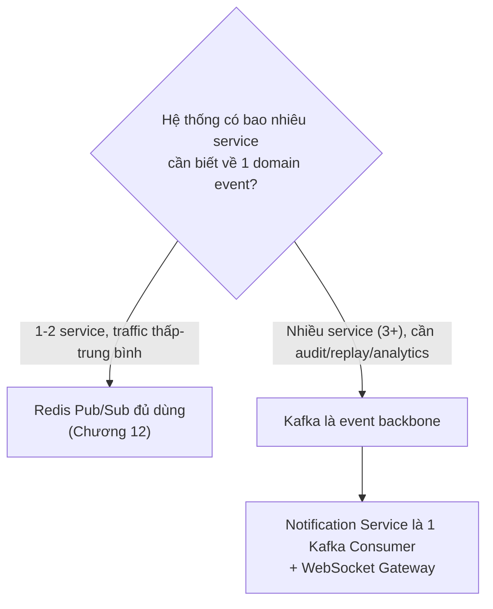
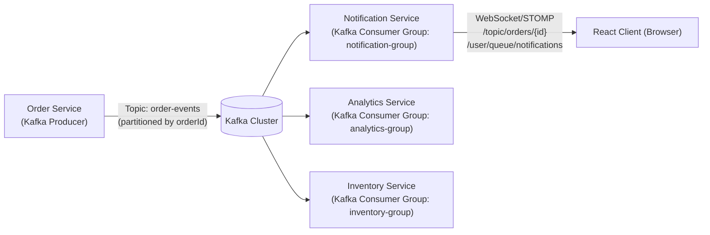
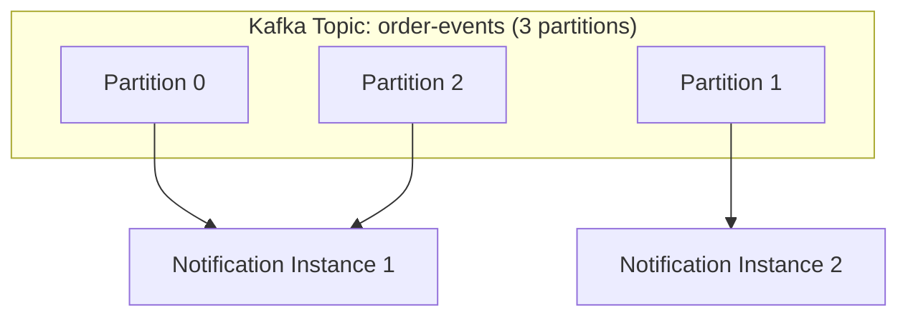
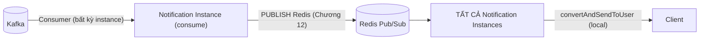
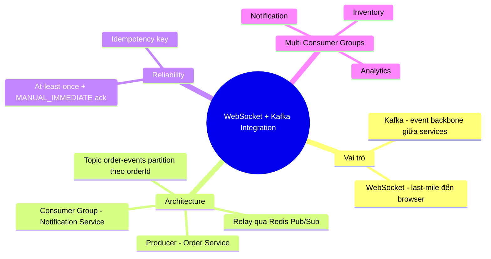

# CHƯƠNG 20 — WEBSOCKET + KAFKA INTEGRATION

## 🎯 1. Learning Objectives

- Hiểu sâu vì sao **Kafka và WebSocket giải quyết hai vấn đề khác nhau** (mở rộng Chương 19).
- Thiết kế **Event-Driven Architecture** kết hợp Kafka (event backbone) và WebSocket
  (last-mile delivery).
- Triển khai **Kafka Producer** (Order Service) và **Kafka Consumer** (Notification Service).
- Xây dựng **WebSocket Gateway** nhận event từ Kafka và broadcast đến client.
- Phân tích **Production Architecture Patterns** khi nào nên kết hợp Kafka + WebSocket.

---

## 📖 2. Lý thuyết

### 2.1. Vì sao Kafka và WebSocket "giải quyết vấn đề khác nhau"?

| | Kafka | WebSocket |
|---|---|---|
| **Bài toán giải quyết** | "Làm sao để N service biết về 1 sự kiện, có thể xử lý lại (replay), đảm bảo không mất dữ liệu, throughput cao?" | "Làm sao để đẩy dữ liệu đến browser của user theo thời gian thực, độ trễ thấp?" |
| **Tham gia** | Service ↔ Service (backend) | Server ↔ Browser/Mobile (client-facing) |
| **Đặc tính** | Durable, replayable, ordered (theo partition), at-least-once | Ephemeral, low-latency, stateful connection |

**Kết luận:** Một hệ thống lớn **cần cả hai** — Kafka làm "trục truyền thông" giữa các
microservice (Order, Inventory, Payment, Shipping, Analytics...), còn WebSocket là "lớp cuối"
đưa thông tin đến UI.

### 2.2. Khi nào nên kết hợp Kafka + WebSocket?



**Dấu hiệu cần Kafka thay vì chỉ Redis Pub/Sub:**
- Cần **Event Sourcing** / **CQRS** — lưu lại toàn bộ lịch sử sự kiện để rebuild state.
- Nhiều team/service độc lập cần subscribe cùng 1 loại event (Order, Inventory, Analytics,
  Fraud Detection...) — Kafka cho phép **nhiều consumer group** đọc độc lập.
- Cần **đảm bảo at-least-once** delivery cho dữ liệu quan trọng (thanh toán, kho hàng).
- Traffic rất cao, cần **partition** để scale việc xử lý song song.

### 2.3. Kiến trúc tổng thể: Order Service → Kafka → Notification Service → WebSocket → React Client



**Điểm khác biệt so với Chương 12 (Redis Pub/Sub):**
- **Redis Pub/Sub**: mọi instance của Notification Service subscribe **cùng** channel, mỗi
  instance tự lọc "user nào ở đây" — phù hợp khi chỉ 1 loại consumer (Notification Service).
- **Kafka**: nhiều **Consumer Group khác nhau** (Notification, Analytics, Inventory) đều đọc
  từ **cùng topic `order-events`** một cách **độc lập** — mỗi group có offset riêng, không
  ảnh hưởng nhau. Trong **Notification Service**, các instance thuộc **cùng consumer group**
  → Kafka tự **chia partition** giữa các instance (load balancing tự nhiên).



> **Lưu ý quan trọng:** Vì Kafka **chia partition** giữa các instance trong cùng consumer
> group, **Instance 1 có thể nhận event của `alice`, nhưng `alice` lại có WebSocket session ở
> Instance 2**! Điều này **TÁI HIỆN** vấn đề Chương 11 — vẫn cần `convertAndSendToUser` +
> cơ chế cross-instance. Giải pháp: sau khi Notification Service (instance bất kỳ) consume
> message từ Kafka, nó **vẫn publish lại qua Redis Pub/Sub (Chương 12)** để đảm bảo mọi
> instance Notification Service đều biết, rồi mới `convertAndSendToUser` local.



---

## 🛒 3. Ví dụ thực tế: Order Service publish lên Kafka

**Bài toán:** `Order Service` publish `OrderStatusChangedEvent` lên Kafka topic `order-events`
(partition theo `orderId` để đảm bảo **thứ tự** các event của cùng 1 đơn hàng được giữ
nguyên). `Notification Service` consume, sau đó relay qua Redis Pub/Sub để đảm bảo đúng
instance giữ session của user nhận được.

---

## 💻 4. Source Code

### 4.1. Dependencies

```xml
<dependency>
    <groupId>org.springframework.kafka</groupId>
    <artifactId>spring-kafka</artifactId>
</dependency>
```

### 4.2. Kafka Producer — `KafkaNotificationPublisher` (Order Service)

```java
package com.ecommerce.order.infrastructure.messaging.kafka;

import com.ecommerce.order.application.notification.port.NotificationPublisherPort;
import com.ecommerce.order.domain.order.event.OrderStatusChangedEvent;
import lombok.RequiredArgsConstructor;
import lombok.extern.slf4j.Slf4j;
import org.springframework.kafka.core.KafkaTemplate;
import org.springframework.stereotype.Component;

@Slf4j
@Component
@RequiredArgsConstructor
public class KafkaNotificationPublisher implements NotificationPublisherPort {

    private static final String TOPIC = "order-events";

    private final KafkaTemplate<String, Object> kafkaTemplate;

    @Override
    public void publish(Object domainEvent) {
        if (domainEvent instanceof OrderStatusChangedEvent event) {
            // KEY = orderId -> đảm bảo mọi event của cùng đơn hàng vào CÙNG partition
            // -> Kafka giữ THỨ TỰ các event trong 1 partition -> timeline (Chương 13) luôn đúng thứ tự
            kafkaTemplate.send(TOPIC, event.orderId(), event)
                    .whenComplete((result, ex) -> {
                        if (ex != null) {
                            log.error("Failed to publish to Kafka: orderId={}", event.orderId(), ex);
                            // Production: cần retry/dead-letter strategy (xem mục 4.5)
                        } else {
                            log.debug("Published to Kafka: orderId={}, offset={}",
                                    event.orderId(), result.getRecordMetadata().offset());
                        }
                    });
        }
    }
}
```

### 4.3. Kafka Consumer Configuration

```yaml
# application.yml - Notification Service
spring:
  kafka:
    bootstrap-servers: ${KAFKA_BROKERS:localhost:9092}
    consumer:
      group-id: notification-group
      auto-offset-reset: earliest
      properties:
        spring.json.trusted.packages: "com.ecommerce.*"
    listener:
      ack-mode: MANUAL_IMMEDIATE # kiểm soát ack thủ công cho reliability
```

### 4.4. Kafka Consumer — `KafkaOrderEventListener` (Notification Service)

```java
package com.ecommerce.notification.infrastructure.messaging.kafka;

import com.ecommerce.notification.application.notification.usecase.CreateNotificationFromEventUseCase;
import com.ecommerce.notification.domain.order.event.OrderStatusChangedEvent;
import lombok.RequiredArgsConstructor;
import lombok.extern.slf4j.Slf4j;
import org.springframework.kafka.annotation.KafkaListener;
import org.springframework.kafka.support.Acknowledgment;
import org.springframework.stereotype.Component;

@Slf4j
@Component
@RequiredArgsConstructor
public class KafkaOrderEventListener {

    private final CreateNotificationFromEventUseCase createNotificationUseCase;

    /**
     * Consumer chạy trên một instance bất kỳ (Kafka phân chia partition).
     * Sau khi xử lý (lưu DB + relay qua Redis - Chương 15 mục 4.3), ack thủ công
     * để đảm bảo "at-least-once": nếu instance crash TRƯỚC ack, Kafka sẽ gửi lại message này
     * cho instance khác trong group.
     */
    @KafkaListener(topics = "order-events", groupId = "notification-group")
    public void onOrderEvent(OrderStatusChangedEvent event, Acknowledgment ack) {
        try {
            log.info("Consumed from Kafka: orderId={}, status={}", event.orderId(), event.newStatus());

            // 1. Persist first (Chương 10) + relay qua Redis (Chương 12) để mọi instance
            //    Notification Service biết và tự kiểm tra local session
            createNotificationUseCase.execute("order-events", event);

            ack.acknowledge(); // chỉ ack SAU KHI xử lý thành công
        } catch (Exception e) {
            log.error("Lỗi xử lý Kafka message, sẽ retry: orderId={}", event.orderId(), e);
            // KHÔNG ack -> Kafka sẽ redeliver message này (at-least-once)
            // Production: cần idempotency check để tránh tạo trùng Notification khi redeliver
        }
    }
}
```

### 4.5. Idempotency — tránh trùng Notification khi Kafka redeliver

```java
package com.ecommerce.notification.application.notification.usecase;

import com.ecommerce.notification.application.notification.port.NotificationRepositoryPort;
import com.ecommerce.notification.domain.notification.model.Notification;
import lombok.RequiredArgsConstructor;
import org.springframework.stereotype.Service;
import org.springframework.transaction.annotation.Transactional;

@Service
@RequiredArgsConstructor
public class IdempotentNotificationCreator {

    private final NotificationRepositoryPort notificationRepository;

    /**
     * "At-least-once" của Kafka có thể dẫn đến xử lý 1 event NHIỀU LẦN.
     * Dùng "idempotency key" (ví dụ: orderId + newStatus) để kiểm tra trùng
     * TRƯỚC khi tạo Notification mới.
     */
    @Transactional
    public Notification createIfNotExists(String idempotencyKey, NotificationFactory factory) {
        if (notificationRepository.existsByIdempotencyKey(idempotencyKey)) {
            return null; // đã xử lý trước đó - bỏ qua (idempotent)
        }
        Notification notification = factory.create();
        notification.setIdempotencyKey(idempotencyKey);
        return notificationRepository.save(notification);
    }

    public interface NotificationFactory {
        Notification create();
    }
}
```

> Cần thêm cột `idempotency_key VARCHAR(128) UNIQUE` vào bảng `notifications` (Chương 10),
> với giá trị ví dụ: `"ORD-1001:SHIPPING"` — đủ để phân biệt các lần chuyển trạng thái khác
> nhau, nhưng tránh trùng nếu Kafka gửi lại đúng message.

---

## 📝 5. Hands-on Exercises

**Bài 1:** Cài đặt Kafka (qua `docker-compose` với image `confluentinc/cp-kafka` hoặc
`bitnami/kafka`). Triển khai `KafkaNotificationPublisher` (Order Service) và
`KafkaOrderEventListener` (Notification Service). Test: tạo đơn hàng, cập nhật trạng thái,
xác nhận message xuất hiện trên topic `order-events` (dùng `kafka-console-consumer`).

**Bài 2:** Triển khai cơ chế **idempotency** (mục 4.5). Test: dùng `kafka-console-producer`
gửi **2 lần cùng một message** `{"orderId":"ORD-1001","newStatus":"SHIPPING",...}` — xác
nhận chỉ **1 Notification** được tạo trong DB.

---

## 🚀 6. Advanced Exercises

**Bài 3:** Thiết kế số lượng **partition** cho topic `order-events`. Phân tích trade-off:
- Quá ít partition (ví dụ 1): không thể scale Notification Service ra nhiều instance để xử lý
  song song.
- Quá nhiều partition (ví dụ 100) với chỉ 2 instance: mỗi instance phải quản lý 50 partition —
  có vấn đề gì về resource (connection, memory) không?
- Đề xuất số partition hợp lý cho hệ thống có ~10 instance Notification Service.

**Bài 4:** Trong sơ đồ ở mục 2.3, sau khi Kafka Consumer (instance bất kỳ) nhận event, nó
"relay qua Redis Pub/Sub" để mọi instance Notification Service biết. Có ý kiến cho rằng điều
này là **"thừa"** vì đã dùng Kafka — tại sao không để **mọi instance Notification Service đều
là 1 Consumer Group riêng** (mỗi instance subscribe TOÀN BỘ partition, không chia sẻ)? Phân
tích ưu/nhược điểm của phương án này so với "Kafka (1 consumer group) + Redis relay".

---

## ❓ 7. Interview Questions

1. Tại sao chọn `orderId` làm Kafka message key cho topic `order-events`?
2. Phân biệt "at-least-once", "at-most-once", "exactly-once" — Redis Pub/Sub (Chương 12) và
   Kafka (với manual ack) thuộc loại nào?
3. Vì sao cần "relay qua Redis" sau khi consume từ Kafka, dù Kafka đã là một hệ thống messaging
   mạnh?
4. `MANUAL_IMMEDIATE` ack-mode có ý nghĩa gì? Điều gì xảy ra nếu instance crash sau khi xử lý
   xong nhưng trước khi `ack.acknowledge()`?
5. Thiết kế "idempotency key" cho `OrderStatusChangedEvent` — tại sao không dùng chỉ `orderId`
   làm key?

---

## 📋 8. Chapter Summary

- **Kafka và WebSocket** giải quyết 2 vấn đề khác nhau: Kafka là event backbone giữa services
  (durable, replayable, multi-consumer-group), WebSocket là kênh realtime đến browser.
- Kiến trúc tích hợp: `Order Service (Kafka Producer)` → `Kafka topic order-events` →
  `Notification Service (Kafka Consumer Group)` → (relay qua Redis Pub/Sub - Chương 12) →
  `WebSocket Client`.
- Partition theo `orderId` đảm bảo **thứ tự event** của cùng 1 đơn hàng — quan trọng cho Order
  Tracking (Chương 13).
- Kafka cung cấp **at-least-once** với `MANUAL_IMMEDIATE` ack — cần **idempotency** ở tầng
  application để tránh tạo trùng Notification khi message được redeliver.
- Việc "relay qua Redis" sau khi consume Kafka giải quyết vấn đề **cross-instance** giữa Kafka
  partition assignment và WebSocket session location — đây là sự kết hợp 2 lớp distributed
  messaging cho 2 mục đích khác nhau.

---

## 🧠 9. Mindmap



---

## ✅ 10. Completion Checklist

- [ ] Triển khai Kafka Producer/Consumer cho `order-events` (Bài 1).
- [ ] Triển khai idempotency, test với message trùng (Bài 2).
- [ ] Phân tích và đề xuất số partition hợp lý (Bài 3).
- [ ] So sánh "Kafka + Redis relay" vs "mỗi instance là 1 consumer group" (Bài 4).
- [ ] Tổng kết toàn khóa: vẽ lại kiến trúc Ecommerce Realtime Platform với Kafka tích hợp.

---

## 📌 11. Reference Answers

**Bài 3 (gợi ý):**
- **1 partition**: tất cả message vào 1 partition → chỉ **1 consumer instance** trong group
  có thể xử lý tại một thời điểm (Kafka giới hạn: số consumer active ≤ số partition) — không
  scale được, trở thành bottleneck.
- **100 partition với 2 instance**: mỗi instance quản lý 50 partition — về kỹ thuật vẫn hoạt
  động được, nhưng mỗi partition tốn thêm overhead (file handle, memory cho consumer state,
  network connections đến broker) — với 100 partition nhưng chỉ tận dụng được mức độ song
  song của 2 instance, phần "dư" không mang lại lợi ích, chỉ tốn thêm resource.
- **Đề xuất cho 10 instance**: số partition nên là **bội số của 10** (ví dụ 10, 20, hoặc 30)
  — vừa đủ để mỗi instance nhận đều số partition, vừa để dư khi cần **scale thêm instance**
  trong tương lai (ví dụ tăng lên 20 instance vẫn dùng hết 20 partition). Nguyên tắc chung:
  số partition ≈ (số instance tối đa dự kiến trong 1-2 năm tới).

**Bài 4 (gợi ý so sánh):**
- **Phương án "mỗi instance = 1 consumer group riêng"**: mỗi instance Notification Service
  dùng `group-id` riêng (ví dụ `notification-group-{instanceId}`) → Kafka coi mỗi instance là
  1 group độc lập → **mỗi instance nhận TẤT CẢ message** (giống Redis Pub/Sub broadcast).
  - *Ưu điểm*: không cần Redis relay, đơn giản hơn về luồng dữ liệu.
  - *Nhược điểm*: **mất khả năng load-balancing của Kafka** — mỗi instance phải xử lý
    **100% traffic** (dù chỉ cần gửi cho session local của nó), lãng phí CPU cho việc
    deserialize + kiểm tra "user có ở đây không" trên TOÀN BỘ traffic, ở MỌI instance. Với
    traffic lớn, đây là lãng phí đáng kể.
- **Phương án "Kafka (1 group) + Redis relay"** (đã trình bày): Kafka **chia tải** việc
  consume giữa các instance (mỗi instance chỉ xử lý 1 phần traffic để tạo Notification +
  lưu DB), sau đó **Redis Pub/Sub** (rất rẻ về CPU so với Kafka deserialize) đảm bảo broadcast
  "ai có session ở đâu" đến mọi instance.
  - *Ưu điểm*: tận dụng được khả năng scale của Kafka cho phần "nặng" (DB write, business
    logic), Redis chỉ làm phần "nhẹ" (broadcast để tìm session).
  - *Nhược điểm*: thêm 1 lớp (Redis) trong luồng dữ liệu, thêm độ phức tạp.
- **Khuyến nghị**: với hệ thống traffic lớn (đã cần Kafka), phương án "Kafka (1 group) + Redis
  relay" là lựa chọn cân bằng tốt hơn về resource. Phương án "mỗi instance 1 group" chỉ hợp
  lý khi số instance **rất nhỏ** (2-3) và traffic chưa đủ lớn để lãng phí CPU trở thành vấn đề.
- [Chương 18 - Best Practices](./chap18.md)

- [Chương 20 - Kafka Integration](./chap20.md)
